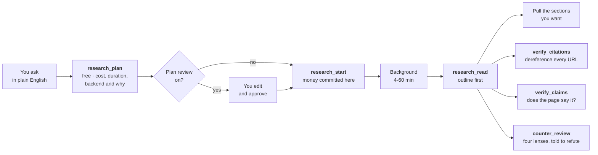

<div align="center">


<br>

[](https://www.npmjs.com/package/dossier-research-mcp)
[](https://nodejs.org)
[](https://modelcontextprotocol.io)
[](docs/test-plan.md)
[](LICENSE)

**Give Claude the ability to do proper research.**<br>
Not a web search. A method it can't skip, citations you can check, and no API key required to start.

```bash
npx dossier-research-mcp
```

</div>

---

## What this actually is

Several companies now sell **deep research**: you give it a question, it goes away for anywhere between four and sixty minutes, runs a hundred or so web searches, reads what it finds, and comes back with a written report that cites its sources.

Dossier lets Claude use them. You ask a research question, Claude sets the job running, and you both get on with something else until it lands.

**A worked example.** You ask *"which open-source vector databases support binary quantization, and what memory do their own docs claim at 10 million vectors?"* Twenty minutes later you have a nineteen-section report with thirty cited sources, a comparison table, an explicit list of what it could not find out, and a confidence rating on every claim. That's a real run; the output is in [How it works](docs/how-it-works.md#a-real-session).

### Four backends, chosen on what they can do

Give Dossier more than one key and it routes on capability first, price second. That order matters, because no amount of cheapness makes an incapable backend correct.

| | What only it can do | Rough cost |
|---|---|---|
| **[Gemini](docs/providers/gemini.md)** | Show you the research plan and let you **edit it before spending** | $1-3 · $3-7 |
| **[Perplexity](docs/providers/perplexity.md)** | Date and domain filters it actually **enforces**, plus native wide research | ~$0.30-2 |
| **[xAI](docs/providers/xai.md)** | Reach **X**. Nothing else does, at any price | cents |
| **[OpenAI](docs/providers/openai.md)** | Filter to **100 domains**, the largest on offer | $0.60-9 |

`research_doctor` tells you what's configured, what isn't, and the one line that would enable each one. It spends nothing and makes no network call.

### And two tiers that cost nothing extra

This is the part most people will actually use.

**A coding CLI you already pay for.** If you have Claude Code, Codex, Cursor or Grok installed, Dossier can run the research through it: no API bill, just your existing subscription. It isn't a downgrade either. On the April 2026 agent benchmark, Claude Code driving plain web search scored **97.0% at $1.54** while a premium deep-research API scored 75.8% at $10.92 on the same questions.

**A subscription you already have.** If you pay for Google AI Pro or ChatGPT, run the report in the web app yourself and `research_import` brings it in as a normal Dossier run: same outline-first reading, same citation checking, same store.

Note: the CLI backend is never chosen for you. It costs $0, so a price tie-break would pick it every single time, and it spends a subscription quota Dossier can't see. Ask for it by name with `provider: "local"`, or list it in `DOSSIER_PROVIDERS`.

> [!IMPORTANT]
> **The API backends cost real money, every single time.** Roughly **$1-3** for a normal Gemini run and **$3-7** for a thorough one, charged whether or not you read the result. That's the whole reason this server exists in the shape it does. None of it is required: the local loop and the import path need no key and no bill.

## Why it needed building

Handing an AI assistant a tool that spends $7 a call and takes an hour isn't straightforward. Four things go wrong immediately, and Dossier is mostly the answer to them.

**Your laptop closing shouldn't kill a forty-minute job.** Every step is written to disk before it's reported, so a run survives you disconnecting, the server restarting, and coming back tomorrow.

**An assistant stuck in a loop shouldn't be able to spend $200 overnight.** There's a daily ceiling, **$100** by default, and a run reserves its worst-case cost *before* the call is made, so the limit refuses early rather than discovering the overage later. Asking the same question twice doesn't pay twice. A call that spends money is never retried, because a create that timed out after the provider accepted it has already bought the report.

**A sixty-thousand-word report shouldn't be dumped into the chat.** You get a contents page first, and pull only the sections you want.

**Nobody should have to learn four APIs to pick one.** Each backend enforces different things, and the differences are invisible until they bite. Dossier picks, tells you why, and says plainly which of your constraints the backend will enforce and which are just a sentence in a prompt.

## Getting started

**No API key needed.** Install it and it works:

```bash
claude mcp add dossier -- npx -y dossier-research-mcp
```

Then ask for research, and Claude does the searching with the web search it already has:

> *Research which open-source vector databases support binary quantization, and what memory their docs claim at 10 million vectors. Use the local loop.*

Dossier plans the search tasks, holds the registry, freezes it before you draft, and refuses a report that cites anything you never gathered. That's the whole method, and it costs nothing.

With no key at all you get: the local loop, `research_import` for a report you ran on a subscription, outline-first reading, citation dereferencing, evidence profiling, the spend ledger, and all four prompts. If you have Claude Code, Codex, Cursor or Grok installed, `provider: "local"` runs the research through that instead, still without an API bill.

### When a key is worth adding

One thing genuinely needs a hosted backend: **a long unattended investigation.** Forty minutes across a hundred sources, running while your laptop is shut, is not something the calling assistant can do for you. A Gemini key is the one to add first, since it's the only backend that lets you edit the plan before it spends, and it's what powers `research_verify_claims` and `research_counter_review`.

```bash
claude mcp add dossier -e GEMINI_API_KEY=your-key-here -- npx -y dossier-research-mcp
```

[Setup](docs/setup.md) walks through getting one from nothing, including putting a spending cap on your Google account first. Adding `PERPLEXITY_API_KEY`, `OPENAI_API_KEY` or `XAI_API_KEY` later is all it takes to enable those; run `research_doctor` to see what's on and what each one would need.

> [!TIP]
> Say **"plan it first"** and you get to read and edit the research plan before any money is spent. It's the most useful thing you can do to a run: pruning the irrelevant branches and adding the angle it missed changes the output more than anything else available.

## What asking it something actually looks like

Six real shapes of question, what each one triggers, and what comes back. You type plain English; Claude does the rest.

<details open>
<summary><b>1. A technical comparison</b> · ~$3-7 · 14-60 min</summary>

> *"Research which open-source vector databases support binary quantization, and what memory their docs claim at 10 million vectors."*

| | |
|---|---|
| **Picks** | `technical` archetype, `max` tier |
| **Reads** | Project docs, GitHub issues, benchmark posts, release notes |
| **Data it hunts for** | Version-specific figures, config flags, memory numbers **as the vendor states them**, and where two vendors measure differently |
| **You get** | A contents page, a comparison table, per-claim confidence, and a Knowledge Gaps section naming what it failed to pin down |

The last row is the useful part. On this question a real run came back saying two projects publish memory figures under incompatible benchmark conditions, which is more honest than a tidy table would have been.
</details>

<details>
<summary><b>2. A table, not an essay</b> · `research_wide`</summary>

> *"Build me a matrix: Qdrant, Milvus and Weaviate, against binary quantization support, claimed memory at 10M vectors, and licence."*

Sometimes the answer is a grid and a beautifully written essay is a **failed answer**. One benchmark scored a major provider zero for exactly that: it returned prose where a table was required.

| | |
|---|---|
| **You name** | The rows (entities) and the columns (fields) |
| **You get** | Every cell filled, cited, or explicitly marked `[uncertain]` |
| **Then** | Call it again with the run handle and it checks the returned table against what you asked for |

That second call is the point. A model that quietly drops the awkward column produces a table that looks complete, and only a check that knows what was requested can tell the difference.
</details>

<details>
<summary><b>3. What happened recently</b> · `research_recent`</summary>

> *"What's changed in EU AI Act enforcement in the last 90 days?"*

| | |
|---|---|
| **Windows** | 24h, 7d, 30d, 90d, 1y, 5y, all. Defaults to 30 days here and a year everywhere else |
| **You get** | The report, plus a plain statement of whether the backend **enforced** your window or merely read it in the prompt |

That distinction is the whole reason the tool exists. "Restricted to the last 12 months" means something different on Perplexity than on Gemini, and showing them identically would be a lie of omission.
</details>

<details>
<summary><b>4. Two backends, and where they disagree</b> · `research_compare` · one bill per backend</summary>

> *"Run this on Gemini and Perplexity and show me where they disagree."*

The conflicts are the output. Two well-resourced research agents disagreeing about a number tells you where the uncertainty actually sits, and it's the one thing a single-provider tool can never show you.

| | |
|---|---|
| **Costs** | A full run on **each** backend. Worth it when a number is load-bearing |
| **You get** | Claims both made, claims only one made, and a support grade on each |

> [!CAUTION]
> Agreement is not evidence if both backends read the same page. Three research agents citing one vendor press release is one source with three wrappers, so support is counted in **independent domains**, never in how many backends agreed. Near-identical wording across different domains gets flagged as possible syndication, because one wire story across twenty outlets is twenty domains and one source.
</details>

<details>
<summary><b>5. Your own documents against the public web</b> · ~$1-3 · 6-28 min</summary>

> *"Compare our internal pricing assumptions against what competitors publish. Use my `pricing-notes` corpus."*

| | |
|---|---|
| **Reads** | Your corpus **and** the open web, in one run |
| **Data it hunts for** | Published prices, packaging, discount structures, and specifically **where your assumptions and the public record disagree** |
| **You get** | A contradictions section, plus a stated hierarchy: your documents are authoritative when they conflict |

That disagreement is normally the whole reason to run it. There's also a **local corpus** that never leaves the machine: files are read and matched here, and no provider sees them.
</details>

<details>
<summary><b>6. Research that costs nothing</b> · `research_local_start` · free</summary>

> *"Research this using my own web search, and hold me to the method."*

You do the searching with the web search your client already has. Dossier does the part that can only be enforced server-side.

| | |
|---|---|
| **Start** | One search task per source class, each with the query dialect that index expects |
| **Report back** | Findings fold into one numbered registry, deduplicated by URL |
| **Draft** | The registry **freezes**. No source can be added after that, including by you |
| **Submit** | Every cited URL is checked against the frozen registry, and the draft is **refused** if it cites anything you never gathered |

Searching an academic index the way you search an issue tracker finds nothing, and it still returns results, which is why it goes unnoticed. That last row is the guarantee: a prompt can ask a model not to reach for a plausible-looking reference mid-sentence, and a server holding the registry can check.
</details>

### The flow, whichever question you asked



> [!TIP]
> **Before it spends anything, it tells you how long it'll take and why.** The estimate reflects what the run will actually do, not just the tier: attaching a corpus, naming URLs, or wiring in an external MCP server each widen the band, and the reasoning is shown so you can decide whether to trim the run or go and make a coffee.
>
> ```
> - Estimated duration: 14-60 minutes, running in the background.
> - Sources it will consult: Google Search (the open web) · 1 private corpus store
> - What drives that estimate: up to ~160 searches (max tier); searching your
>   private corpus alongside the web; capped at the API's 60-minute task limit
> ```

## Checking the work

Every provider produces citations. None of them grade them. This is the part that does.

| | |
|---|---|
| **`research_verify_citations`** | Dereferences every cited URL. Free of judgement: it tells you the link resolves |
| **`research_verify_claims`** | Fetches the page and asks whether it **actually contains the claim**. The verdict that earns its keep is `not_addressed`: a source about the right topic that doesn't say the thing |
| **`research_counter_review`** | Four lenses over the report, each told to **refute** rather than summarise: claim validation, source diversity, recency, internal contradiction |
| **`research_evidence`** | Free. Profiles the source mix, spots one organisation cited through three of its own pages, and gives you the numbered citation registry |

> [!CAUTION]
> **A verified citation means the link resolves. It doesn't mean the source supports the claim attached to it.** That's a judgement, and `research_verify_claims` is the honest attempt at it rather than a guarantee.

Two things this layer refuses to do, both deliberate. The quality floors are **advisory**: a report built on one extraordinary leaked document fails the source mix and is still the right report to publish, so nothing is ever withheld. And if all four review lenses come back empty, that's reported as a **failed review**, not a clean bill of health, because four adversarial passes finding nothing usually means the passes didn't bite.

## What you can do with it

| | |
|---|---|
| **Run research** | Ask a question, get a cited report. Check on it, read it by section, search inside it |
| **Get a table** | `research_wide` for entity-by-field matrices, with a completion check against what you asked for |
| **Box it in time** | `research_recent` with a real date filter where the backend has one, and a plain statement when it doesn't |
| **Compare backends** | `research_compare` runs one brief on two and diffs the claims |
| **Check the work** | Resolve every URL, test claims against their sources, run an adversarial review, profile the evidence |
| **Use your own documents** | Upload a corpus, or search local files that never leave the machine |
| **Spend nothing** | Run it through a CLI you already pay for, import a report from a subscription, or drive the free local loop |
| **Watch the spend** | See what you've committed today, what's left, and per-backend sub-ceilings |

Full contract for all thirty-four tools: **[Tool reference](docs/tools.md)**.

## What it costs

| | Searches | Cost | Time |
|---|---|---|---|
| **Gemini normal** (`fast`) | ~80 | **$1-3** | 4-20 min |
| **Gemini thorough** (`max`) | up to ~160 | **$3-7** | 10-60 min |
| **Perplexity deep** | ~30 | **~$0.30-2** | 5-20 min |
| **xAI** | model's choice, capped | **cents** | 1-5 min |
| **A CLI you already pay for** | your subscription's | **$0 extra** | 2-20 min |
| **An imported report** | already run | **$0** | as long as you took |

Normal is the default and is right most of the time. Dossier never quietly upgrades you to the expensive one; that decision stays yours, because a server that triples your bill on its own judgement isn't one you can leave running unattended.

> [!CAUTION]
> These are published estimate bands, and Dossier reserves the top of the range so it stops you early rather than late. It's a guardrail, not an invoice. Where a provider reports what a run really cost, that figure is recorded next to the reservation: one live Perplexity run came back at **$0.29** against a $2.00 reservation. Cancelling doesn't refund, because providers bill for work already done.

## Documentation

| | |
|---|---|
| **[Setup](docs/setup.md)** | Getting a key, spend caps, installing, every environment variable |
| **[Providers](docs/providers/README.md)** | Which backend for which job, and how routing decides |
| **[Tool reference](docs/tools.md)** | All thirty-four tools, six resources, four prompts |
| **[How it works](docs/how-it-works.md)** | What it decides for you and what it doesn't, how a brief is built, a real session end to end |
| **[Security](docs/security.md)** | Prompt injection, SSRF, what leaves your machine |
| **[Test plan](docs/test-plan.md)** | The acceptance-criteria matrix, and the gaps named honestly |
| **[Development](docs/development.md)** | Toolchain, the two test suites, using it as a library |
| **[Releasing](docs/releasing.md)** | The tag-triggered publish flow |

**Per backend:** [Gemini](docs/providers/gemini.md) · [Perplexity](docs/providers/perplexity.md) · [OpenAI](docs/providers/openai.md) · [xAI](docs/providers/xai.md) · [Subscriptions and CLIs](docs/providers/subscriptions.md) · [Browser sessions](docs/providers/browser-sessions.md)

**Background:** [Deep Research vs custom agents](docs/deep-research-api-vs-agent.md) on which Google surface fits which job · [The multi-provider plan](docs/plan/multi-provider-research.md) for the design and what shipped · [Source notes](docs/reference/source-notes.md) for every provider fact, benchmark and URL, dated.

**Also worth reading:** [The failure mode of AI research moved](blog/the-state-of-deep-research.md), on what fourteen months of deep-research reviews actually found, and why link-checking defends against last year's problem.

## Honest limitations

Worth knowing before you build on this.

- **"Verified citation" means the link resolves**, not that the source supports the claim attached to it. `research_verify_claims` samples and tests that separately, and it's a model's reading rather than a guarantee.
- **Mid-run progress is not available on Gemini.** Its API buffers it; a 7.1-minute run reported nothing until it finished. The plumbing is in place if that changes ([#1](https://github.com/fledgeling-co/dossier-research-mcp/issues/1)).
- **xAI runs synchronously**, whatever its `deferred` flag suggests. The work happens inside the request, so it suits fast, broad questions rather than hour-long ones.
- **Private-corpus grounding is Gemini only.** OpenAI vector stores and xAI collections are real features and aren't wired up here yet, so both declare no corpus support rather than routing your documents to a backend that ignores them.
- **Perplexity's wide research writes its result to a file** that Dossier can't download yet. The run says so instead of handing back an empty report.
- **Vertex AI works but loses features.** An ordinary API key is the fuller backend, which surprises most people. See [Setup](docs/setup.md#using-vertex-ai-instead).
- **Browser automation isn't built.** Dossier has no browser and can't drive yours, so the Gemini web flow ships as a prompt that walks you through it, with the terms-of-service position stated rather than buried. See [Browser sessions](docs/providers/browser-sessions.md).
- **Provider spend caps are soft for this workload.** Google's docs say long-running agents may overrun theirs. Dossier's ceiling is the tighter of the two; use both.

---

<div align="center">

**MIT** © fledgeling-co · [Report an issue](https://github.com/fledgeling-co/dossier-research-mcp/issues)

<sub>Dossier isn't affiliated with Google, Perplexity, OpenAI or xAI. "Gemini" and "Vertex AI" are trademarks of Google LLC.</sub>

</div>
