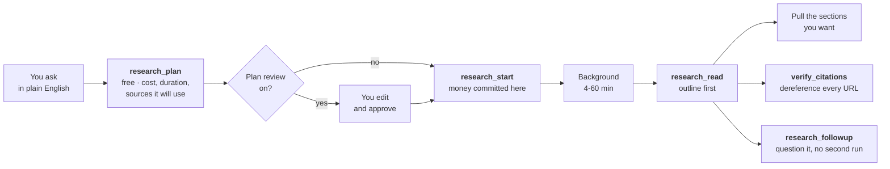

<div align="center">


<br>

[](https://www.npmjs.com/package/dossier-research-mcp)
[](https://nodejs.org)
[](https://modelcontextprotocol.io)
[](docs/test-plan.md)
[](LICENSE)

**Give Claude the ability to do proper research.**<br>
Not a web search. A forty-minute investigation across a hundred sources, with citations you can check.

```bash
npx dossier-research-mcp
```

</div>

---

## What this actually is

Several companies now sell **deep research**: you give it a question, it goes away for anywhere between four and sixty minutes, runs a hundred or so web searches, reads what it finds, and comes back with a written report that cites its sources.

Dossier lets Claude use them. You ask a research question, Claude sets the job running, and you both get on with something else until it lands.

Four backends, and it picks one on capability rather than price: **Gemini** is the only one that lets you edit the plan before it spends, **Perplexity** is the only one whose date and domain filters are actually enforced, **xAI** is the only one that reaches X, and **OpenAI** takes the largest domain filter. Give it more than one key and `research_compare` runs the same brief on two and shows you where they disagree, which is the one thing a single-provider tool can never do.

**And two tiers that cost nothing.** If you already pay for Claude Code, Codex or Grok, Dossier can run the research through the CLI you already have. If you pay for Google AI Pro or ChatGPT, you can run the report in the web app yourself and `research_import` brings it in as a normal run.

**A worked example.** You ask *"which open-source vector databases support binary quantization, and what memory do their own docs claim at 10 million vectors?"* Twenty minutes later you have a nineteen-section report with thirty cited sources, a comparison table, an explicit list of what it could not find out, and a confidence rating on every claim. That is a real run; the output is in [How it works](docs/how-it-works.md#a-real-session).

> [!IMPORTANT]
> **The API backends cost real money, every single time.** Roughly **$1-3** for a normal run and **$3-7** for a thorough one, charged whether or not you read the result. That is the whole reason this server exists in the shape it does. The CLI and import paths cost nothing extra, and are never chosen for you.

## Why it needed building

Handing an AI assistant a tool that spends $7 a call and takes an hour is not straightforward. Three things go wrong immediately, and Dossier is mostly the answer to them.

**Your laptop closing shouldn't kill a forty-minute job.** Every step is written to disk before it is reported, so a run survives you disconnecting, the server restarting, and coming back tomorrow.

**An assistant stuck in a loop shouldn't be able to spend $200 overnight.** There is a daily ceiling, **$100** by default, and a run reserves its worst-case cost *before* the call is made, so the limit refuses early rather than discovering the overage later. Asking the same question twice does not pay twice.

**A sixty-thousand-word report shouldn't be dumped into the chat.** You get a contents page first, and pull only the sections you want.

## Getting started

You need one API key to start, and a Google Gemini key is the one to get first: it is the only backend with an editable plan, and it powers the claim-checking and follow-up tools. It takes about five minutes, and [Setup](docs/setup.md) walks through it from nothing, including how to put a spending cap on your Google account before your first run. Adding `PERPLEXITY_API_KEY`, `OPENAI_API_KEY` or `XAI_API_KEY` later is all it takes to enable those; run `research_doctor` to see what is on, what is off, and what each one would need.

```bash
# 1. Get a key at https://aistudio.google.com/apikey
# 2. Tell Claude Code about the server
claude mcp add dossier -e GEMINI_API_KEY=your-key-here -- npx -y dossier-research-mcp
```

Then just ask, in plain English:

> *Research which open-source vector databases support binary quantization, and what memory their docs claim at 10 million vectors.*

Claude will show you the cost before spending anything, start the job, and tell you when it lands.

> [!TIP]
> Say **"plan it first"** and you get to read and edit the research plan before any money is spent. It is the most useful thing you can do to a run: pruning the irrelevant branches and adding the angle it missed changes the output more than anything else available.

## What asking it something actually looks like

Four real shapes of question, what each one triggers, and what comes back. You type plain English; Claude does the rest.

<details open>
<summary><b>1. A technical comparison</b> · ~$3–7 · 14–60 min</summary>

> *"Research which open-source vector databases support binary quantization, and what memory their docs claim at 10 million vectors."*

| | |
|---|---|
| **Picks** | `technical` archetype, `max` tier |
| **Reads** | Project docs, GitHub issues, benchmark posts, release notes |
| **Data it hunts for** | Version-specific figures, config flags, memory numbers **as the vendor states them**, and where two vendors measure differently |
| **You get** | A contents page, a comparison table, per-claim confidence, and an explicit list of what it could not establish |

The last row is the useful part. On this question a real run came back saying two projects publish memory figures under incompatible benchmark conditions, which is more honest than a tidy table would have been.
</details>

<details>
<summary><b>2. Regulatory mapping, with the plan reviewed first</b> · ~$3–7 · plus your thinking time</summary>

> *"What are the disclosure obligations for AI-assisted financial advice in Australia? Plan it first."*

Saying **"plan it first"** turns on collaborative planning. Nothing is spent until you approve.

| | |
|---|---|
| **Picks** | `regulatory` archetype, asks for jurisdiction if you left it out |
| **You see first** | The research plan, editable. Prune the branches that don't matter, add the angle it missed |
| **Reads** | Primary legislation, regulator guidance, consultation papers |
| **Data it hunts for** | The instrument, the section, the commencement date, and whether guidance is binding or advisory |

Editing that plan is the single highest-leverage thing available to you, and it's free.
</details>

<details>
<summary><b>3. Your own documents against the public web</b> · ~$1–3 · 6–28 min</summary>

> *"Compare our internal pricing assumptions against what competitors publish. Use my `pricing-notes` corpus."*

| | |
|---|---|
| **Reads** | Your corpus **and** the open web, in one run |
| **Data it hunts for** | Published prices, packaging, discount structures, and specifically **where your assumptions and the public record disagree** |
| **You get** | A contradictions section, plus a stated hierarchy: your documents are authoritative when they conflict |

That disagreement is normally the whole reason to run it.
</details>

<details>
<summary><b>4. A cheap factual sweep</b> · ~$1–3 · 4–20 min</summary>

> *"What changed in the Node.js permission model between v20 and v22?"*

| | |
|---|---|
| **Picks** | `technical`, `fast` tier. No plan review; the question is already precise |
| **Reads** | Changelogs, release notes, the API docs, relevant PRs |
| **Data it hunts for** | Flag names, version boundaries, behavioural changes, deprecations |

For a question this well-scoped, `fast` is the right answer and Dossier won't upsell you to `max`.
</details>

### The flow, whichever question you asked



> [!TIP]
> **Before it spends anything, it tells you how long it'll take and why.** The estimate reflects what the run will actually do, not just the tier: attaching a corpus, naming URLs, or wiring in an external MCP server each widen the band, and the reasoning is shown so you can decide whether to trim the run or go and make a coffee.
>
> ```
> - Estimated duration: 14-60 minutes, running in the background.
> - Sources it will consult: Google Search (the open web) · 1 private corpus store
> - What drives that estimate: up to ~160 searches (max tier); searching your
>   private corpus alongside the web; capped at the API's 60-minute task limit
> ```

## What you can do with it

| | |
|---|---|
| **Run research** | Ask a question, get a cited report. Check on it, read it by section, search inside it |
| **Check the sources** | Dereference every cited URL and get a verdict on each. A confident-sounding fabricated citation is the failure nobody catches, because nobody clicks |
| **Ask follow-ups** | Question a finished report without paying for a second run |
| **Use your own documents** | Have a run read your internal docs alongside the public web, and say explicitly where the two disagree. That disagreement is usually the valuable part |
| **Watch the spend** | See what you have committed today and what is left |

Full contract for all twenty tools: **[Tool reference](docs/tools.md)**.

## What it costs

| | Searches | Cost | Time |
|---|---|---|---|
| **Normal** (`fast`) | ~80 | **$1–3** | 4–20 min |
| **Thorough** (`max`) | up to ~160 | **$3–7** | 10–60 min |

Normal is the default and is right most of the time. Dossier never quietly upgrades you to the expensive one; that decision stays yours, because a server that triples your bill on its own judgement is not one you can leave running unattended.

> [!CAUTION]
> These are Google's published estimates, and Dossier reserves the top of the range so it stops you early rather than late. It is a guardrail, not an invoice. Reconcile against Google billing for real figures, and note that cancelling does not refund, because Google bills for work already done.

## Documentation

| | |
|---|---|
| **[Setup](docs/setup.md)** | Getting a key, free vs paid, spend caps, installing, every environment variable |
| **[Providers](docs/providers/README.md)** | Perplexity, OpenAI, xAI, subscriptions, browser sessions, and which to use when |
| **[Tool reference](docs/tools.md)** | All thirty-four tools, six resources, four prompts |
| **[How it works](docs/how-it-works.md)** | What it decides for you and what it doesn't, how a brief is built, a real session end to end |
| **[Deep Research vs custom agents](docs/deep-research-api-vs-agent.md)** | Which Google surface fits which job, and the naming that trips everyone up |
| **[Security](docs/security.md)** | Prompt injection, SSRF, what leaves your machine |
| **[Development](docs/development.md)** | Toolchain, the two test suites, using it as a library |
| **[Test plan](docs/test-plan.md)** | The acceptance-criteria matrix, and the gaps named honestly |
| **[Releasing](docs/releasing.md)** | The tag-triggered publish flow |
| **[Multi-provider plan](docs/plan/multi-provider-research.md)** | Where this goes next: routing, combination, evidence governance |
| **[Source notes](docs/reference/source-notes.md)** | Every provider fact, benchmark and URL the plan rests on, dated |

**Also worth reading:** [The failure mode of AI research moved](blog/the-state-of-deep-research.md), on what fourteen months of deep-research reviews actually found, and why link-checking defends against last year's problem.

## Honest limitations

Worth knowing before you build on this.

- **Mid-run progress is not available.** Google's API buffers it; a 7.1-minute run reported nothing until it finished. The plumbing is in place if that changes ([#1](https://github.com/fledgeling-co/dossier-research-mcp/issues/1)).
- **"Verified citation" means the link resolves**, not that the source supports the claim attached to it. Matching a claim to its source is a judgement, and the tool does not pretend to make it.
- **Vertex AI works but loses features.** An ordinary API key is the fuller backend, which surprises most people. See [Setup](docs/setup.md#using-vertex-ai-instead).
- **Google's own spend cap is soft for this workload.** Their docs say long-running agents may overrun it. Dossier's ceiling is the tighter of the two; use both.

---

<div align="center">

**MIT** © fledgeling-co · [Report an issue](https://github.com/fledgeling-co/dossier-research-mcp/issues)

<sub>Dossier isn't affiliated with Google. "Gemini" and "Vertex AI" are trademarks of Google LLC.</sub>

</div>
