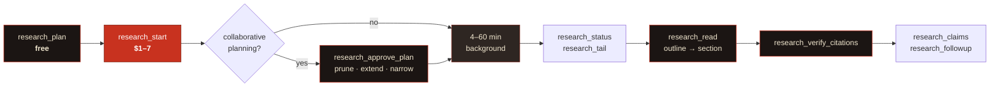
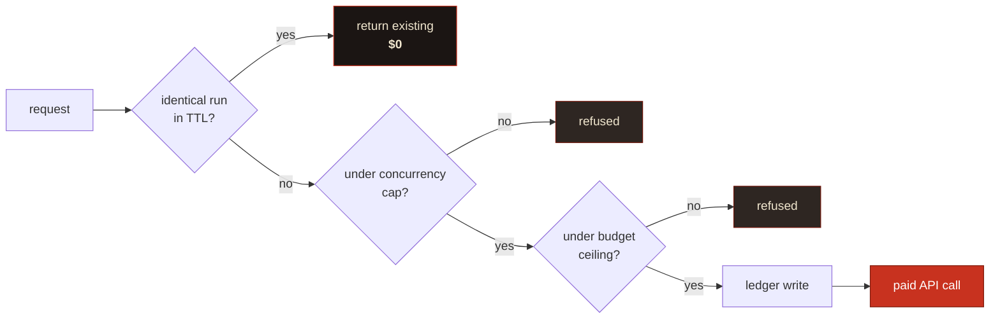

<div align="center">


<br>

[](https://www.npmjs.com/package/dossier-mcp)
[](https://nodejs.org)
[](https://modelcontextprotocol.io)
[](#development)
[](LICENSE)

**Google Gemini Deep Research, wrapped so an autonomous agent can drive it**<br>
without burning a month's budget in a loop, losing a 45-minute job to a dropped<br>connection, or dumping a 60,000-token report into a context window.

```bash
npx dossier-mcp
```

</div>

---

## Why this exists

Deep Research is an unusual API to wrap. Three of its properties break the assumptions most MCP servers are built on:

| Property | What naive wrapping does | What Dossier does |
|---|---|---|
| A task runs **4–60 min** in the background | Tool call times out; client disconnects and the job is orphaned | **Jobs outlive connections.** Every transition hits disk before it's reported |
| A task costs **$1–7, every time** | An agent in a retry loop spends $200 overnight; nobody notices until the invoice | **Two-step spend handshake** + dedupe + a budget gate |
| A report is **~60,000 tokens** | Returning it inline kills the session that asked for it | **Outline first**, sections on demand, hard token caps |

> [!NOTE]
> These aren't features bolted on top — they're the architecture. Durability, spend control and context discipline shape every module in `src/`.

---

## The shape of a session



`research_start` returns a **handle** in about a second. Everything after it is optional, resumable, and survives you disconnecting.

---

## Install

<details open>
<summary><b>Claude Code</b></summary>

```bash
claude mcp add dossier -e GEMINI_API_KEY=your-key -- npx -y dossier-mcp
```

</details>

<details>
<summary><b>Claude Desktop / any <code>mcpServers</code> config</b></summary>

```json
{
  "mcpServers": {
    "dossier": {
      "command": "npx",
      "args": ["-y", "dossier-mcp"],
      "env": {
        "GEMINI_API_KEY": "your-key-here",
        "DOSSIER_BUDGET_USD": "25"
      }
    }
  }
}
```

</details>

<details>
<summary><b>From source</b></summary>

```bash
git clone https://github.com/fledgeling-co/dossier.git
cd dossier
npm install && npm run build
GEMINI_API_KEY=... node dist/index.js
```

</details>

<details>
<summary><b>HTTP transport (remote / shared)</b></summary>

```bash
DOSSIER_HTTP_TOKENS=$(openssl rand -hex 32) \
  npx dossier-mcp --transport http --port 8787
```

Streamable HTTP at `/mcp`, SSE at `/sse`, health at `/health`. Bearer tokens are compared in constant time.

> [!WARNING]
> Bind to loopback unless `DOSSIER_HTTP_TOKENS` is set. The server warns on start-up if you don't.

</details>

### Auth

Either backend works; **Vertex wins if both are set.**

```bash
# A — Google AI Studio  ·  https://aistudio.google.com/apikey
export GEMINI_API_KEY=...

# B — Vertex AI, via Application Default Credentials
export VERTEX_PROJECT=my-project
export VERTEX_LOCATION=global
gcloud auth application-default login
```

> [!IMPORTANT]
> **Vertex trade-off:** File Search stores (`corpusStores`) are a Gemini Developer API feature and are **not available on Vertex**. If you want private-corpus grounding, use an API key.

Without credentials the server still starts and every read-only tool works — you just can't start a run.

---

## A real session

Verbatim output from a live `fast`-tier run, trimmed for length.

```jsonc
// (1) Free. See exactly what you're about to buy.
research_plan {
  "question": "Which open-source vector databases support scalar and binary quantization, and what memory footprint do their own docs report at 10 million vectors?",
  "tier": "fast",
  "scope": { "decisionContext": "pick a self-hosted store for a small team" }
}
```

```text
Archetype: technical
Estimated cost: $1.00-$3.00 — ~80 searches, ~250k input tokens…
Estimated duration: 4-20 minutes, background.
Budget: $0.00 committed of $10.00 in the last 24h; $10.00 remaining.
Contract fingerprint: dbc239386807d76bf5573328dd926baf
```

```jsonc
// (2) Spends money. Returns in ~1s with a handle. Do NOT block on it.
research_start { /* …same args… */ "contractFingerprint": "dbc239386807d76bf5573328dd926baf" }
```

```text
Run started. Handle: dr_4dea031ff91d84fc
Committed against your budget: ~$2.00 (band $1.00-$3.00)

# calling it again with identical args:
De-duplicated onto an existing run — nothing new was charged.
```

```jsonc
// (3) Later. This was polled by a DIFFERENT server process than the one that
//     started it — the first was killed immediately after step 2.
research_status { "runId": "dr_4dea031ff91d84fc" }   // → completed · 30 cited sources

// (4) Outline first, always: ~8,000 tokens of report surveyed in ~200.
research_read { "runId": "dr_4dea031ff91d84fc" }
```

```text
Report outline — 19 sections, ~8070 estimated tokens total.
  1. Open-Source Vector Database Memory Economics…   (~25 tok)
  2.   Executive Summary                             (~642 tok)
  4.     Primary: Which databases support…           (~566 tok)
  5.       Qdrant                                    (~583 tok)
  6.       Milvus                                    (~458 tok)
 16.   Evidence Table                                (~539 tok)
 17.   Knowledge Gaps                                (~352 tok)
```

```jsonc
research_read { "runId": "dr_4dea031ff91d84fc", "mode": "section", "section": "Executive Summary" }
```

```text
(High Confidence) Qdrant's official capacity planning documentation provides
explicit mathematical formulas indicating that 10 million 1,024-dimensional
float32 vectors require 57.2 GB of active RAM. Scalar quantization reduces
this by a factor of 4 (~14.3 GB); binary by a factor of 32 (~1.8 GB).
```

```jsonc
// (5) Before anyone acts on it.
research_verify_citations { "runId": "dr_4dea031ff91d84fc" }
```

```text
Citation scorecard: PARTIAL — 25/30 resolved (83%).
  live 25 · not_found 0 · blocked 5 · unreachable 0 · invalid 0
  - blocked (403) https://medium.com/@…   paywalled or bot-blocked
  - blocked       https://milvus.io/docs/overview.md
    server redirects this URL to itself — typically a bot deterrent;
    the source is probably fine, open it in a browser to confirm
```

---

## Tools

<details open>
<summary><b>Research</b> — 12 tools</summary>

<br>

### `research_plan` · free

Returns the fully engineered prompt, the selected archetype, cost and duration bands, your budget position, and a **contract fingerprint**. Spends nothing. Call it first for anything non-trivial — it's where you catch a badly scoped question before it costs $7.

| Parameter | Type | Notes |
|---|---|---|
| `question` | `string` | Your question, **or** an already-engineered brief (detected, passed through verbatim) |
| `tier` | `fast` \| `max` | Default `fast` |
| `archetype` | `enum` | `technical` · `competitive` · `regulatory` · `academic` · `forecasting`. Omit to auto-select |
| `scope` | `object` | `jurisdiction`, `timeHorizon`, `decisionContext`, `analysisLenses[]`, `exclude[]` |
| `corpusStores` | `string[]` | File Search stores to ground the run in |
| `collaborativePlanning` | `boolean` | Return a plan to review before executing |

> [!TIP]
> `scope.decisionContext` is the highest-value field here. "What will you *do* with the findings" drives the analysis lens, which outperforms any amount of extra "search for X" instruction.

### `research_start` · spends money

Starts the run, returns a handle immediately. Three gates run first — **all free**:



The ledger is written **before** the interaction, so a crash between them over-counts rather than under-counts — the safe direction for a spend gate.

Set `DOSSIER_REQUIRE_CONTRACT=true` to make the plan→start handshake mandatory. **Recommended for any server an autonomous agent can reach.**

### `research_approve_plan`

Approve — optionally amending — the plan a collaborative-planning run proposed.

> [!TIP]
> Pruning tangential branches and injecting missing angles here is the single highest-leverage intervention available on a Deep Research run. Zero-shot autonomous execution is the wrong default for anything decision-critical.

### `research_status` · `research_tail`

Status reports **liveness separately from state**: a run with no forward progress inside the watchdog window is marked `stalled`, which you can branch on. `in_progress` alone can't distinguish a thinking run from a dead one.

`research_tail` replays the durable journal from a cursor: `{ runId, sinceSeq }` → events + next cursor.

> [!NOTE]
> **Timing, measured against the live API.** While a run is in flight, `interactions.get` returns only the echoed `user_input` step. The full step list — including the researcher's reasoning summaries — arrives in one batch at completion (a real run produced 25). So mid-run you see lifecycle events; reasoning arrives at the end. Live reasoning would need the SSE stream, which this server doesn't yet consume ([#1](https://github.com/fledgeling-co/dossier/issues/1)).

### `research_read`

| `mode` | Returns |
|---|---|
| `outline` *(default)* | Table of contents with per-section token estimates |
| `section` | One section, by 1-based index or heading substring |
| `grep` | Matching lines with their containing section (literal by default; `regex: true` opts in) |
| `summary` | Title, abstract, Executive Summary |
| `full` | Everything, capped by `maxTokens` |

`maxTokens` (default 6,000) is a hard cap, and **truncation is always marked explicitly** — silent truncation is how someone acts confidently on half a finding.

### `research_verify_citations`

| Verdict | Meaning |
|---|---|
| `live` | Resolves |
| `not_found` | 404/410 — broken or fabricated |
| `blocked` | 401/402/403, or a self-redirect loop — paywalled/bot-blocked; plausible but unconfirmed |
| `unreachable` | Network failure or timeout |
| `invalid_url` | Malformed, non-HTTP, or resolves to a private address |

Badges: `verified` (≥90% live) · `partial` · `suspect` (>15% broken or invalid).

> [!CAUTION]
> **`live` means the URL resolves. It does not mean the source supports the claim it's attached to.** Semantic claim-matching would need a model call per citation and would still be a judgement, not a fact. Pair this with the `research-red-team` prompt.

### `research_followup` · `research_claims`

`research_followup` runs a cheap single model turn continuing the original interaction — it does **not** start a new research run and does not re-search the web.

`research_claims` extracts load-bearing claims as portable cards (`claim`, `confidence`, `sourceUrl`, `evidence`) via structured output. Small enough to pass between agents where a whole report isn't. **Confidence is copied from the report, never re-assessed.**

### `research_list` · `research_cancel` · `research_budget`

List runs (reads the local store, not the API). Cancel an in-flight run — committed spend stays on the ledger, because Google bills for work already done. Report spend position and largest commitments.

</details>

<details>
<summary><b>Corpus</b> — private documents, 4 tools</summary>

<br>

`corpus_create` · `corpus_list` · `corpus_add_file` · `corpus_delete`

File Search stores let a run search **your documents alongside the public web**. Pass store names as `corpusStores` and the server appends a grounding instruction that does two things:

1. **Hierarchy of truth** — internal documents are authoritative on internal facts, so high-fidelity data isn't silently overwritten by whatever the web says louder.
2. Requires an explicit **"Contradictions with the attached corpus"** section.

That contradictions section is usually the most valuable output. What the internet says is commodity; **where it disagrees with what your team already believes is not.**

> [!WARNING]
> `corpus_add_file` **uploads the file to Google.** It's annotated non-read-only and says so in its description. Only add documents you're willing to disclose to a third-party API.

</details>

<details>
<summary><b>Managed agents</b> — the other Gemini surface, 4 tools</summary>

<br>

`agent_create` · `agent_list` · `agent_run` · `agent_delete`

Persisted custom agents with a real Linux sandbox (Ubuntu, Python 3.12, Node 22) that can run code, write files, and carry house methodology across every run.

**[Deep Research API vs the Managed Agents API →](docs/deep-research-api-vs-agent.md)** — which surface fits your job, and the third option (rolling your own).

> [!IMPORTANT]
> At preview the only `base_agent` is Antigravity. **You cannot derive a custom agent from `deep-research-*`.** A custom agent *complements* a Deep Research run; it doesn't specialise one.

</details>

---

## Resources & prompts

| Resource URI | Contents |
|---|---|
| `research://capabilities` | Version, auth mode, `degraded` flag, tiers + cost bands, archetypes, feature flags, budget |
| `research://budget` | Ledger snapshot + every entry in the window |
| `research://runs` | Index of all runs |
| `research://run/{runId}` | Full run record |
| `research://run/{runId}/report` | The report markdown |
| `research://run/{runId}/citations` | Verification scorecard + per-citation verdicts |

| Prompt | Purpose |
|---|---|
| `deep-research-brief` | Turn a vague need into a fully engineered brief, ready for `research_start` |
| `research-red-team` | Adversarially audit a completed report — a concrete five-step procedure, not a vibe check |
| `research-triage` | Decide whether a question warrants a run at all, and at which tier, before spending |

---

## The bundled skill

[`skills/deep-research-prompt-creator/`](skills/deep-research-prompt-creator/) is a Claude Code skill that turns a vague research need into an engineered Gemini Deep Research prompt — pseudo-XML scaffolding, five archetype override sets, epistemic bounding tags, inline citation protocol, and the Operator Notes that wrap around the run.

```bash
cp -r skills/deep-research-prompt-creator ~/.claude/skills/
```

**The skill and the server compose.** With the server connected, the skill hands its prompt straight over instead of printing it to paste. The server **detects an already-engineered brief and sends it verbatim** — it does not re-wrap it, because two `<role>` blocks and two competing `<output_format>` sections is precisely the over-specification failure the scaffold exists to avoid.

Detection triggers on a `<core_directive>` tag, or any two structural tags together — so it works with a prompt from the skill, from another tool, or written by hand:

```jsonc
research_start {
  "question": "<role>…</role>\n\n<core_directive>…</core_directive>\n\n<output_format>…</output_format>"
}
// → "your brief was already engineered — it will be sent verbatim"
```

The same framework is available three other ways without installing anything: the `deep-research-brief` MCP prompt, the automatic scaffolding inside `research_plan`, and the `buildPrompt()` export.

---

## Configuration

<details>
<summary><b>All environment variables</b></summary>

<br>

| Variable | Default | Purpose |
|---|---|---|
| `GEMINI_API_KEY` | — | Google AI Studio key |
| `VERTEX_PROJECT` / `VERTEX_LOCATION` | — / `global` | Vertex AI (takes precedence) |
| `DOSSIER_STORE_DIR` | `~/.dossier-mcp` | Runs, journals, reports, ledger |
| `DOSSIER_BUDGET_USD` | `25` | Hard ceiling per rolling window. `0` disables |
| `DOSSIER_BUDGET_WINDOW_HOURS` | `24` | Rolling window |
| `DOSSIER_MAX_CONCURRENT` | `3` | Runs in flight at once |
| `DOSSIER_REQUIRE_CONTRACT` | `false` | Make plan→start mandatory |
| `DOSSIER_DEDUPE_TTL_MINUTES` | `1440` | Window for collapsing identical requests |
| `DOSSIER_POLL_SECONDS` | `20` | Poll interval for in-flight runs |
| `DOSSIER_STALL_MINUTES` | `12` | Silence before a run is marked `stalled` |
| `DOSSIER_UTILITY_MODEL` | `gemini-3.1-pro-preview` | Titles, summaries, follow-ups, claims |
| `DOSSIER_HTTP_PORT` | `8787` | Port for `--transport http` |
| `DOSSIER_HTTP_TOKENS` | — | Comma-separated bearer tokens |

Every value is Zod-validated once at start-up; an invalid one fails fast with a readable message. An empty string is treated as unset, because a committed `.env.example` key is commonly present-but-empty.

</details>

---

## Costs, honestly

| Tier | Agent | Searches | Estimate | Typical duration |
|---|---|---|---|---|
| `fast` | `deep-research-preview-04-2026` | ~80 | **$1–3** | 4–20 min |
| `max` | `deep-research-max-preview-04-2026` | up to ~160 | **$3–7** | 10–60 min |

> [!CAUTION]
> These are Google's published preview **estimate bands**, and the ledger commits the midpoint at start. **It's a spend guardrail, not an invoice** — reconcile against Google billing for actuals. Cancelling does not refund; Google bills for work already done.

**Cheapest habits, in order of impact:** `research_plan` before starting (free) · `fast` unless breadth genuinely justifies double the cost · `research_followup` instead of a second run · let dedupe work by not varying wording between retries.

---

## Security

Deep Research reads the open web on your behalf, and Google's own documentation flags prompt injection from untrusted pages, exposure to malicious sites, and exfiltration risk when internal data meets web browsing. Dossier takes concrete positions:

- **Citation verification is SSRF-safe.** URLs come out of a model that was reading untrusted pages, so they're treated as untrusted input: scheme allowlist, DNS resolution checked against private/loopback/link-local/CGNAT ranges (including `169.254.169.254`), redirects followed manually and re-validated per hop, explicit timeouts, response-size caps.
- **Private corpus goes through File Search, not a live endpoint.** Deep Research can call a remote `mcp_server` tool mid-run — so a poisoned page could in principle steer it into calling your tools. Dossier deliberately grounds private context through Google's retrieval layer instead, so there's no live endpoint for a compromised run to reach.
- **Data-egress tools are labelled.** `corpus_add_file` is annotated non-read-only and states plainly that the file leaves your machine.
- **Secrets never reach a log or a fingerprint.** MCP auth headers are excluded from the dedupe hash (so a rotated token doesn't fork the key), and error messages carry no credential material.
- **Every boundary is Zod-parsed, never cast** — API responses, stored records, config, model output alike.

---

## Development

```bash
npm install
npm run dev        # tsx src/index.ts
npm run typecheck  # tsgo --noEmit
npm run lint       # eslint 9 flat, type-aware
npm test           # vitest (swc transform) — hermetic, no network, no keys
npm run build
npm run gate       # typecheck && lint && test && build — run before pushing
npm run inspect    # MCP Inspector
```

**Toolchain:** [tsgo](https://github.com/microsoft/typescript-go) (`@typescript/native-preview`) compiles and typechecks · eslint 9 flat + type-aware · vitest with the swc transform.

> [!NOTE]
> The suite is hermetic by construction: `DOSSIER_HERMETIC=1` (set in `vitest.config.ts`) means a live client is never constructed, so a stray key in your environment cannot make the tests spend money. Every test injects a scripted `DeepResearchClient` and points the store at a temp directory.

**Library use:**

```ts
import { buildPrompt } from 'dossier-mcp/server';

const { prompt, archetype, preEngineered } = buildPrompt({
  question: 'What disclosure obligations apply to dual-listed issuers?',
  scope: { jurisdiction: 'UK and Singapore', decisionContext: 'inform a board paper' },
});
```

`createServer(deps)` and `buildDeps(config)` are exported too, so you can mount the tools inside an existing FastMCP server or inject a fake client for tests.

---

<div align="center">

**MIT** © fledgeling-co · [Report an issue](https://github.com/fledgeling-co/dossier/issues)

<sub>Dossier is not affiliated with Google. "Gemini" and "Vertex AI" are trademarks of Google LLC.</sub>

</div>
