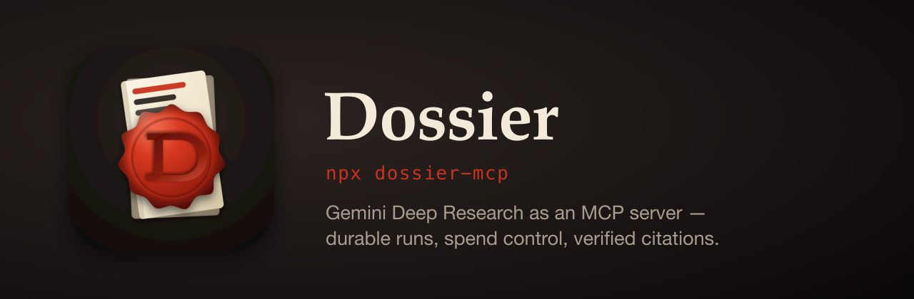
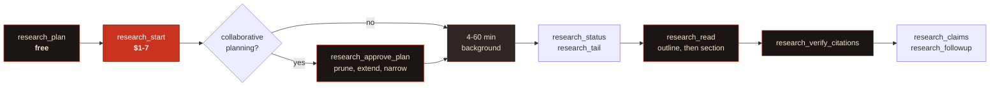
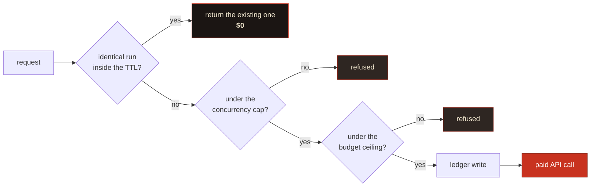

<div align="center">



<br>

[](https://www.npmjs.com/package/dossier-research-mcp)
[](https://nodejs.org)
[](https://modelcontextprotocol.io)
[](#development)
[](LICENSE)

**Gemini Deep Research, wrapped so an agent can drive it safely.**<br>
Your runs survive a dropped connection. Your budget survives a retry loop.<br>Your context window survives the report.

```bash
npx dossier-research-mcp
```

</div>

---

## Why this exists

Deep Research is an odd API to wrap. Three of its properties break assumptions most MCP servers are built on, and you hit all three on day one.

| Property | What you get if you wrap it naively | What Dossier does |
|---|---|---|
| A task runs **4-60 minutes** in the background | The tool call times out, or your client disconnects and the job is orphaned | **Jobs outlive connections.** Every state change hits disk before it's reported |
| A task costs **$1-7, every time** | An agent in a retry loop spends $200 overnight and you find out from the invoice | **Two-step spend handshake**, plus dedupe and a budget gate |
| A report is **~60,000 tokens** | Returning it inline kills the session that asked for it | **Outline first**, sections on demand, hard token caps |

None of that is bolted on. Durability, spend control and context discipline shape every module in `src/`; take any one of them out and the design stops making sense.

---

## The shape of a session



`research_start` hands you a **handle** in about a second. Everything after it is optional, resumable, and survives you closing the laptop.

---

## Install

<details open>
<summary><b>Claude Code</b></summary>

<br>

```bash
claude mcp add dossier -e GEMINI_API_KEY=your-key -- npx -y dossier-research-mcp
```

</details>

<details>
<summary><b>From source</b></summary>

<br>

```bash
git clone https://github.com/fledgeling-co/dossier-research-mcp.git
cd dossier-research-mcp && npm install && npm run build

# then point any MCP client at it
claude mcp add dossier -e GEMINI_API_KEY=your-key -- node "$PWD/dist/index.js"
```

</details>

<details>
<summary><b>Claude Desktop, or any <code>mcpServers</code> config</b></summary>

<br>

```json
{
  "mcpServers": {
    "dossier": {
      "command": "npx",
      "args": ["-y", "dossier-research-mcp"],
      "env": {
        "GEMINI_API_KEY": "your-key-here",
        "DOSSIER_BUDGET_USD": "25"
      }
    }
  }
}
```

</details>

<details>
<summary><b>HTTP transport</b> (remote or shared)</summary>

<br>

```bash
DOSSIER_HTTP_TOKENS=$(openssl rand -hex 32) \
  npx dossier-research-mcp --transport http --port 8787
```

Streamable HTTP on `/mcp`, SSE on `/sse`, health on `/health`. Bearer tokens are compared in constant time.

> [!WARNING]
> Bind to loopback unless you've set `DOSSIER_HTTP_TOKENS`. The server warns you on start-up if you haven't.

</details>

### Auth

Either backend works. **Vertex wins if you've set both.**

```bash
# A. Google AI Studio: https://aistudio.google.com/apikey
export GEMINI_API_KEY=...

# B. Vertex AI, via Application Default Credentials
export VERTEX_PROJECT=my-project
export VERTEX_LOCATION=global
gcloud auth application-default login
```

> [!IMPORTANT]
> **The Vertex trade-off:** File Search stores (`corpusStores`) are a Gemini Developer API feature and aren't available on Vertex. If you want private-corpus grounding, use an API key.

With no credentials the server still starts and every read-only tool works. You just can't start a run.

---

## A real session

This is verbatim output from a live `fast`-tier run, trimmed for length.

```jsonc
// 1. Free. See exactly what you're about to buy.
research_plan {
  "question": "Which open-source vector databases support scalar and binary quantization, and what memory footprint do their own docs report at 10 million vectors?",
  "tier": "fast",
  "scope": { "decisionContext": "pick a self-hosted store for a small team" }
}
```

```text
Archetype: technical
Estimated cost: $1.00-$3.00, ~80 searches, ~250k input tokens…
Estimated duration: 4-20 minutes, background.
Budget: $0.00 committed of $10.00 in the last 24h; $10.00 remaining.
Contract fingerprint: dbc239386807d76bf5573328dd926baf
```

```jsonc
// 2. This one spends money. Returns in ~1s with a handle. Don't block on it.
research_start { /* …same args… */ "contractFingerprint": "dbc239386807d76bf5573328dd926baf" }
```

```text
Run started. Handle: dr_4dea031ff91d84fc
Committed against your budget: ~$2.00 (band $1.00-$3.00)

# call it again with identical args and you get:
De-duplicated onto an existing run, nothing new was charged.
```

```jsonc
// 3. Later. A DIFFERENT server process polled this one; the process that
//    started it was killed immediately after step 2.
research_status { "runId": "dr_4dea031ff91d84fc" }   // completed, 30 cited sources

// 4. Outline first, always. ~8,000 tokens of report, surveyed in ~200.
research_read { "runId": "dr_4dea031ff91d84fc" }
```

```text
Report outline: 19 sections, ~8070 estimated tokens total.
  1. Open-Source Vector Database Memory Economics…   (~25 tok)
  2.   Executive Summary                             (~642 tok)
  4.     Primary: Which databases support…           (~566 tok)
  5.       Qdrant                                    (~583 tok)
  6.       Milvus                                    (~458 tok)
 16.   Evidence Table                                (~539 tok)
 17.   Knowledge Gaps                                (~352 tok)
```

```jsonc
research_read { "runId": "dr_4dea031ff91d84fc", "mode": "section", "section": "Executive Summary" }
```

```text
(High Confidence) Qdrant's official capacity planning documentation provides
explicit mathematical formulas indicating that 10 million 1,024-dimensional
float32 vectors require 57.2 GB of active RAM. Scalar quantization reduces
this by a factor of 4 (~14.3 GB); binary by a factor of 32 (~1.8 GB).
```

```jsonc
// 5. Before anyone acts on it.
research_verify_citations { "runId": "dr_4dea031ff91d84fc" }
```

```text
Citation scorecard: PARTIAL, 25/30 resolved (83%).
  live 25 · not_found 0 · blocked 5 · unreachable 0 · invalid 0
  - blocked (403) https://medium.com/@…   paywalled or bot-blocked
  - blocked       https://milvus.io/docs/overview.md
    server redirects this URL to itself, typically a bot deterrent;
    the source is probably fine, open it in a browser to confirm
```

---

## Tools

<details open>
<summary><b>Research</b> (12 tools)</summary>

<br>

### `research_plan`, free

You get the engineered prompt, the archetype it picked, cost and duration bands, your budget position, and a **contract fingerprint**. It spends nothing. Call it first for anything non-trivial; it's where you catch a badly scoped question before it costs you $7.

| Parameter | Type | Notes |
|---|---|---|
| `question` | `string` | Your question, or an already-engineered brief (detected, sent verbatim) |
| `tier` | `fast` \| `max` | Defaults to `fast` |
| `archetype` | `enum` | `technical`, `competitive`, `regulatory`, `academic`, `forecasting`. Omit and it picks one |
| `scope` | `object` | `jurisdiction`, `timeHorizon`, `decisionContext`, `analysisLenses[]`, `exclude[]` |
| `corpusStores` | `string[]` | File Search stores to ground the run in |
| `collaborativePlanning` | `boolean` | Get a plan back to review before it executes |

> [!TIP]
> Of the fields here, I reckon `scope.decisionContext` is the one worth filling in. What you'll actually *do* with the findings drives the analysis lens, and telling the researcher how to think about what it finds tends to do more than telling it what to look for.

### `research_start`, spends money

Starts the run and hands back a handle. Three gates run first, and **all three are free**.



The ledger is written *before* the interaction, so a crash between the two over-counts rather than under-counts. That's the safe direction for a spend gate.

Set `DOSSIER_REQUIRE_CONTRACT=true` to make the plan-then-start handshake mandatory. Worth doing on any server an autonomous agent can reach.

### `research_approve_plan`

Approve the plan a collaborative-planning run proposed, amending it if you want.

> [!TIP]
> Pruning tangential branches and injecting the angles it missed is the highest-leverage thing you can do to a Deep Research run. Zero-shot autonomous execution is the wrong default for anything you'll be held to.

### `research_status` and `research_tail`

Status reports **liveness separately from state**. A run with no forward progress inside the watchdog window gets marked `stalled`, which you can branch on; `in_progress` on its own can't tell you the difference between a run that's thinking and one that's dead.

`research_tail` replays the durable journal from a cursor. Pass `{ runId, sinceSeq }`, get events plus the next cursor.

> [!NOTE]
> **Timing, measured against the live API.** While a run is in flight, `interactions.get` returns only the echoed `user_input` step. The full step list, reasoning summaries included, arrives in one batch at completion; a real run produced 25 of them. So mid-run you see lifecycle events, and reasoning lands at the end. Live reasoning would need the SSE stream, which this server doesn't consume yet ([#1](https://github.com/fledgeling-co/dossier-research-mcp/issues/1)).

### `research_read`

| `mode` | What you get |
|---|---|
| `outline` *(default)* | Table of contents with per-section token estimates |
| `section` | One section, by 1-based index or heading substring |
| `grep` | Matching lines with their containing section. Literal by default; `regex: true` opts in |
| `summary` | Title, abstract, Executive Summary |
| `full` | Everything, capped by `maxTokens` |

`maxTokens` defaults to 6,000 and it's a hard cap. **Truncation is always marked in the text**, because silent truncation is exactly how someone acts confidently on half a finding.

### `research_verify_citations`

| Verdict | What it means |
|---|---|
| `live` | Resolves |
| `not_found` | 404 or 410; broken, or fabricated |
| `blocked` | 401/402/403, or a self-redirect loop. Paywalled or bot-blocked, so plausible but unconfirmed |
| `unreachable` | Network failure or timeout |
| `invalid_url` | Malformed, non-HTTP, or resolves to a private address |

Badges: `verified` at 90% live or better, then `partial`, then `suspect` above 15% broken or invalid.

> [!CAUTION]
> **`live` means the URL resolves. It doesn't mean the source supports the claim it's attached to.** Matching a claim to its source semantically would need a model call per citation and would still be a judgement rather than a fact, so this tool doesn't pretend to do it. Pair it with the `research-red-team` prompt.

### `research_followup` and `research_claims`

`research_followup` is one cheap model turn continuing the original interaction. It doesn't start a new research run and it doesn't re-search the web.

`research_claims` pulls the load-bearing claims out as portable cards (`claim`, `confidence`, `sourceUrl`, `evidence`), small enough to pass between agents where a whole report isn't. **Confidence is copied from the report, never re-assessed.**

### `research_list`, `research_cancel`, `research_budget`

List runs, which reads the local store rather than the API, so it's cheap. Cancel an in-flight run; the committed spend stays on the ledger, because Google bills for work already done. Check your spend position and largest commitments.

</details>

<details>
<summary><b>Corpus</b>: your own documents (4 tools)</summary>

<br>

`corpus_create` · `corpus_list` · `corpus_add_file` · `corpus_delete`

File Search stores let a run search **your documents alongside the public web**. Pass store names in `corpusStores` and the server appends a grounding instruction that does two things.

First, it sets a **hierarchy of truth**: your internal documents are authoritative on internal facts, so your own numbers don't get quietly overwritten by whatever the web says louder. Second, it requires a **"Contradictions with the attached corpus"** section.

When it works, that contradictions section is the most useful thing in the report. What the internet says about your problem is commodity; where it disagrees with what your team already believes isn't.

> [!WARNING]
> `corpus_add_file` **uploads the file to Google.** It's annotated non-read-only and its description says so plainly. Only add documents you're happy to hand to a third-party API.

> [!IMPORTANT]
> **Rough edge, disclosed in place.** In my one live test of this, the corpus was indexed, the `file_search` tool was attached, and both instructions were in the prompt; the researcher then produced a 12,660-token report with zero references to the corpus. The cause was almost certainly placement, since the block was being appended *after* the closing `<core_directive>`, which is both the weakest position in the prompt and a spot that broke the anti-drift anchor. That's fixed: the block now sits inside the scaffold and the contradictions section is part of `<output_format>`. I haven't re-run a paid job to confirm the fix end to end, so treat corpus grounding as attached-and-instructed rather than proven until you've seen it work on your own corpus.

</details>

<details>
<summary><b>Managed agents</b>: the other Gemini surface (4 tools)</summary>

<br>

`agent_create` · `agent_list` · `agent_run` · `agent_delete`

Persisted custom agents with a real Linux sandbox (Ubuntu, Python 3.12, Node 22) that can run code, write files, and carry your house methodology across every run.

**[Deep Research API vs the Managed Agents API](docs/deep-research-api-vs-agent.md)** covers which surface fits which job, and the third option of rolling your own.

> [!IMPORTANT]
> At preview the only `base_agent` on offer is Antigravity, so **you can't derive a custom agent from `deep-research-*`**. A custom agent complements a Deep Research run; it doesn't specialise one.

</details>

---

## Resources and prompts

| Resource URI | What's in it |
|---|---|
| `research://capabilities` | Version, auth mode, `degraded` flag, tiers and cost bands, archetypes, feature flags, budget |
| `research://budget` | Ledger snapshot plus every entry in the window |
| `research://runs` | Index of all runs |
| `research://run/{runId}` | The full run record |
| `research://run/{runId}/report` | The report markdown |
| `research://run/{runId}/citations` | Verification scorecard and per-citation verdicts |

| Prompt | What it's for |
|---|---|
| `deep-research-brief` | Turns a vague need into an engineered brief, ready for `research_start` |
| `research-red-team` | Audits a finished report adversarially. A five-step procedure, not a vibe check |
| `research-triage` | Works out whether a question deserves a run at all, and at which tier, before you spend |

---

## The bundled skill

[`skills/deep-research-prompt-creator/`](skills/deep-research-prompt-creator/) is a Claude Code skill that turns a vague research need into an engineered Gemini Deep Research prompt: pseudo-XML scaffolding, five archetype override sets, epistemic bounding tags, an inline citation protocol, and the Operator Notes that wrap around the run.

```bash
cp -r skills/deep-research-prompt-creator ~/.claude/skills/
```

**The skill and the server compose.** With the server connected, the skill hands its prompt straight over instead of printing it for you to paste. The server spots an already-engineered brief and sends it **verbatim**; it won't re-wrap it, because two `<role>` blocks and two competing `<output_format>` sections is precisely the over-specification failure the scaffold exists to prevent.

Detection fires on a `<core_directive>` tag, or on any two structural tags together. So it works with a prompt from the skill, from another tool, or one you wrote by hand.

```jsonc
research_start {
  "question": "<role>…</role>\n\n<core_directive>…</core_directive>\n\n<output_format>…</output_format>"
}
// "your brief was already engineered, it will be sent verbatim"
```

You can get the same framework three other ways without installing anything: the `deep-research-brief` MCP prompt, the automatic scaffolding inside `research_plan`, or the `buildPrompt()` export.

---

## Configuration

<details>
<summary><b>Every environment variable</b></summary>

<br>

| Variable | Default | What it does |
|---|---|---|
| `GEMINI_API_KEY` | | Google AI Studio key |
| `VERTEX_PROJECT` / `VERTEX_LOCATION` | / `global` | Vertex AI. Takes precedence over the API key |
| `DOSSIER_STORE_DIR` | `~/.dossier-research-mcp` | Runs, journals, reports, ledger |
| `DOSSIER_BUDGET_USD` | `25` | Hard ceiling per rolling window. `0` turns the gate off |
| `DOSSIER_BUDGET_WINDOW_HOURS` | `24` | The rolling window |
| `DOSSIER_MAX_CONCURRENT` | `3` | Runs in flight at once |
| `DOSSIER_REQUIRE_CONTRACT` | `false` | Makes plan-then-start mandatory |
| `DOSSIER_DEDUPE_TTL_MINUTES` | `1440` | Window for collapsing identical requests |
| `DOSSIER_POLL_SECONDS` | `20` | Poll interval for in-flight runs |
| `DOSSIER_STALL_MINUTES` | `12` | Silence before a run is marked `stalled` |
| `DOSSIER_UTILITY_MODEL` | `gemini-3.1-pro-preview` | Titles, summaries, follow-ups, claims |
| `DOSSIER_HTTP_PORT` | `8787` | Port for `--transport http` |
| `DOSSIER_HTTP_TOKENS` | | Comma-separated bearer tokens |

Every value is Zod-validated once at start-up, so an invalid one fails fast with a readable message instead of surfacing as a mystery mid-run.

Note: an empty string counts as unset. A committed `.env.example` key is very often present-but-empty, and `??` won't catch that where `||` will.

</details>

---

## What it costs, honestly

| Tier | Agent | Searches | Estimate | Typical duration |
|---|---|---|---|---|
| `fast` | `deep-research-preview-04-2026` | ~80 | **$1-3** | 4-20 min |
| `max` | `deep-research-max-preview-04-2026` | up to ~160 | **$3-7** | 10-60 min |

> [!CAUTION]
> These are Google's published preview **estimate bands**, and the ledger commits the midpoint when a run starts. It's a spend guardrail, not an invoice; reconcile against Google billing for the real numbers. Cancelling doesn't refund, because Google bills for work already done.

The habits that save you the most, roughly in order: run `research_plan` before you start, since it's free. Stay on `fast` unless the breadth genuinely justifies double the cost. Use `research_followup` rather than a second run. And let dedupe do its job by not fiddling with the wording between retries.

---

## Security

Deep Research reads the open web for you, and Google's own documentation flags prompt injection from untrusted pages, exposure to malicious sites, and exfiltration risk when internal data meets web browsing. Dossier takes a position on each.

Citation verification is **SSRF-safe**. Those URLs came out of a model that was reading untrusted pages, so they get treated as untrusted input: scheme allowlist, DNS resolution checked against private, loopback, link-local and CGNAT ranges (`169.254.169.254` included), redirects followed manually and re-validated on every hop, explicit timeouts, response-size caps.

Private context goes through **File Search rather than a live endpoint**. Deep Research can call a remote `mcp_server` tool mid-run, so a poisoned page could in principle steer it into calling your tools. Grounding through Google's retrieval layer means there's no live endpoint for a compromised run to reach.

Anything that **sends your data somewhere** says so. `corpus_add_file` is annotated non-read-only and its description states plainly that the file leaves your machine.

Secrets stay out of **logs and fingerprints**. MCP auth headers are excluded from the dedupe hash, so rotating a token doesn't fork the key, and error messages carry no credential material.

Every boundary is **Zod-parsed, never cast**. API responses, stored records, config, model output, all of it.

---

## Development

```bash
npm install
npm run dev        # tsx src/index.ts
npm run typecheck  # tsgo --noEmit
npm run lint       # eslint 9 flat, type-aware
npm test           # vitest on the swc transform. Hermetic, no network, no keys
npm run build
npm run gate       # typecheck, lint, test, build. Run it before you push
npm run inspect    # MCP Inspector
```

**Toolchain:** [tsgo](https://github.com/microsoft/typescript-go) (`@typescript/native-preview`) compiles and typechecks, eslint 9 flat and type-aware lints, vitest runs the tests on the swc transform.

> [!NOTE]
> The suite is hermetic by construction. `DOSSIER_HERMETIC=1` is set in `vitest.config.ts`, which means a live client is never constructed, so a stray key in your environment can't make the tests spend money. Every test injects a scripted `DeepResearchClient` and points the store at a temp directory.

Using it as a library:

```ts
import { buildPrompt } from 'dossier-research-mcp/server';

const { prompt, archetype, preEngineered } = buildPrompt({
  question: 'What disclosure obligations apply to dual-listed issuers?',
  scope: { jurisdiction: 'UK and Singapore', decisionContext: 'inform a board paper' },
});
```

`createServer(deps)` and `buildDeps(config)` are exported too, so you can mount the tools inside an existing FastMCP server, or inject a fake client for your own tests.

Releasing is `npm version patch`, which gates, bumps, tags and pushes; the workflow publishes from the tag. [docs/releasing.md](docs/releasing.md) has the detail, including how to retire the npm token in favour of Trusted Publishing.

---

<div align="center">

**MIT** © fledgeling-co · [Report an issue](https://github.com/fledgeling-co/dossier-research-mcp/issues)

<sub>Dossier isn't affiliated with Google. "Gemini" and "Vertex AI" are trademarks of Google LLC.</sub>

</div>
