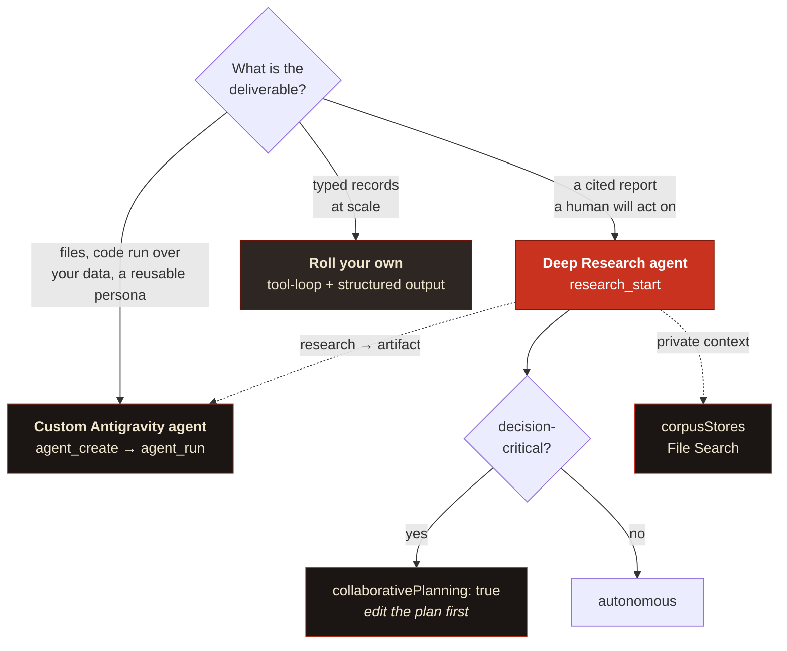

# Deep Research API vs the Managed Agents API

Google ships two things that both look like "an AI that does research for you", and they aren't variants of each other. Pick the wrong one and it costs you either a lot of money or a lot of quality. Here's the decision, made concrete.

> **First, a naming correction, including of an earlier version of this page.** There is no separate "Deep Research API". Deep Research is an *agent*; the Interactions API is the transport you invoke it through, and **both** things compared below are managed agents on that same transport. The real choice is between Google's pre-built research agent and a custom agent you build on Antigravity.

> **Preview caveat.** Both surfaces are in public preview, so model ids, pricing and field names all move. Everything below was checked against Google's docs at the time of writing; check pricing and agent ids against the live docs before you budget against them.

---

## Choosing, in one diagram



---

## The one-paragraph version

**Deep Research** is a *finished product*. One call buys you a planned, executed and synthesised report with 80-160 web searches behind it and inline citations, and you can't change how it works.

**Managed Agents** is a *harness*. One call buys you a Linux sandbox running a Gemini Flash model that'll do whatever you told it to, research included; the methodology, the search discipline and the citation rigour are now your job.

Use Deep Research when you want the report. Use a managed agent when you want files, code run over your own data, or a reusable persona that does research as one step of something longer.

---

## Side by side

| | **Deep Research** (pre-built agent) | **Antigravity** (build your own) |
|---|---|---|
| What it is | A managed, opinionated research agent | A configurable agent harness with a sandbox |
| Agent ids | `deep-research-preview-04-2026` (fast)<br>`deep-research-max-preview-04-2026` (max) | `antigravity-preview-05-2026`, plus any custom agent you create |
| Underlying model | Fixed by Google | You pick: `gemini-3.6-flash` (default), `gemini-3.5-flash`, `gemini-3.5-flash-lite` |
| Reusable config | **No.** Every call is configured from scratch | **Yes.** `agents.create` persists id, instructions, tools, environment (up to 1,000 agents) |
| Execution | **Background only.** `background: true` and `store: true` are mandatory | Synchronous by default; streaming available |
| Duration | 4-60 min (hard 60-min ceiling) | Seconds to minutes, bounded by your request timeout |
| Cost | **~$1-3 (fast), ~$3-7 (max) per task** | Token-metered; a single interaction typically 100k-3M tokens. Environment compute unbilled during preview |
| Web search | Built in, extensive, and the point of the product | Available as a tool, but depth and discipline are on you |
| Citations | Inline, first-class, and promptable | Only if you instruct it and check it |
| Filesystem | None | Full Ubuntu sandbox: Python 3.12, Node 22, persistent environments |
| File outputs | None (charts come back as base64 images) | Yes; download the environment as a tar |
| Structured output | **No** | No (extract afterwards either way) |
| Custom function calling | **No.** Remote MCP servers are the substitute | Yes, plus MCP servers |
| Skills / `AGENTS.md` | No | Yes; mounted at `.agents/`, auto-discovered |
| Credential injection | Headers on an MCP tool | Egress-proxy header transformation, never exposed inside the sandbox |
| Network restriction | Not configurable | `network.allowlist` per domain |
| Human-in-the-loop planning | **Yes.** `collaborative_planning` returns a plan to edit and approve | No equivalent |
| Multi-turn | `previous_interaction_id` | `previous_interaction_id` *and* `environment` (conversation and filesystem state are independent) |

---

## The constraint that decides most cases

**You can't currently build a custom agent on top of Deep Research.** At preview, `agents.create` accepts exactly one `base_agent`, which is `antigravity-preview-05-2026`. So the appealing idea, forking the Deep Research agent and baking in your house source discipline to reuse it, isn't on the table. A custom agent complements Deep Research; it doesn't specialise it.

That collapses the decision into a much simpler question. **Do you want Google's research loop, or your own?**

---

## Choosing

### Use the **Deep Research agent** when

- The deliverable is a **cited report someone will read and act on**: due diligence, competitive landscape, regulatory mapping, literature review, market sizing.
- **Breadth of search is the value.** 80-160 searches, planned and pursued autonomously, is genuinely hard to reproduce; approximating it badly would cost you well over $3 in engineering time and tokens.
- **Citation discipline matters**, because someone's going to be held to the numbers.
- You can **wait 5-60 minutes** and design around a background job.
- You want the **plan-review pause**. It's the highest-leverage quality step available on a research run, and only this surface has it.

### Use a **custom Antigravity agent** when

- The job **produces artifacts**, not prose: a spreadsheet, a slide deck, a PDF, a chart, a code change, a populated database.
- You need **code run over your own data** (analysis, transformation, validation) rather than web synthesis.
- The **same job runs repeatedly** and you'd rather the methodology lived in one persisted place than in every caller's prompt.
- You need **credentialed access to private APIs**, with secrets injected at the egress proxy rather than sitting in a prompt.
- You need **environment state to persist** across turns (installed packages, working files).
- **Latency and cost matter more than search depth.** Flash-class models over a handful of searches, in seconds, for a fraction of what a Deep Research task costs.

### Use **both** when

The natural pipeline is research → artifact:

1. `research_start` → Deep Research investigates and returns a cited report.
2. `research_claims` → extract the load-bearing claims as structured cards.
3. `agent_run` → a managed agent turns those into the deliverable: a model, a deck, a populated tracker, a set of tickets.

The reverse composition is real too, and it's the most interesting thing either API supports. **Deep Research accepts an `mcp_server` tool**, so a remote MCP server you control can be called *by the researcher, mid-run*. That's how a run reads your private corpus, your decision log, or your ticket history; context it could never crawl.

Dossier exposes the safer version of that idea through File Search stores (`corpusStores`), which keeps the data inside Google's retrieval layer rather than handing a live endpoint to an agent that's simultaneously reading untrusted web pages.

---

## The third option: build the loop yourself

Worth naming, because for some jobs it beats both. A hand-rolled loop, meaning a tool-calling agent with a search tool, a fetch tool and a structured-extraction step, built on the Vercel AI SDK or similar:

```ts
import { generateText, Output } from 'ai';
// … a loop: plan → search → read → extract → decide whether to continue
```

| | Roll your own |
|---|---|
| **Structured output** | **Yes.** This is the decisive advantage; neither Google surface gives you a schema-validated result, both hand you prose you have to post-process. |
| Model choice | Any provider, any model, swappable |
| Cost | You control every call; can be far cheaper *or* far more expensive |
| Search | You buy it (Brave, Exa, Tavily, SerpAPI) and you tune it |
| Quality | Entirely on you. This is the part people underestimate |
| Time to first result | Days, not minutes |

**Choose it when** you need typed results at scale (populating a database, scoring a thousand entities), when you need a specific model for compliance or cost reasons, or when the "research" is really structured extraction over a known source list rather than open-ended investigation.

**Don't choose it** to save $3 on a report. The 80-search planned investigation Deep Research does for a couple of dollars isn't something you'll match in a weekend, and a shallow imitation that returns five links and a summary is worse than useless; it looks like research.

---

## Quick reference

```
Need a cited report a human will act on?           → Deep Research API      (research_start)
Need it decision-critical?                         → …with collaborativePlanning: true
Need files, code execution, or a reusable persona? → Managed Agents API     (agent_create / agent_run)
Need typed records at scale?                       → Roll your own loop
Need private context inside the research?          → Deep Research + corpusStores (File Search)
Need research THEN an artifact?                    → Deep Research → research_claims → agent_run
```

---

## A note on Vertex AI

Worth stating plainly, because it runs against the usual assumption: for the features this server uses, **a Gemini Developer API key is a superset of Vertex**, not a subset.

| | API key | Vertex |
|---|---|---|
| Deep Research agents | Verified working | Expected to work, unverified |
| Managed Agents | Verified working | Expected to work, unverified |
| File Search (corpus grounding) | Yes | **No.** Developer API only |
| Standard models through the Interactions API | Yes | **No.** Vertex serves agents and specialised media models |
| Follow-up turns, AI titles, claim extraction | Yes | **No.** They need standard models |
| VPC-SC, CMEK, data residency, IAM | No | Yes |

Google's own migration guidance says most developers should use the Developer API unless they need specific enterprise controls, and for this workload that reads as sound. Choose Vertex when compliance requires it, and expect to lose corpus grounding and every follow-up feature when you do.

## Sources

- [Gemini API: Deep Research](https://ai.google.dev/gemini-api/docs/deep-research)
- [Gemini API: Managed agents overview](https://ai.google.dev/gemini-api/docs/agents)
- [Gemini API: Building managed agents](https://ai.google.dev/gemini-api/docs/custom-agents)
- [Gemini API: Managed agents quickstart](https://ai.google.dev/gemini-api/docs/managed-agents-quickstart)
- [Gemini API: Interactions API](https://ai.google.dev/gemini-api/docs/interactions-overview)
