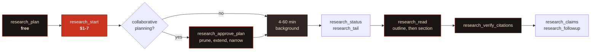

# How it works

Why the server behaves as it does: what it decides for you, what it deliberately does not, and how a research brief actually gets built.

---

## The shape of a session



`research_start` hands you a **handle** in about a second. Everything after it is optional, resumable, and survives you closing the laptop.

---

---

## How it picks what to run

Two decisions get made for you unless you override them. Both are worth understanding, because one costs money and the other costs quality.

### The tier: `fast` or `max`

**It does not choose.** `tier` defaults to `fast` and nothing infers it, deliberately. An automatic escalation to `max` is a silent decision to spend $3-7 instead of $1-3, and a server that quietly triples your bill because it judged a question "complex" is not one you can leave an agent alone with.

So the choice is yours, and `research_plan` exists to make it an informed one: it shows the band and your remaining budget before anything is spent.

| Use `fast` | Use `max` |
|---|---|
| A scoped question with a handful of sub-questions | Breadth genuinely needs ~160 searches rather than ~80 |
| You will read it today | A decision you will be held to |
| The default, and right most of the time | Roughly double the cost and up to triple the wall-clock |

The `research-triage` prompt walks the prior question, which is whether it warrants a run at all. Most questions do not: if a single model call or one web search answers it, that is the correct tool.

### The archetype: how the brief gets written

This one **is** automatic, because it changes the prompt rather than the price. Five archetypes, each a self-contained override set applied to the pseudo-XML scaffold. Exactly one is applied; they are never blended.

Selection is keyword scoring over your question, and the counts are what decide it, not a model call. Ties and no-match fall to `competitive`, because its overrides are the broadest and the cost of guessing it wrong is mild (some extra sentiment mining) where guessing `regulatory` wrong puts a legal disclaimer on a technical report.

| Archetype | Triggered by | What it changes |
|---|---|---|
| `technical` | api, architecture, latency, benchmark, sdk, throughput, runtime | Prioritises official docs, repos, published benchmarks. Demands exact latency figures, schemas and rate limits verbatim. Requires a comparison table |
| `competitive` | market, pricing, positioning, gtm, rival, landscape, churn | Prioritises filed financials and organic customer sentiment. Adds pain-point mining and demands two named underserved gaps |
| `regulatory` | regulation, compliance, disclosure, jurisdiction, statute, enforcement | Prioritises primary legal texts and regulator publications. Tags every finding `<ENACTED>`/`<PENDING>`/`<GUIDANCE>`/`<PROPOSED>`. Appends a not-legal-advice notice |
| `academic` | peer-reviewed, methodology, p-value, sample size, systematic review | Prioritises journals and proceedings. Demands methodology, sample size and effect sizes per study, not just abstracts |
| `forecasting` | forecast, outlook, projection, scenario, capex, five-year | Demands underlying drivers over surface trends, and divergent scenarios with named break conditions |

Pass `archetype` explicitly to override. `research_plan` tells you which one it picked and shows the prompt it produced, so you can check before spending.

> [!TIP]
> If your question spans two archetypes, that is a **decomposition signal, not a reason to widen the prompt**. A run trying to satisfy both competitive and regulatory analysis satisfies neither. Split it into separate runs sharing a role and context but varying the core directive, then synthesise.

---

---

## The utility model

Deep Research returns prose and offers no structured output, so anything typed has to be extracted afterwards. A second, much cheaper model does that work: titles and summaries when a run lands, `research_claims`, and the fallback path in `research_followup`.

It is a rounding error next to the research itself. A run is $1-7; these calls are fractions of a cent each. **`DOSSIER_UTILITY_MODEL` is about latency, quality and availability, not cost.**

Default: `gemini-3.1-pro-preview`.

| Model | Why you would pick it |
|---|---|
| `gemini-3.1-pro-preview` *(default)* | Best extraction quality of the practical options. Claim cards keep the report's own confidence qualifiers instead of drifting, and summaries stay specific rather than generic. Slowest and dearest of these, which does not matter at this volume |
| `gemini-3.6-flash` | Newest Flash. Noticeably faster; good when you extract claims in bulk or want a title the instant a run completes. Slightly likelier to smooth a hedged claim into a confident one, which matters because these cards get passed to other agents |
| `gemini-3.5-flash` | The stable Flash, no preview label. Reach for it if you would rather not depend on a preview model for a production path |
| `gemini-3.1-flash-lite-preview` / `gemini-3.5-flash-lite` | Cheapest and fastest. Fine for titles and summaries; I would not use it for `research_claims`, where the job is to copy confidence levels faithfully rather than paraphrase |
| `gemini-3-pro-preview` | The prior Pro. Useful only if you have measured something you dislike about 3.1 |

Check what your key can actually reach, since availability varies by project and tier:

```bash
curl -s "https://generativelanguage.googleapis.com/v1beta/models?pageSize=200" \
  -H "x-goog-api-key: $GEMINI_API_KEY" | grep -o '"name": "models/[^"]*"'
```

> [!NOTE]
> The utility model is **not** the researcher. It never runs the investigation and it cannot change what the report says; it only reads a finished report and extracts from it. Changing it will not make research better or worse, only the titles, summaries and claim cards.
>
> It is also Developer-API only. On Vertex there is no utility model, so titles, summaries and `research_claims` are unavailable there.

---

---

## The bundled skill

[`skills/deep-research-prompt-creator/`](../skills/deep-research-prompt-creator/) is a Claude Code skill that turns a vague research need into an engineered Gemini Deep Research prompt: pseudo-XML scaffolding, five archetype override sets, epistemic bounding tags, an inline citation protocol, and the Operator Notes that wrap around the run.

```bash
cp -r skills/deep-research-prompt-creator ~/.claude/skills/
```

**The skill and the server compose.** With the server connected, the skill hands its prompt straight over instead of printing it for you to paste. The server spots an already-engineered brief and sends it **verbatim**; it won't re-wrap it, because two `<role>` blocks and two competing `<output_format>` sections is precisely the over-specification failure the scaffold exists to prevent.

Detection fires on a `<core_directive>` tag, or on any two structural tags together. So it works with a prompt from the skill, from another tool, or one you wrote by hand.

```jsonc
research_start {
  "question": "<role>…</role>\n\n<core_directive>…</core_directive>\n\n<output_format>…</output_format>"
}
// "your brief was already engineered, it will be sent verbatim"
```

You can get the same framework three other ways without installing anything: the `deep-research-brief` MCP prompt, the automatic scaffolding inside `research_plan`, or the `buildPrompt()` export.

---

---

## A real session

This is verbatim output from a live `fast`-tier run, trimmed for length.

```jsonc
// 1. Free. See exactly what you're about to buy.
research_plan {
  "question": "Which open-source vector databases support scalar and binary quantization, and what memory footprint do their own docs report at 10 million vectors?",
  "tier": "fast",
  "scope": { "decisionContext": "pick a self-hosted store for a small team" }
}
```

```text
Archetype: technical
Estimated cost: $1.00-$3.00, ~80 searches, ~250k input tokens…
Estimated duration: 4-20 minutes, background.
Budget: $0.00 committed of $10.00 in the last 24h; $10.00 remaining.
Contract fingerprint: dbc239386807d76bf5573328dd926baf
```

```jsonc
// 2. This one spends money. Returns in ~1s with a handle. Don't block on it.
research_start { /* …same args… */ "contractFingerprint": "dbc239386807d76bf5573328dd926baf" }
```

```text
Run started. Handle: dr_4dea031ff91d84fc
Committed against your budget: ~$2.00 (band $1.00-$3.00)

# call it again with identical args and you get:
De-duplicated onto an existing run, nothing new was charged.
```

```jsonc
// 3. Later. A DIFFERENT server process polled this one; the process that
//    started it was killed immediately after step 2.
research_status { "runId": "dr_4dea031ff91d84fc" }   // completed, 30 cited sources

// 4. Outline first, always. ~8,000 tokens of report, surveyed in ~200.
research_read { "runId": "dr_4dea031ff91d84fc" }
```

```text
Report outline: 19 sections, ~8070 estimated tokens total.
  1. Open-Source Vector Database Memory Economics…   (~25 tok)
  2.   Executive Summary                             (~642 tok)
  4.     Primary: Which databases support…           (~566 tok)
  5.       Qdrant                                    (~583 tok)
  6.       Milvus                                    (~458 tok)
 16.   Evidence Table                                (~539 tok)
 17.   Knowledge Gaps                                (~352 tok)
```

```jsonc
research_read { "runId": "dr_4dea031ff91d84fc", "mode": "section", "section": "Executive Summary" }
```

```text
(High Confidence) Qdrant's official capacity planning documentation provides
explicit mathematical formulas indicating that 10 million 1,024-dimensional
float32 vectors require 57.2 GB of active RAM. Scalar quantization reduces
this by a factor of 4 (~14.3 GB); binary by a factor of 32 (~1.8 GB).
```

```jsonc
// 5. Before anyone acts on it.
research_verify_citations { "runId": "dr_4dea031ff91d84fc" }
```

```text
Citation scorecard: PARTIAL, 25/30 resolved (83%).
  live 25 · not_found 0 · blocked 5 · unreachable 0 · invalid 0
  - blocked (403) https://medium.com/@…   paywalled or bot-blocked
  - blocked       https://milvus.io/docs/overview.md
    server redirects this URL to itself, typically a bot deterrent;
    the source is probably fine, open it in a browser to confirm
```

---
