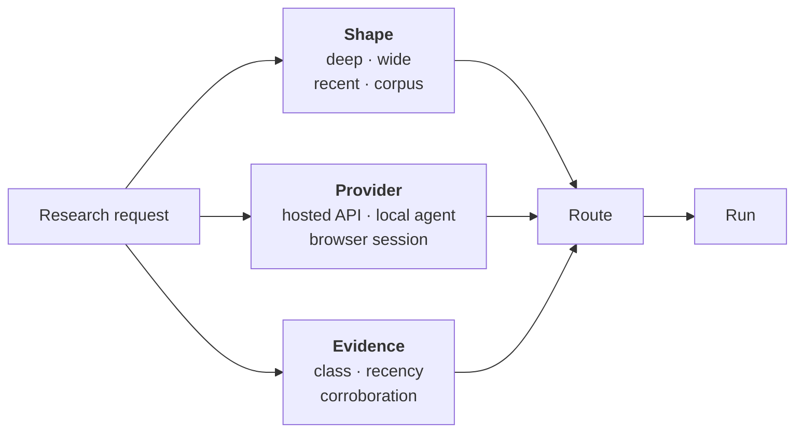
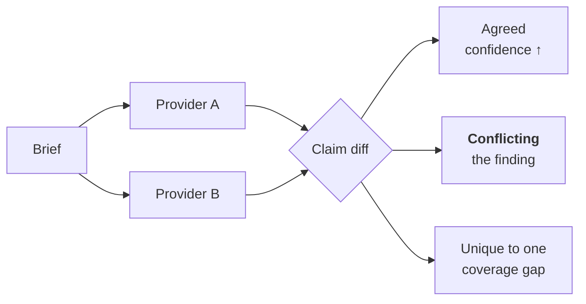
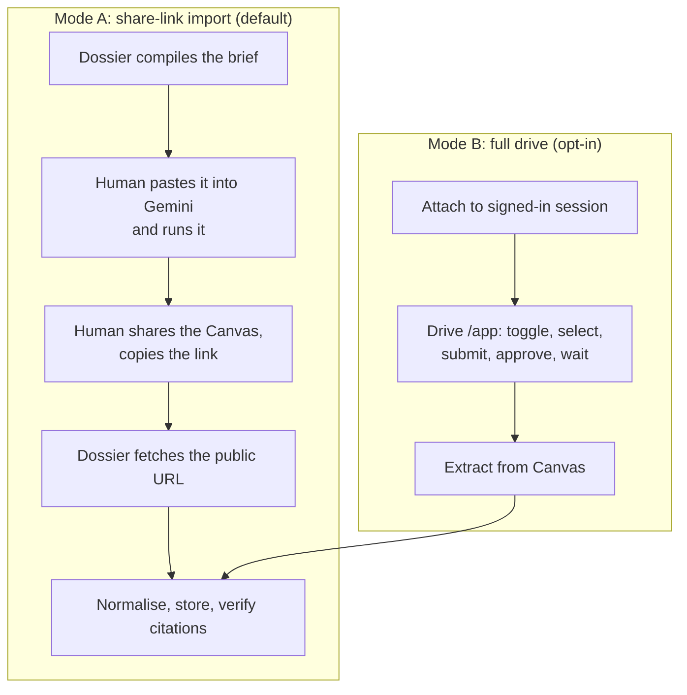

<div align="center">

# Dossier: the multi-provider research plan

**One MCP server, every research backend you have access to,<br>and an opinion about which one to use.**

<sub>Status: plan · Written 25 July 2026 · Supersedes nothing, extends everything</sub>

</div>

---

> [!NOTE]
> **What has landed since this was written** (25 July 2026, same day; recorded here rather than by editing the design above, so the plan stays a record of what was intended).
>
> Shipped on `main`: the provider abstraction and registry, all four API-key backends, capability-first routing, `research_doctor`, the three shapes (`research_wide`, `research_recent`, `research_compare`), cross-backend corroboration counted in independent domains, `research_verify_claims`, `research_counter_review`, `research_evidence` (source classes, advisory floors, citation registry, search trace), follow-ups answered from the registry and marked synthesised, and the local corpus that never leaves the machine.
>
> Also shipped since: CLI-agent integration ([§8d](#8d-cli-agents-and-subscriptions)) as identity-checked detection in `research_doctor` plus a `local` subprocess provider, and the share-link path ([§8c](#8c-the-gemini-web-deep-research-flow) Mode A) as `research_import` with the `gemini-web-session` prompt.
>
> The agent loop ([§8a](#8a-the-local-agent-loop)) shipped too, in a shape the plan half-anticipated: **the host searches, the server enforces.** `research_local_start` decomposes into per-source-class tasks, `_note` builds one deduplicated registry, `_draft` freezes it, and `_submit` refuses a draft that cites anything outside it. Dossier has no web search to run the fan-out itself, but the registry rule is the part that could never have lived in a client-side skill anyway.
>
> Not built: Mode B browser automation ([§8b](#8b-browser-sessions)), for a reason the plan did not anticipate: **Dossier has no browser and cannot drive the host's.** Every driver in the §8b table is a capability of the client, so the portable form is method, and the `gemini-web-session` prompt is where it lives. That also leaves the terms-of-service decision with the person whose account is exposed.
>
> **Every backend has now made a real call through this code** (25 July 2026): Perplexity ran a full deep-research job, OpenAI and xAI created, polled and parsed real runs, and the local CLI path was driven against both Claude Code and Grok Build. Doing that found four defects no hermetic test could have: Perplexity returns `COMPLETED` in upper case against its own documentation, so a finished run polled forever and its paid-for report was never stored; Perplexity, OpenAI and xAI all return their citations out of band, so cited reports were stored as uncited; and xAI accepts `deferred: true` and ignores it, so its runs are synchronous rather than durable.
>
> An adversarial review at max effort then found a critical spend defect: `retry.ts` stated the rule that a paid call is never retried, named the mechanism, and that mechanism was never written, so every provider retried its paid POST four times. Shipped in 0.3.0 with that and 26 other findings closed.
>
> One deliberate departure from [§13](#13-tool-surface): the local corpus ships as `corpus_local_list` and `corpus_local_search` with directories granted by the operator through `DOSSIER_LOCAL_CORPUS_DIRS`, and there is **no** tool that registers one. A file reader an agent can point anywhere is an exfiltration primitive, and the agent is the caller most likely to have just read something hostile.

## Contents

| | |
|---|---|
| **[1. What this changes](#1-what-this-changes)** | The problem with being a Gemini wrapper |
| **[2. The three axes](#2-the-three-axes)** | Provider, shape, evidence |
| **[3. Provider capability model](#3-provider-capability-model)** | The interface every backend implements |
| **[4. Detection and the doctor](#4-detection-and-the-doctor)** | Zero-config discovery, four-state audit |
| **[5. The routing matrix](#5-the-routing-matrix)** | Which backend for which job, with the evidence |
| **[6. Combining providers](#6-combining-providers)** | Four combinators, and the corroboration trap |
| **[7. Research shapes](#7-research-shapes)** | Deep, wide, recent, corpus |
| **[8. Local research](#8-local-research)** | Browser sessions, CLI agents, subscriptions |
| **[9. Processing-model routing](#9-processing-model-routing)** | Which model reads the output |
| **[10. Time windows](#10-time-windows)** | Beyond thirty days |
| **[11. Evidence governance](#11-evidence-governance)** | Source classes, gates, counter-review |
| **[12. Budget across providers](#12-budget-across-providers)** | One ledger, many currencies |
| **[13. Tool surface](#13-tool-surface)** | What changes for the caller |
| **[14. Config surface](#14-config-surface)** | Every environment variable |
| **[15. Phasing](#15-phasing)** | What ships when |
| **[16. Risks](#16-risks-and-open-questions)** | Named honestly |
| **[Appendix A: evidence](#appendix-a-the-evidence-base)** | Benchmarks, with dates |
| **[Appendix B: prior art](#appendix-b-prior-art-absorbed)** | What we took from where |

---

## 1. What this changes

Dossier is a good Gemini Deep Research client. The durability, the spend gate, the outline-first reading discipline, the citation verification: all of that is provider-neutral infrastructure that happens to have exactly one provider plugged into it.

That's the problem. The infrastructure is the valuable part and it's currently locked to one backend, which means Dossier inherits every one of that backend's weaknesses with no way out. Gemini can't filter by date. It can't search X. It can't enumerate seventy companies into a JSONL file. It has no idea what Reddit thinks. And if Google's API is down, or your key runs out, or the answer just needs a different kind of search, Dossier has nothing to offer.

Meanwhile the honest reading of the 2026 benchmark data is that **no single backend wins**. On AIMultiple's April 2026 agent bench, a plain CLI agent with web search tied the best deep-research API for accuracy at a seventh of the cost. On their DR-50 bench, Perplexity's Sonar Deep Research led. On their table-extraction task, Perplexity scored **zero**, because it returned prose when a table was asked for. Gemini won data accuracy and lost on speed. OpenAI's o3-deep-research came last on accuracy at the highest price, and has since been retired outright: both dedicated deep-research models reached end of access on 23 July 2026, replaced by `gpt-5.6-sol`.

There is no best tool. There is only a best tool *for this question, at this budget, with the keys you happen to have*. That judgement is the product.

So: **Dossier becomes a router with a spine.** The spine is what already exists (durable runs, worst-case spend reservation, outline-first reads, SSRF-safe citation checks, corpus grounding). The router picks backends, sometimes several, and combines them in ways that are defensible rather than just averaged.

> [!NOTE]
> This plan does not deprecate the Gemini path. Gemini stays the default when its key is present, because it's the only backend offering an editable research plan before spending, which remains the single highest-leverage control a user has over output quality.

---

## 2. The three axes

Every research request lands somewhere in a three-dimensional space. Getting the vocabulary right first makes the rest of the design fall out.



### Axis 1: shape

What kind of artefact does the question want?

| Shape | The question sounds like | Artefact |
|---|---|---|
| **Deep** | "Explain X, with evidence" | One cited narrative report |
| **Wide** | "Find every X and cite each one" | A matrix: N entities × M fields |
| **Recent** | "What are people saying about X" | Ranked, dated, engagement-weighted evidence |
| **Corpus** | "What do *our* docs say vs the web" | Contradictions, explicitly |

This axis is under-served everywhere. Almost every tool assumes **deep** and produces an essay. But three independent sources converged on **wide** being a distinct first-class shape: Perplexity built a whole preset and a benchmark for it (WANDR), the `Deep-Research-skills` project structures its entire workflow as items × fields, and Paperguide's narrative-review workflow is an extraction matrix with per-cell source links. When someone asks "which vector databases support binary quantization and what memory do they claim", they want a table, and a beautifully written essay is a failure.

### Axis 2: provider

Where does the work physically happen?

- **Hosted research API** (Gemini, Perplexity, OpenAI, xAI): you pay per run, it happens on their infrastructure, you get a job id.
- **Local agent loop** (Claude Code, Codex, Gemini CLI, or Dossier's own loop): search and fetch happen from your machine or your existing subscription; you control every step.
- **Browser session** (agent-browser, Playwright, a Chrome/Safari MCP): you drive a signed-in web UI. Slow and brittle, but it's the only way to spend a *subscription* instead of an API balance, and the only way to reach content that's behind your own login.

### Axis 3: evidence

Not all findings are equal, and the plan treats this as structure rather than vibes. Borrowed largely from the `daymade/deep-research` skill, which has the sharpest thinking on this that I found:

- **Accessibility class**: `public` · `semi-public` · `exclusive-user-provided` · `private-user-owned`
- **Source type**: `official` · `academic` · `journalism` · `secondary-industry` · `community` · `other`
- **Recency**: publication date attached to every citation, with decay rules
- **Corroboration**: how many *independent* sources support this, where independence is measured properly (see [§6](#the-corroboration-trap))

---

## 3. Provider capability model

Every backend implements one interface. The capability record is not documentation; it's the input to routing and to honest degradation. Dossier already does this well for Vertex via `backendLimitations()`, and this generalises that idea.

```ts
export interface ResearchProvider {
  readonly id: ProviderId;               // 'gemini' | 'perplexity' | 'openai' | 'xai' | 'local' | 'browser'
  readonly capabilities: Capabilities;

  /** Credentials present and shaped correctly? Never a network call. */
  detect(env: Env): CredentialStatus;

  /** Cheap, offline, and always a band. Feeds the spend gate. */
  estimate(brief: Brief): CostBand;

  start(brief: Brief): Promise<RunHandle>;
  poll(handle: RunHandle): Promise<Snapshot>;
  cancel(handle: RunHandle): Promise<void>;
}

export interface Capabilities {
  readonly shapes: readonly Shape[];        // which of deep/wide/recent/corpus
  readonly background: boolean;             // survives client disconnect
  readonly planReview: boolean;             // editable plan before spending
  readonly followUp: boolean;               // question a finished report for free
  readonly dateFilter: DateFilterKind;      // 'none' | 'recency-bucket' | 'range'
  readonly domainFilter: number;            // 0 = unsupported, else max domains
  readonly corpus: CorpusKind;              // 'none' | 'file-search' | 'vector-store' | 'collections'
  readonly socialSources: readonly SocialSource[];   // 'x' | 'reddit' | ...
  readonly structuredOutput: boolean;       // can it be forced into a schema
  readonly fileOutput: boolean;             // can it write results to a file
  readonly citationShape: CitationShape;    // 'annotations' | 'url-list' | 'uri-scheme'
  readonly maxWallClockMinutes: number;
}
```

### The capability matrix as it stands today

| | Gemini | Perplexity | OpenAI | xAI | Local agent | Browser |
|---|:-:|:-:|:-:|:-:|:-:|:-:|
| **Deep shape** | ✅ | ✅ | ✅ | ✅ | ✅ | ✅ |
| **Wide shape** | ⚠️ prompt | ✅ native | ⚠️ prompt | ⚠️ prompt | ✅ orchestrated | ❌ |
| **Recent shape** | ❌ | ✅ | ❌ | ✅ best | ✅ | ❌ |
| **Corpus** | ✅ File Search | ❌ | ✅ vector stores | ✅ collections | ✅ local files | ❌ |
| **Background job** | ✅ | ✅ | ✅ | ⚠️ deferred, 24h | n/a | n/a |
| **Editable plan** | ✅ **only one** | ❌ | ❌ | ❌ | ✅ you write it | ✅ manual |
| **Free follow-up** | ✅ | ✅ via state | ✅ via id | ✅ | ✅ | ✅ |
| **Editable plan mid-run** | ❌ | ❌ | ❌ | ❌ | ✅ | ✅ |
| **Date range filter** | ❌ | ✅ bucket + range | ❌ | ✅ from/to | ✅ | ❌ |
| **Domain allow-list** | ❌ | ✅ max 20 | ✅ max 100 | ✅ max 5 | ✅ | ❌ |
| **X / Twitter** | ❌ | ❌ | ❌ | ✅ **only one** | ⚠️ scrape | ✅ |
| **Structured output** | ⚠️ prompt | ✅ file | ✅ on `gpt-5.6` | ✅ | ✅ | ❌ |
| **Writes files** | ❌ | ✅ sandbox | ✅ code interp | ✅ code exec | ✅ | ❌ |

> [!IMPORTANT]
> Two entries in that table are the whole argument for multi-provider. **Only Gemini has an editable plan.** **Only xAI can search X.** Neither is a matter of degree; if you need one, no amount of budget on another provider substitutes.

And one is a trap. Those constraints applied to the **retired** `o3-deep-research` models; `gpt-5.6-sol` supports structured outputs and function calling, so a capability matrix copied from the deep-research guide is already wrong. This is why capabilities must attach to provider **plus model**, never to a provider-wide boolean. Perplexity's format compliance is measurably weak: it scored zero on AIMultiple's table task by returning prose.

---

## 4. Detection and the doctor

### Zero config, then progressive disclosure

Dossier already starts with no credentials and serves read-only tools. That property extends: the server starts, detects which keys are present, and **says what it can and cannot do** rather than failing at call time. This is the existing `backendLimitations()` discipline applied per provider.

Detection is pure and offline. A key's presence and shape is checked; no network call is made at startup, because a slow or failing provider must not delay the server coming up.

```
GEMINI_API_KEY / GOOGLE_API_KEY   →  gemini    (deep, corpus, plan review)
VERTEX_PROJECT                    →  gemini    (deep only; loses File Search, follow-ups, summaries)
PERPLEXITY_API_KEY                →  perplexity (deep, wide, recent, filters)
OPENAI_API_KEY                    →  openai    (deep, vector-store corpus, MCP data sources)
XAI_API_KEY                       →  xai       (deep, X search, collections)
ANTHROPIC_API_KEY                 →  utility model only
(none of the above)               →  local     (agent loop over host web search)
```

The `local` provider is always available, which matters: **Dossier is useful with zero API keys.** That is a deliberate product decision, not a fallback. See [§8](#8-local-research).

### `research_doctor`

A new tool, lifted straight from `last30days`, whose four-state audit is the best version of this idea I've seen. One command answers "what could be on, what's turned on, what's working, and what isn't":

| State | Meaning | Example line |
|---|---|---|
| ✅ **WORKING** | Verified this session | `perplexity: key valid, wide-research available` |
| 🟡 **CONFIGURED, UNVERIFIED** | Key present, not yet exercised | `xai: XAI_API_KEY set, no call made yet` |
| ❌ **NOT WORKING** | Present but failing, with the fix | `openai: 401. Key revoked or wrong project.` |
| ⚪ **COULD BE ON** | Absent, with what it would unlock | `xai: set XAI_API_KEY to search X. See docs/providers/xai.md` |

The "could be on" state is the one that earns its place. A user with only a Gemini key has no idea they're missing X search until something tells them, and a tool that silently omits a capability reads as "we covered everything" when it didn't.

`research_doctor --verify` makes one cheap real call per provider to promote 🟡 to ✅ or ❌. It costs a fraction of a cent and is never run automatically.

---

## 5. The routing matrix

This is the part users actually want: given a question, which backend?

Routing is **advisory by default and always overridable**. `research_plan` returns the chosen route and the reasoning; `research_start` accepts an explicit `provider` that skips routing entirely. Dossier never silently upgrades to a more expensive backend, for the same reason it never silently upgrades from `fast` to `max` today.

### The matrix

| The job | Route | Why | Evidence |
|---|---|---|---|
| One big question, you want to steer it | **Gemini** `fast` | Only editable pre-spend plan | Capability |
| Same, high stakes, budget available | **Gemini** `max` + counter-review | Plan review plus adversarial pass | [§11](#11-evidence-governance) |
| "Find every X, cite each" | **Perplexity** `wide-research` | Only native wide mode; writes JSONL | Perplexity WANDR docs |
| Factual multi-hop, cost matters | **Local agent** | 97.0% accuracy at $1.54, fastest | AIMultiple Apr 2026 |
| Must produce a strict table/schema | **Local agent** or **Perplexity wide** | Deep-research APIs can't be schema-forced | OpenAI: no structured outputs |
| Academic / primary literature | **OpenAI** `gpt-5.6-sol` + web search | Strongest academic DB integration | Xu & Peng §3.2.1 |
| Same, cost-sensitive | **OpenAI** `gpt-5.6-terra` or `-luna` | Same tools, a third to a fifth of the price | Provider pricing |
| "What's being said right now" | **xAI** `x_search` + **Perplexity** `recency` | Only routes to X; only date buckets | Capability |
| Needs a specific date window | **Perplexity** or **xAI** | Gemini has no date filter at all | Capability |
| Must exclude SEO aggregators | **OpenAI** (100 domains) or **Perplexity** (20) | Widest allow-list wins; xAI caps at 5 | Provider docs |
| Your private docs vs the public web | **Gemini** File Search | Existing, verified, produces contradictions | Dossier today |
| Behind your own login / paywall | **Browser session** | Nothing else can reach it | [§8](#8-local-research) |
| You have a subscription, not a key | **Browser session** or **CLI agent** | Spends the sub, not an API balance | [§8](#8-local-research) |

### The tie-breaks

When more than one route qualifies, in order:

1. **Capability**, always. A hard requirement (date range, X, editable plan, a real table) eliminates providers outright. This runs first because no amount of cheapness makes an incapable provider correct.
2. **Cost**, using the reserved worst case, not the midpoint.
3. **Measured accuracy** on the closest matching benchmark, with the date shown, because this evidence rots fast **and is thinner than it looks**. Per the Xu & Peng survey there is no literature-review benchmark, no methodology-assessment benchmark, and no evidence that any deep-research system has been formally evaluated on TREC. Published scores are general-reasoning benchmarks standing in for research quality. Treat this tie-break as weak evidence, and never let it override capability.
4. **Diversity**, if a second run is being commissioned for corroboration: prefer a provider that reads different sources.

### What routing will not do

- It will not pick `max` tier or a premium model on its own judgement.
- It will not fan out to three providers because the question "seemed important". Fan-out is explicit, costed, and confirmed.
- It will not hide the choice. Every route comes with one sentence of reasoning and the runner-up.

---

## 6. Combining providers

Running two backends is easy. Combining them honestly is the hard part, and it's where most multi-source tools quietly cheat.

### The four combinators

**1. Corroborate.** Same brief, two providers, diff the claim sets.



The conflicts are the output. Two well-resourced research agents disagreeing about a number tells you where the uncertainty actually sits, and it's exactly the thing a single-provider tool can never show you.

**2. Relay.** Cheap wide pass enumerates candidates, expensive deep pass investigates the top K. Perplexity `wide-research` finds seventy companies; Gemini investigates the six that matter. This is the highest-value combinator by cost efficiency, because it spends deep-research money only where a shallow pass has already shown there's something to find.

**3. Adversarial.** Provider A writes; provider B is asked to refute it. Prompted to *refute*, not to "review", because a reviewer with no stake agrees with plausible prose. Directly from the `daymade` skill's mandatory counter-review, which requires at least three issues be raised and splits the job across four lenses: claim validation, source diversity, recency, contradiction.

**4. Union with provenance.** Merge results but never anonymise them. Every claim keeps `{provider, url, retrievedAt, sourceType}`. A merged report where you can't tell which backend produced which claim is worse than two separate reports, because it launders a weak finding into a strong-looking one.

### The corroboration trap

> [!CAUTION]
> **Cross-provider agreement is not independent evidence if both providers read the same page.**

This is the single most important correctness rule in the whole plan, and it's easy to get wrong in a way that looks fine. Three deep-research agents all citing the same vendor press release is *one* source with three wrappers, and a naive "3 of 3 providers agree" confidence score is actively misleading.

So corroboration is counted **after** deduplication, at two levels:

- **URL level**: exact and canonicalised (strip tracking params, resolve redirects, unify `www`).
- **Domain level**: two claims from `example.com/a` and `example.com/b` count as one corroborating *domain*, and the report says so.

The confidence rule, adapted from `last30days`' Confidence floor:

| Support | Verdict |
|---|---|
| ≥2 independent **domains**, at least one `official` or `academic` | **corroborated** |
| ≥2 independent domains, all `community` or `secondary` | **weakly supported** |
| 1 domain, `official` | **single-source, authoritative** |
| 1 domain, anything else | **single-source, unverified** |
| 0 resolvable sources | **unsupported**, never presented as a finding |

And the honest empty outcome, which `last30days` calls **Nothing-solid**: when no claim clears the floor, the report says so and names the closest sub-floor candidate. Reporting weak findings because a run cost money is the failure this exists to prevent.

---

## 7. Research shapes

### Deep (exists today)

One question, one cited narrative report. Dossier's current behaviour: brief → optional plan review → background run → outline-first read. No change beyond gaining alternative backends.

### Wide (new)

A matrix. The user names entities (or asks the tool to discover them) and names fields; every cell is filled with a value, a source, and a confidence marker.

```yaml
topic: Open-source vector databases with binary quantization
entities:                      # discovered, or user-supplied
  - Qdrant
  - Milvus
  - Weaviate
fields:
  - name: binary_quantization_supported
    detail: brief
  - name: claimed_memory_10m_vectors
    detail: moderate
  - name: source_of_claim
    detail: brief
window: 1y
```

Three implementation routes, chosen by capability:

| Route | When | Mechanics |
|---|---|---|
| **Perplexity native** | `PERPLEXITY_API_KEY` present | `preset: wide-research`, `background: true`, results downloaded from the sandbox as JSONL |
| **Orchestrated local** | No Perplexity key | One agent per entity batch, parallel, each writing a validated JSON file |
| **Deep-provider prompt** | Fallback | Ask a deep provider for a table; verify the shape, and say plainly it wasn't schema-enforced |

The orchestrated route is `Deep-Research-skills`' design, and three of its details are worth keeping verbatim:

- **`[uncertain]` markers per cell**, plus an `uncertain[]` array listing every field the run wasn't sure about. Per-cell epistemic marking is far more useful than a whole-report confidence line.
- **Schema validation as a completion gate.** The run isn't done until every declared field is present. Silent omission is the failure mode this catches.
- **Resume by skipping completed files**, which composes perfectly with Dossier's existing durable store.

### Recent (new)

Time-boxed, engagement-weighted, multi-source. This is `last30days`' territory and the design borrows heavily, generalised past thirty days ([§10](#10-time-windows)).

Sources by availability: xAI `x_search` for X; Perplexity with `recency_filter` for the indexed web; host web search and RSS for the keyless floor. The concepts worth importing wholesale:

- **Entity grounding**: check the candidate actually mentions the primary entity before ranking it. Deliberately conservative, because its failure mode must degrade toward "no penalty", never toward burying on-topic signal.
- **Junk shape**: a leading item that reads as a help-me question rather than a story gets classified and loses its single-source bypass.
- **Nothing-solid**: covered above.
- **Prediction markets as a source.** Polymarket odds are people betting real money on an outcome, which is a genuinely different evidence class from commentary and deserves its own row in a report.

### Corpus (exists today, generalising)

Your documents alongside the public web, with disagreement called out explicitly. Currently Gemini File Search only. Extends to OpenAI vector stores and xAI collections, with one rule preserved: the corpus block goes **inside** the prompt scaffold, before the final directive re-anchor. Placing it after was a real bug that made grounding invisible, and it's in the test suite now.

New: a **local corpus** that never leaves the machine, taking `last30days`' privacy model. Files are read locally, matched locally, and never forwarded to any provider or reranker. Matches appear in a badged "from your files" section. When a local corpus is configured, provider-side routing that would forward file-derived text is bypassed rather than silently disabled.

---

## 8. Local research

Everything so far costs money per run. This section is about the paths that don't, and they matter more than they look: they're what makes Dossier usable by someone who has a ChatGPT subscription and no intention of setting up API billing.

### 8a. The local agent loop

Dossier orchestrates search-and-fetch itself, using whatever web search the host session already has. No research API is called; the calling agent's own capability does the work.

The AIMultiple April 2026 result makes this more than a consolation prize. **Claude Code, driving plain web search with no MCP tools, scored 97.0% at $1.54 and was the fastest tool tested**, tying the best deep-research API and beating every other one. Codex hit 93.9% at $1.30. The premium deep-research API in that test scored 75.8% at $10.92.

So the local loop is not the cheap tier. On factual multi-hop questions it's the *good* tier, and it happens to be cheap. Where hosted deep research genuinely wins is breadth of sources read per run and long uninterrupted investigation, which is a real advantage on open-ended questions and not much of one on "find these five facts".

Structure, taken from `Deep-Research-skills` and `daymade`:

1. **Plan**: decompose into tasks, each with an expert role, an objective, explicit queries, and a depth (`DEEP` reads pages, `SCAN` reads results).
2. **Dispatch**: parallel workers, capped, each writing findings to a notes file rather than returning prose to the coordinator. This keeps raw search results out of the orchestrating context, which is the difference between a loop that finishes and one that runs out of room.
3. **Registry**: merge and deduplicate by URL, number sequentially, tag type and date, apply the [§11](#11-evidence-governance) gates, and **list what was dropped**.
4. **Draft from notes only.** No new sources at drafting time.
5. **Counter-review**, mandatory.
6. **Verify**: every citation checked against the registry, a sample of claims spot-checked, no dropped source resurrected.

Source-class routing modules, also from `Deep-Research-skills`: GitHub issues, Stack Overflow, academic databases, general web, and regional communities each get a different query strategy. Searching arXiv the way you search Stack Overflow finds nothing.

### 8b. Browser sessions

Three things only a browser can do:

1. Reach content behind **your** login or a UA-hostile paywall.
2. Spend a **subscription** rather than an API balance.
3. Use a web-only feature with no API surface.

Available drivers, with the property that actually matters (can it reach a page behind an existing Google login without anyone typing a password into an agent?):

| Driver | Reaches an existing Google login | One-time manual setup |
|---|---|---|
| **Claude in Chrome** | ✅ by default, shares the browser's login state | Install extension, `claude --chrome` |
| **chrome-devtools-mcp** `--autoConnect` | ✅ Chrome 144+ | Approve once at `chrome://inspect/#remote-debugging` |
| **Playwright MCP** `--extension` | ✅ | Install the Playwright extension, pick the tab |
| **chrome-devtools-mcp** default / `--browserUrl` | ❌ | `--remote-debugging-port` forces a non-default `--user-data-dir`, so your logins aren't there |
| **agent-browser** | ❌ own profile, persist via `state save` | `npm i -g agent-browser` |
| **Safari MCP** (Apple, `safaridriver --mcp`) | ❌ isolated automation window | Safari 27 beta or STP 247+; enable remote automation |

> [!CAUTION]
> **The isolated-profile options are not merely inconvenient for Google, they don't work.** Google actively blocks sign-in from browsers flagged as automated, which is the stated reason `--autoConnect` exists at all. Logging in manually inside an automation window will most likely fail too. For anything Google-authenticated, only the three attach-to-existing-session drivers are viable.

Apple's Safari MCP is real and official (announced on the WebKit blog, 1 July 2026; a `--mcp` flag on `safaridriver`, 17 tools). It is not useful for this particular job, because its automation windows are isolated from normal browsing, with no access to AutoFill or session state. It's a web-developer tool, not a way to spend your subscription. Worth supporting for general local research; not for signed-in work.

> [!WARNING]
> **Dossier will never type a password.** Sign-in is always a manual, one-time, human action; Dossier attaches to a session that already exists. This is not a soft preference, it's a hard rule in the design, and it's why every row above is framed around "existing session" rather than "credentials".

### 8c. The Gemini web Deep Research flow

The most-requested version of the above: use a Google AI Pro or Ultra **subscription** to run Deep Research, instead of paying per run through the API.

#### What I verified

I read the control surface directly off `gemini.google.com/app` (signed out), and cross-checked the signed-in sequence against Google's own support documentation.

Confirmed by DOM inspection:

| Control | Accessible name | Type |
|---|---|---|
| Prompt input | `Enter a prompt for Gemini` | `textbox` |
| Tools menu | `Upload & tools` | `button` |
| **Deep Research toggle** | `Deep research` | **`menuitemcheckbox`**, `checked=false` |
| Model picker | `Open mode picker, currently <name>` | `button` |
| Model options | `3.6 Flash All-around help`, `3.1 Pro Advanced math & code` | `menuitem` |

Confirmed from Google support documentation: the flow does show a **research plan** for approval; the approve button is **`Start research`**; the revise button is **`Edit plan`**; the completion button is **`Open`**; the finished report lands in the **Canvas panel on the right**, not as a chat message; export is **Share & export** offering **Share Canvas**, **Export to Docs** and **Copy Contents**, with no direct PDF.

Two fragilities worth designing around. Deep Research is a **checkbox**, so its state must be read before it's clicked; clicking a checked box turns it off. And the parent button's label has changed at least twice (Google's docs still say "Add Files", a third-party walkthrough calls it a globe icon, the live DOM says "Upload & tools"), while the `menuitemcheckbox "Deep research"` child has been stable throughout. Resolve the parent by role, anchor on the child.

Still unverified, and flagged as such: whether **Edit plan** opens an inline editor or a conversational revision turn, and whether refreshing mid-run is safe. Google documents runs as asynchronous, so refresh very probably is safe, but that's inference.

#### The terms-of-service problem, stated plainly

> [!CAUTION]
> **`gemini.google.com/robots.txt` disallows `/app/` and `/chat/`.** Google's Terms of Service prohibit "using automated means to access content from any of our services" where that violates machine-readable instructions on Google's pages, and the clause names robots.txt as its own example. The Gemini web app is at `/app`. On a plain reading, driving that UI with an agent is the thing the clause describes. The practical exposure is account suspension, not a policy footnote.

The honest counterweight: robots.txt is a crawler convention, and an agent acting inside the user's own signed-in session at their direction is arguably not crawling. Google has published no carve-out either way and I found no enforcement precedent. It's untested rather than settled, and the text is broad enough to cover it.

That's a user's call to make, not ours to make quietly on their behalf. So it gets stated in the docs at the same size as the feature.

#### The consequence: two modes, and the safe one is the default

**`/share/` is not disallowed by robots.txt.** A published Gemini share link is a public URL that returns HTTP 200 with a server-rendered payload. That difference reshapes the design:



**Mode A is the default.** Dossier does the parts it's good at (compiling a well-scaffolded brief, normalising the result, verifying every citation, storing it durably next to your API-sourced runs) and a human does the ten seconds of clicking. It touches no disallowed path, needs no browser automation, and cannot break when Google renames a button. It is also, unglamorously, more reliable than Mode B will ever be.

**Mode B is opt-in, off by default, and documented with the risk attached.** Some people will want it and they should be able to have it, having read the paragraph above.

Two more findings that Mode B must handle as documented states rather than edge cases: **Workspace admins can disable the Gemini app entirely** (Admin console → Generative AI → Gemini app → Service status, scoped by OU or group), and **free accounts can find Deep Research unavailable during high demand**. Both look identical to a broken locator unless the code distinguishes them.

Business accounts also differ in a way that matters for model selection: Workspace tiers meter Pro usage per **4 hours** on Business Standard and Plus, against per-day on consumer plans, and personal accounts moved to compute-based allowances on 17 May 2026 with a 5-hour refresh and a weekly cap. Google publishes no per-run Deep Research number for personal accounts, so any specific figure quoted anywhere is third-party and should be treated as such.

Design rules for Mode B, all of which exist because browser automation is brittle:

- **Opt-in only**, behind `DOSSIER_BROWSER_PROVIDER=1`. Never a fallback, never automatic.
- **Semantic locators with fallbacks**, never recorded CSS. Anchor on the stable child, not the renamed parent.
- **Every step asserts its postcondition.** If the plan card doesn't appear, stop and say so; don't blindly wait forty minutes.
- **Fail loudly on model mismatch.** Running a forty-minute investigation on Flash-Lite because a locator missed is a bad failure, and a silent one.
- **Never type a password.** Attach to a session that already exists, always.
- **Normalise into Dossier's own format**, so a browser-sourced report reads, greps and citation-verifies exactly like an API-sourced one.

### 8d. CLI agents and subscriptions

Where a research backend is reachable through a CLI the user already pays for, Dossier can shell out to it rather than billing an API. This is the cheapest good tier available and it deserves more than a passing mention, because for most users it is the tier they will actually run.

The shape is a `subprocess` provider with a per-CLI adapter that knows three things: the invocation, the headless flag, and how to parse the result.

| CLI | Binary | Billing | Headless | Web search | MCP |
|---|---|---|---|---|---|
| **Claude Code** | `claude` | Subscription (Pro/Max/Team) | `claude -p` | Built in, **no per-search fee on a subscription** | `claude mcp add` |
| **agy** (Antigravity) | `agy` | Subscription, **incl. a free tier** | unconfirmed | via `read_url`; exact tool name unconfirmed | `~/.gemini/config/mcp_config.json` |
| **Codex** | `codex` | ChatGPT subscription | `codex exec` | On by default in `cached` mode; `--search` for live | `codex mcp` |
| **Grok Build** | `grok` | Browser OAuth, **coverage unconfirmed by xAI** | `grok -p` | Built-in client-side `web_search` | `grok mcp add` |
| **Cursor** | `agent` | Subscription, plan pools | `agent -p --force` | "Web access", tool unnamed | shared `mcp.json` |
| **Gemini CLI** | `gemini` | **API key only** since 18 Jun 2026 | yes | Google Search grounding | yes |

Four things follow from this table that the design has to respect.

**Claude Code is the strongest default.** It scored 97.0% on the April 2026 agent bench, ships a bundled `/deep-research` that fans out and cross-checks, and charges no per-search fee on a subscription where the API charges $10 per 1,000 searches. If Dossier is running inside Claude Code, shelling out to anything else needs a reason.

**`agy` is the strongest zero-cost option**, because its free tier includes Claude Sonnet and Opus 4.6 as agent models. A user with no subscription at all still gets a capable loop.

**Gemini CLI is no longer a subscription path.** Consumer access was withdrawn on 18 June 2026 and its own README still says otherwise. Any adapter must not present it as free.

**Two binaries called `agent` and two called `grok`.** xAI's installer drops `agent` into `~/.grok/bin`; Cursor's drops `agent` into `~/.local/bin`; a third-party npm package claims `grok` and is not xAI's. **Detection must resolve the absolute path and verify identity, never trust the name on `PATH`.**

#### Detecting what is actually installed

The user should not have to declare their toolchain. `research_doctor` probes it, and the probe is cheap, offline and identity-checked:

```
for each known CLI:
  resolve absolute path            (which / where, then realpath)
  confirm identity                 (--version, match expected output)
  detect auth state                (config file present, no credential read)
  record: absent | present-unauthed | ready
```

Identity confirmation is the load-bearing step, for the collision reason above. A `--version` that does not look like the expected tool means `absent`, not `ready`.

The same applies to browser drivers, where the question is not merely "installed" but "can it reach a signed-in session":

| Driver | Probe |
|---|---|
| Claude in Chrome | extension connected to the session |
| chrome-devtools-mcp | package resolvable **and** Chrome ≥144 running with remote debugging approved |
| Playwright MCP | package resolvable **and** the Playwright extension present |
| `playwright` CLI | `npx playwright --version`; useful for fetch and render, **not** for signed-in Google work |
| agent-browser | binary on `PATH`; own profile, so signed-out by default |
| Safari MCP | `safaridriver --mcp` accepted, which needs Safari 27 or STP 247+ |

Two of those rows encode a fact worth stating plainly, because it is counter-intuitive: **`playwright-cli` and `agent-browser` are excellent for fetching and rendering pages and useless for spending your Google subscription**, because they run their own profiles and Google blocks sign-in from browsers flagged as automated. They belong in the local-research toolkit for JS-rendered pages and UA-hostile paywalls; they do not belong on the Gemini path.

Results feed the four-state doctor output from [§4](#research_doctor), so a user sees `could be on` for a CLI they have but have not authenticated, with the one command that fixes it.

#### The discipline

Subscription terms and CLI auth models change faster than anything else in this plan. Gemini CLI's consumer tier vanished between two releases of its own README. So: **every claim about what a subscription covers is dated and sourced, or it is not made**, and an adapter that cannot confirm coverage reports `unconfirmed` rather than guessing. Getting this wrong costs someone real money.

---

## 9. Processing-model routing

Distinct from *doing* research: this is the model that reads the output. Dossier's utility model already writes titles and summaries, extracts claims, and outlines reports. Multi-provider adds harder jobs: claim diffing, contradiction detection, cross-provider dedupe, judging.

The controls differ by provider and the exact parameter names matter:

| Provider | Parameter | Values |
|---|---|---|
| **Anthropic** | `output_config.effort` (with `thinking: {type:'adaptive'}`) | `low` · `medium` · `high` (default) · `xhigh` · `max` |
| **OpenAI** | `reasoning.effort` (plus `reasoning.mode`: `standard`/`pro`) | `none` · `minimal` · `low` · `medium` (default) · `high` · `xhigh` · `max`, model-dependent |
| **Google** | `generation_config.thinking_level` | `minimal` · `low` · `medium` · `high`, model-dependent |
| **xAI** | reasoning is intrinsic on `grok-4.5` | n/a |

> [!NOTE]
> Anthropic's `thinking.type: "enabled"` with `budget_tokens` returns a **400** on Claude 4.7 and later. Opus 5 and Sonnet 5 use adaptive thinking with `effort`. Anything carrying a token budget forward from an older model breaks.

### The job-to-model table

| Job | Model | Effort | Why |
|---|---|---|---|
| Routing decision itself | `gemini-3.5-flash-lite` · `gpt-5.6-luna` | `minimal` · `none` | Runs on every request, must be near free |
| Title, one-line summary | `gemini-3.5-flash-lite` · `claude-haiku-4-5` | `minimal` · n/a | Mechanical. Cheapest thing that reads |
| Outline, section token estimates | `gemini-3.6-flash` · `gpt-5.6-luna` | `low` | Structure extraction, no judgement |
| Claim extraction | `gemini-3.6-flash` · `gpt-5.6-terra` | `medium` | Needs to spot hedging |
| **Synthesis marking** | `gemini-3.6-flash` · `gpt-5.6-terra` | `medium` | Sourced vs inferred. Mechanical once defined, and load-bearing |
| Cross-provider claim diff | `claude-sonnet-5` · `gpt-5.6-terra` | `high` | "Same claim, different words" is genuinely hard |
| Contradiction detection | `claude-sonnet-5` | `xhigh` | Adversarial, high cost of a miss |
| Counter-review / refutation | `claude-opus-5` · `gpt-5.6-sol` (`mode: pro`) | `xhigh` | The quality gate; worth the money |
| Final synthesis, high stakes | `claude-opus-5` · `gpt-5.6-sol` | `xhigh` → `max` | Only where evals show `max` earns it |

Each row lists a Gemini/Anthropic option and an OpenAI one so the table works whichever key you hold. `gpt-5.6-sol` is the highest-intelligence tier and pairs with `reasoning.mode: "pro"`; `-terra` is the mid tier; `-luna` is the cheapest and fastest.

Two calibration notes from the provider docs. OpenAI names `xhigh` specifically for "deep research, async and long-running agentic runs", which is exactly the counter-review job. Anthropic warns that `max` "adds significant cost for relatively small quality gains" on most workloads and can cause overthinking on structured-output tasks, so `max` is reserved for the final synthesis on genuinely frontier questions and never used for extraction.

Defaults stay configurable per job (`DOSSIER_MODEL_<JOB>`), because the right answer depends on which keys someone has. A user with only a Gemini key should get a working system, not an error about a missing Anthropic key.

---

## 10. Time windows

`last30days` is excellent and its name is a constraint. Research questions have windows ranging from "this week" to "since the field began".

```
window: 24h | 7d | 30d | 90d | 1y (default) | 5y | all
```

**One year is the default**, not thirty days. A thirty-day window is right for a news question and wrong for almost anything else.

Mapping to what each provider can actually enforce:

| Provider | Mechanism | Fidelity |
|---|---|---|
| Perplexity | `search_recency_filter` (`hour`/`day`/`week`/`month`/`year`) + date range | Enforced |
| xAI | `from_date` / `to_date`, ISO 8601, inclusive both ends | Enforced |
| OpenAI | none | Prompt only |
| Gemini | none | Prompt only |
| Local agent | query construction + post-filter on publication date | Enforced |

> [!CAUTION]
> A window a provider can't enforce is a **request**, not a guarantee. Reports must show which it was. "Restricted to the last 12 months" on a Gemini run is a hope; on a Perplexity run it's a filter. Presenting them identically is a lie of omission.

### Freshness decay

Recency isn't binary. From `daymade`'s AS_OF policy: set the as-of date at planning time, attach a publication date to every citation, and **downgrade confidence** rather than excluding outright. Studies older than three years and news older than six months lose a confidence step on fast-moving topics. A 2019 paper on transformer architectures is not wrong, it's just weaker evidence about 2026 practice, and the report should say which.

Undated sources are marked `date-unknown` and never counted toward a recency claim. Most tools silently treat them as current.

---

## 11. Evidence governance

Every provider produces citations. None of them grade them. This layer is provider-neutral and applies to all output, which means it also becomes the thing that makes cross-provider comparison meaningful.

### Source classification

**Accessibility**, from `daymade` and worth stating because the fourth class is a genuine insight:

| Class | Usable | Note |
|---|---|---|
| `public` | ✅ | Default |
| `semi-public` | ✅ | Registration walls; note the barrier |
| `exclusive-user-provided` | ✅ | The user's own subscriptions and documents. **Use these**, they're often the best sources available |
| `private-user-owned` | ⚠️ | Valid **primary** evidence for questions about the user's own position ("what did we agree?"), and never **independent corroboration** of an external fact. Citing a user's own file back to them as though it confirmed something about the world is circular verification: it produces a report that looks sourced and proves nothing |

**Type**: `official` · `academic` · `journalism` · `secondary-industry` · `community` · `other`.

### Quality gates

Applied before drafting; a run that fails reports the failure rather than drafting anyway.

> [!CAUTION]
> These are **advisory floors for routine work, not pass/fail gates**. They are gameable (padding with official sources satisfies a percentage without improving anything) and they wrongly penalise good investigative research, where a single leaked primary document can outweigh twenty secondary write-ups. Where the numbers and the evidence disagree, report both and let a human decide, rather than refusing a report because its source mix looks unusual.

| Gate | Standard | Light |
|---|---|---|
| Official share | ≥30% | ≥20% |
| Approved sources | ≥12 | ≥6 |
| Distinct domains | ≥5 | ≥3 |
| Max single-source share | ≤25% | ≤30% |

### The citation registry

One numbered, deduplicated, frozen list built before drafting. Numbers are final. Drafting cites *from the registry only*; no new sources appear at draft time, and a dropped source may not reappear. This closes the failure where a model, mid-draft, invents a plausible reference to support a sentence it wanted to write.

### Verification, and its honest limit

Dossier already dereferences every cited URL, distinguishes `live` / `not_found` / `blocked` / `invalid`, and correctly classifies self-redirect loops as `blocked` rather than invalid (a real false-positive found live). That stays and extends to every provider.

> [!IMPORTANT]
> **A verified citation means the link resolves. It does not mean the source supports the claim attached to it.** That's a judgement, and Dossier doesn't pretend to make it automatically.

What it *can* do, as an explicit and separately-costed step: `research_verify_claims` samples N claims, fetches each cited source, and asks a model whether the source actually supports the claim. This is the single highest-value addition in the plan, because it targets the failure mode the 2026 reviews converge on. Sarah Constantin found no overt hallucination across five tools. LivePlan in May 2026 found no factual errors either, and then found Gemini establishing three correct facts and ignoring one of them when it multiplied, producing an inflated market estimate. **The facts were right and the conclusion was wrong.** Link-checking cannot catch that; claim-to-source checking sometimes can, and saying so plainly is more useful than a confidence score.

### Synthesis markers

The highest-leverage idea in the Xu & Peng survey, and the one that targets the failure mode everything else in this plan is circling. From §7.3.2: attribution becomes hardest for insights synthesised *across* sources, and the answer is **explicit synthesis markers that distinguish directly sourced information from system-generated connections**.

Concretely, every claim in a report carries one of three marks:

| Mark | Meaning |
|---|---|
| **sourced** | This sentence is supported by a specific citation |
| **synthesised** | This is the system joining two or more sourced claims. The inputs are cited; the *connection* is the system's |
| **unverified** | Asserted without support. Never presented as a finding |

That middle row is the whole point. When Gemini established three correct facts and multiplied two of them while ignoring the third, every input was sourced and the output was wrong. A reader shown "this conclusion is *synthesised* from claims 4, 7 and 11" knows exactly where to look. A reader shown a paragraph of confident prose does not.

It is also cheap. It requires no extra retrieval, only that the report generator distinguish quotation from inference, which is a formatting discipline rather than a capability.

### Reproducible search

A finding from the Paperguide corpus, attributed to Elicit and transferable to every backend here: **repeated searches can return different paper sets**, which breaks the search-documentation requirement of any serious review method.

So a run records its **search trace**: the queries issued, the filters applied, the provider and model, the as-of date, and the resulting URL set. Re-running is never guaranteed to reproduce a result, and pretending otherwise is the dishonest option; recording exactly what was asked and what came back is the achievable one. This is what makes a Dossier report auditable rather than merely cited.

### Follow-ups are a risk vector

Dossier's `research_followup` questions a finished report without paying for a second run, which is genuinely useful and quietly dangerous. The survey (§7.1.1) flags "tendencies toward misleading responses in conversation, presenting particular challenges for interactive research workflows where **iterative refinement may inadvertently amplify initial inaccuracies**."

The mechanism is easy to see. A follow-up conditions on the report, so an error in the report becomes a premise of the answer, and the answer then reads as independent corroboration of the error.

Three cheap mitigations, all of which Dossier can do because it keeps the run:

- **Answer from the citation registry, not from the report prose.** The follow-up re-reads what was cited rather than what was written about it.
- **Mark follow-up answers as `synthesised` by default.** They are inference over an existing report unless they cite a source directly.
- **Never let a follow-up upgrade a claim's confidence.** A claim that was `single-source, unverified` in the report cannot become `corroborated` because a follow-up restated it more confidently.

### Counter-review

Mandatory on high-stakes runs, four lenses, each a separate pass prompted to **refute**:

| Lens | Question |
|---|---|
| Claim validator | Is this actually supported by its cited source? |
| Source diversity | Is this conclusion resting on one domain wearing several hats? |
| Recency | Has this been superseded? |
| Contradiction | Does the report disagree with itself? |

**Coverage is required; an issue quota is not.** An earlier draft demanded at least three issues, which rewards inventing objections to hit a number. Each lens must instead report explicitly on what it checked and what it found, including "checked, nothing found", and a review that returns nothing on *every* lens is treated as a failed review rather than a passed report. The empirical finding behind the rule stands: unprompted reviewers agree with fluent prose. The fix is forcing coverage, not manufacturing dissent.

---

## 12. Budget across providers

The existing gate is good: mutex-serialised check-and-reserve, worst-case reservation, dedupe on identical briefs. It generalises with one addition, because providers bill in genuinely different units.

| Provider | Unit | Estimation |
|---|---|---|
| Gemini | Per task | Published band, reserve the top |
| Perplexity | Tokens + `$5/1k` searches + citation tokens | Model the run; reserve the p90 |
| OpenAI | Tokens, capped by `max_tool_calls` | `max_tool_calls` × per-call worst case |
| xAI | Tokens + server-side tool calls | Token band plus tool-call ceiling |
| Local agent | Host tokens | Report, don't gate |
| Browser | Subscription | Zero marginal, **gate on quota not dollars** |

Two additions:

- **`max_tool_calls` is a first-class control** for OpenAI, described in their own docs as "the primary tool available to you to constrain cost and latency". It should be surfaced, not buried in defaults.
- **Per-provider sub-ceilings** under the global cap: `DOSSIER_BUDGET_USD=100` with `DOSSIER_BUDGET_USD_OPENAI=20` means a runaway OpenAI loop can't consume the whole day's budget.

Reconciliation stays out of scope and stays clearly labelled. Perplexity returns real per-request `usage.cost` in USD, which is worth recording as *actual* alongside our *estimate*, precisely so the gap is visible rather than assumed.

---

## 13. Tool surface

### Changed

| Tool | Change |
|---|---|
| `research_plan` | Returns the chosen provider, the runner-up, the reasoning, and a per-provider cost band |
| `research_start` | New optional `provider`, `shape`, `window`, `domains`, `maxToolCalls` |
| `research_status` | Reports which provider is running and per-provider progress |
| `research_read` | Unchanged contract; reports normalise into one format |
| `research_verify_citations` | Unchanged; now provider-neutral |
| `research_budget` | Per-provider breakdown alongside the total |

### New

| Tool | Purpose |
|---|---|
| `research_doctor` | Four-state provider audit; `--verify` for a live check |
| `research_wide` | Entity × field matrix run |
| `research_recent` | Time-boxed multi-source recency run |
| `research_compare` | Corroborate: same brief, N providers, diff the claims |
| `research_verify_claims` | Sample claims, fetch sources, judge support |
| `research_counter_review` | Four-lens adversarial pass over a finished report |
| `corpus_local_*` | Register local directories that never leave the machine |

### The provider-neutrality rule

`research_read`, `research_verify_citations` and the resource templates keep their exact contracts. A caller that works today keeps working, and a report from a browser-driven Gemini session greps identically to one from Perplexity's API. If adding a provider requires a caller to learn a new read path, the abstraction has failed.

### The client-portability rule

> [!IMPORTANT]
> **Methodology ships as MCP primitives, never as a bundled skill alone.** Dossier is an MCP server. Most of the prior art it draws on is packaged as Claude Code skills, and a skill is invisible to someone connecting from Cursor, Codex, Antigravity, Grok Build, Windsurf or anything else. If the research discipline only exists in `skills/`, then most users get a thin API wrapper and none of the actual method.

This is already true of the prompt architecture, and it's the model to follow. The archetype tables, the scaffold builder and the epistemic bounding live in `src/research/prompt.ts` and `archetypes.ts` and are reachable through the `research_plan` **tool** and the `deep-research-brief` **prompt**. The bundled `deep-research-prompt-creator` skill is a convenience layer over that, not the home of it. Delete the skill and a Cursor user loses nothing.

Everything absorbed in this plan has to meet the same bar:

| Methodology | Portable home |
|---|---|
| Source classes, quality gates, citation registry | Enforced **server-side** during the run; surfaced in the report and in `research://capabilities` |
| Four-lens counter-review | `research_counter_review` tool, plus the existing `research-red-team` prompt widened to four lenses |
| Frame-diverse sweeps | A tool parameter and an MCP prompt, never an instruction the client is assumed to have read |
| Entity × field matrix | `research_wide` tool with a declared schema |
| Confidence floor, Nothing-solid | Computed server-side; a client that ignores it still cannot be shown a sub-floor finding |

MCP's three primitives cover this: **tools** for actions, **resources** for state, **prompts** for method. Prompts are the underused one and they are exactly the right vehicle for a research protocol, because every MCP client can enumerate and invoke them without knowing anything about Claude Code.

**One architectural consequence, and it's not a small one.** The `daymade` pipeline and the `Deep-Research-skills` fan-out both assume the host can dispatch subagents. Claude Code can. A generic MCP client cannot, and Dossier cannot require it. So the [local agent loop](#8a-the-local-agent-loop) must be able to orchestrate **inside the server**, using the host only for the search and fetch capability it exposes, rather than delegating the plan-and-dispatch structure to a client that may have no such primitive.

Where a host does bring its own orchestration, use it. Claude Code's bundled `/deep-research` already fans out across angles, cross-checks sources, votes per claim and filters what does not survive, which is the same shape as [§6](#6-combining-providers) arrived at independently. Dossier should complement that rather than duplicate it: durability across restarts, cross-provider spend gating, outline-first reads, stored and greppable reports, and a second provider to compare against. On a client with no orchestration at all, Dossier supplies the whole method itself.

---

## 14. Config surface

```bash
# ── Providers: presence enables, nothing else required ──────────────────
GEMINI_API_KEY=            # Gemini Deep Research (also GOOGLE_API_KEY)
VERTEX_PROJECT=            # Gemini via Vertex (compliance; loses features)
PERPLEXITY_API_KEY=        # Sonar deep research, wide research, filters
OPENAI_API_KEY=            # o3 / o4-mini deep research, vector stores
XAI_API_KEY=               # Grok, X search, collections
ANTHROPIC_API_KEY=         # Utility/processing model only

# ── Routing ────────────────────────────────────────────────────────────
DOSSIER_PROVIDERS=         # Allow-list. Default: everything detected
DOSSIER_PROVIDER_ORDER=    # Preference order for ties
DOSSIER_DEFAULT_SHAPE=deep # deep | wide | recent
DOSSIER_DEFAULT_WINDOW=1y  # 24h | 7d | 30d | 90d | 1y | 5y | all
DOSSIER_AUTO_ROUTE=1       # 0 = always require an explicit provider

# ── Budget ─────────────────────────────────────────────────────────────
DOSSIER_BUDGET_USD=100
DOSSIER_BUDGET_USD_<PROVIDER>=   # Optional sub-ceiling
DOSSIER_MAX_CONCURRENT=10
DOSSIER_MAX_TOOL_CALLS=          # OpenAI cost lever

# ── Processing models ──────────────────────────────────────────────────
DOSSIER_UTILITY_MODEL=gemini-3.1-pro-preview
DOSSIER_MODEL_EXTRACT=
DOSSIER_MODEL_JUDGE=
DOSSIER_MODEL_SYNTHESIS=
DOSSIER_EFFORT_JUDGE=xhigh

# ── Evidence governance ────────────────────────────────────────────────
DOSSIER_QUALITY_GATE=standard    # standard | light | off
DOSSIER_COUNTER_REVIEW=auto      # auto | always | never
DOSSIER_FRESHNESS_DECAY=1

# ── Local and browser (opt-in) ─────────────────────────────────────────
DOSSIER_LOCAL_CORPUS_DIRS=       # Never leaves the machine
DOSSIER_BROWSER_PROVIDER=0       # 1 to enable browser-driven runs
DOSSIER_BROWSER_DRIVER=auto      # auto-detect; or pin one explicitly
DOSSIER_CLI_AGENTS=auto          # auto-detect claude/agy/codex/grok/cursor
```

Every one of these follows the existing pattern: Zod-parsed once at startup, empty string falls through to the default, invalid values fail fast with a readable message.

---

## 15. Phasing

Each phase ships independently and leaves the server working.

### Phase 1: abstraction, no new behaviour
Extract `ResearchProvider`; make Gemini its first implementation. Generalise `Config.auth` from a Gemini union to a provider registry. Generalise `backendLimitations()` per provider. **Every existing test must pass unchanged.** If they don't, the abstraction is wrong.

### Phase 2: Perplexity
The highest-value second provider: it adds two shapes (wide, recent) and two filters (date, domain) that Gemini has none of. Background mode, polling, cancel, sandbox file download. Ship `research_doctor` alongside so the two-provider state is legible.

### Phase 3: routing and combination
The routing matrix, `research_compare`, the corroboration/dedupe logic, `research_verify_claims`. This is where multi-provider stops being a list of options and starts being a product.

### Phase 4: OpenAI and xAI
OpenAI for academic depth and vector-store corpora. xAI for X, which nothing else reaches. Both are straightforward once Phase 1 and 3 exist.

### Phase 5: local and browser
The zero-key agent loop, local corpus, and the browser path. Last because it's the least reliable and most likely to need rework, and because a working paid path makes it optional rather than load-bearing.

Cross-cutting, throughout: evidence governance ([§11](#11-evidence-governance)) lands incrementally and applies to every provider from the moment it exists.

---

## 16. Risks and open questions

| Risk | Assessment |
|---|---|
| **Browser automation breaks** | Near-certain, repeatedly. Mitigated by opt-in only, semantic locators, postcondition assertions per step, and never being a fallback. It will still break |
| **Gemini web ToS** | Automating a consumer UI is a different risk from calling an API. Must be documented plainly so users decide, not discovered afterwards |
| **Subscription terms change** | Frequently. Every subscription claim in the docs carries a date and a source, or it isn't made |
| **Routing gets it wrong** | Certain sometimes. Mitigated by always showing the reasoning and the runner-up, and by never blocking an explicit override |
| **Benchmark evidence rots** | The April 2026 numbers will be wrong by 2027. Every table in the docs is dated; the routing matrix cites its evidence so a reader can judge staleness |
| **Cost multiplies with fan-out** | Real. Fan-out is explicit, costed, confirmed, and reserved at worst case before any call |
| **Complexity swamps the value** | The genuine risk. Six providers and four shapes is a lot of surface. The mitigation is that the default path (one Gemini key, ask a question) must stay exactly as simple as it is today |

### Open questions

1. **Should the local agent loop be the default when no keys are present, or should Dossier just say it needs a key?** Leaning strongly toward the loop: the AIMultiple evidence says it's genuinely good, and "works with zero keys" is a real product property. The risk is that a bad local run reads as a bad Dossier.
2. **Does `research_compare` reserve both providers' worst case up front?** Almost certainly yes, per the existing gate's logic, but it doubles the apparent cost of a comparison and that will surprise people.
3. **Is Perplexity's Agent API or the older Sonar chat-completions path the right integration target for deep research?** The Agent API is where Perplexity is heading and has proper background mode, but deep research is not documented on it yet; `sonar-deep-research` still lives on the older async endpoint.
4. **How much of `last30days` should be re-implemented versus shelled out to?** It's a mature Python engine with a large source catalogue. Wrapping it may beat reimplementing it, at the cost of a Python dependency.

---

## Appendix A: the evidence base

Every routing claim traces to something here. Dates are shown because this evidence has a short half-life, and several sources in the corpus contradict each other in ways that are explained entirely by when they were written.

### AIMultiple, agent vs deep research bench (run April 2026, page updated June 2026)

6 tools, 5 tasks, 33 binary ground-truth checkpoints against primary sources.

| Model | Track | Accuracy | Cost | Notes |
|---|---|---|---|---|
| Claude Code | Agent | **97.0%** | $1.54 | Fastest, ~1.7 min/task, 48 citations |
| Parallel Ultra | Deep research | **97.0%** | $2.10 | Slowest, 16.7 min/task, 94 citations |
| Codex | Agent | 93.9% | $1.30 | Cheapest, 398 words avg |
| Perplexity Sonar | Deep research | 87.9% | not given | 5,253 words avg, 123 citations |
| o4-mini Deep Research | Deep research | 81.8% | not given | Most citations on DR-50 |
| o3 Deep Research | Deep research | 75.8% | $10.92 | Highest cost, lowest accuracy |

Findings worth carrying into the design: **verbosity does not track accuracy** (Sonar wrote 4,509 words on a Unity struct and named one of five public methods; Codex named all five in 248 words). **Three of six tools fetched Unity 6.0 docs when 6.3 was specified.** **No tool read four upgrade guides in sequence**, a structural weakness in multi-document research.

Separately, on the DR-2T table task, **Perplexity scored zero** by returning prose instead of the requested table. Grok Deep Search was ~10× faster than ChatGPT Deep Research; Gemini won data accuracy; Claude indexed the most sources (261 in ~6 min).

### Sarah Constantin, *Rough Diamonds* (24 March 2025)

One identical prompt on disease prodromes across five tools. ChatGPT A, PaperQA A, Elicit A−, Gemini B, Perplexity C+. Key finding: **no overt hallucination in any tool.** The weaknesses were scope and sourcing: all capped around 40 sources; Perplexity and Gemini leaned on consumer health sites; Gemini failed to attach claims to individual sources. Verdict: accelerators, not substitutes.

### Hassan Lâasri, *Data Science Collective* (5 December 2025)

The "insight gap": these are "powerful information engines, not insight engines". Aggregation without the cognitive work of deciding what matters. Cites *Royal Society Open Science* on persistent overgeneralisation in scientific summarisation.

### LivePlan (updated 13 May 2026)

Two real research jobs through ChatGPT and Gemini. **No factual errors in either.** But Gemini established the number of US businesses in a revenue band, QuickBooks' market share, *and* that only about half those businesses use accounting software, then ignored the third fact when multiplying. Verify conclusions, not just data points.

### MIT Sloan (26 March 2025)

Deep Research produced a 16-page case study citing 22 sources in six minutes, and **fabricated a citation** to a non-existent "Kumar and colleagues (2024)". Fact-checking is mandatory.

### Xu & Peng, *A Comprehensive Survey of Deep Research* (arXiv 2506.12594, 14 June 2025)

80+ implementations. Four technical dimensions: foundation models and reasoning, tool use and environment, task planning and execution, knowledge synthesis and output. Four architectural patterns: monolithic, pipeline, multi-agent, hybrid. Domain suitability: OpenAI strongest for academic (database integration, citation management); Gemini strongest for enterprise decision-making (information currency, actionable output); Perplexity strongest for personal knowledge management (accessibility, free tier).

### Reading the contradictions

SectionAI (March 2025) called Gemini Deep Research "unusable" for competitive analysis. LivePlan (May 2026) found it excellent, with better presentation and more sources than ChatGPT. Both are honest reports; **the tool changed in between.**

That's the most important thing in this appendix. The durable finding across fourteen months is not any single verdict, it's that **the failure mode migrated**. The 2025 reviews worry about fabricated citations. The 2026 reviews find correct facts assembled into a wrong conclusion. Tooling that only checks whether links resolve is defending against last year's problem.

### Provider facts, verified July 2026

| Fact | Source |
|---|---|
| `sonar-deep-research`: $2/M in, $8/M out, $2/M citation, $3/M reasoning, $5/1k searches, 128k ctx | Perplexity docs |
| Perplexity returns real `usage.cost` in USD per request | Perplexity Agent API docs |
| Perplexity `wide-research` preset, background + sandbox file output | Perplexity docs |
| OpenAI's dedicated DR models **retired 23 July 2026**; replacement `gpt-5.6-sol` | OpenAI deprecations page |
| The OpenAI deep-research *guide* is stale and still documents the retired models | Observed 25 Jul 2026 |
| The retired DR models had **no function calling, no structured outputs**; `gpt-5.6-sol` has both | OpenAI docs |
| ChatGPT Deep Research limits: Free 5/mo, Plus/Team/Enterprise/Edu 25/mo, Pro 250/mo | OpenAI launch post, 24 Apr 2025 update |
| The ChatGPT **product** has an editable plan, mid-run interrupt and a domain filter; the **API** has none of these | OpenAI help centre |
| OpenAI's own launch post concedes "incorrect inferences", trouble "distinguishing authoritative information from rumors", and "weakness in confidence calibration" | OpenAI launch post |
| Pass rate **rises** with `max_tool_calls`, so capping it trades quality for cost | OpenAI launch post chart |
| No literature-review benchmark, no methodology benchmark, and no evidence any DR system has been evaluated on TREC | Xu & Peng §5 |
| Reference-hallucination rates of 28.6% (GPT-4) and 39.6% (GPT-3.5) on systematic-review citations | JMIR 2024, via Paperguide |
| Repeated AI searches can return different paper sets, so search is not reproducible by default | Elicit, via Paperguide |
| OpenAI deep research MCP data sources must expose exactly `search` + `fetch` | OpenAI docs |
| `grok-4.5`: 500k ctx, $2/$6 per M under 200k, **Feb 2026 cutoff** | xAI docs |
| xAI `x_search`: `from_date`/`to_date` inclusive, handle allow/deny max 20, mutually exclusive | xAI docs |
| Perplexity MCP (`@perplexity-ai/mcp-server`) requires an API key, **not** a Pro subscription | Perplexity docs |
| Anthropic: `thinking.type:"enabled"` returns 400 on Claude 4.7+; use `effort` | Anthropic docs |

---

## Appendix B: prior art absorbed

| Source | What we took |
|---|---|
| **[`Deep-Research-skills`](https://github.com/Weizhena/deep-research-skills)** | The entity × field matrix as a first-class shape. `[uncertain]` per-cell marking plus an `uncertain[]` array. Schema validation as a completion gate. Batch approval between waves. Source-class query modules. Resume by skipping completed files |
| **[`daymade/deep-research`](https://github.com/daymade/claude-code-skills)** | Accessibility classes, and `private-user-owned` as circular verification. Quality gates as numbers. The frozen citation registry. Mandatory four-lens counter-review. AS_OF and freshness decay. The information-black-box rule: report zero sources honestly rather than speculate |
| **[`last30days`](https://github.com/mvanhorn/last30days-skill)** | The four-state doctor. Entity grounding. The confidence floor. **Nothing-solid** as a first-class outcome. Junk-shape classification. Prediction markets as an evidence class. The keyless path as a real tier. Local corpus privacy rules |
| **[`ADHD`](https://github.com/UditAkhourii/adhd)** | Strict generate/critique separation. Parallel **isolated** branches (branches that see each other anchor each other). Frame-diverse sweeps as a coverage technique. Explicit trap flagging. Cluster by underlying angle, not keyword. And the rule that matters most for a research report: **refusing to commit is a cop-out** |
| **Perplexity wide-research** | Wide and deep as orthogonal axes rather than a quality gradient |
| **Xu & Peng survey** | The four-dimension capability taxonomy that the provider interface mirrors |

### On ADHD-style divergence in research

Worth spelling out, because it's the least obvious import. The `ADHD` skill's insight is that the first three answers a model gives are the answers a competent person gives in thirty seconds: correct and forgettable. The interesting material is past number three.

Applied to search, this becomes **frame-diverse sweeps**: run the same question under deliberately different vantages, each generating its own queries.

- *Regulator*: what must be provable, traceable, or refusable here?
- *Competitor trying to break it*: where does this fail, and who has written about it failing?
- *3am on-call*: what does the person who got paged know that the docs don't say?
- *$0 budget*: what does someone who can't afford the vendor use instead?

Each frame finds sources the others miss, because each generates different search terms. That's the same mechanism as `last30days`' multi-modal sweep, arrived at from a completely different direction, and the convergence is the reason to trust it.

The critical invariant transfers too: **the branches must be isolated.** Branches that see each other anchor on each other, and the whole method collapses into one slightly wider thought.

Its *output shape* is worth stealing separately from its method, because it solves a problem every research report has: a wall of equally-weighted prose in which nothing is ranked and nothing is refused. Six features fall out of it directly.

| Feature | What it does | Why it earns a place |
|---|---|---|
| **Trap flags** | Mark a finding that looks attractive but misleads, with a one-line reason: vendor benchmark, sample of one, sponsored study, superseded version | The skill flags traps separately from good ideas. A research report that ranks findings without warning you which are booby-trapped is doing half the job |
| **Cluster by underlying angle** | Group findings by mechanism, not keyword. "Everyone citing the same press release" is a cluster; "results mentioning latency" is not | The skill's own rule, and it is exactly the [corroboration trap](#the-corroboration-trap) made visible |
| **Score chips per finding** | Confidence, source strength and relevance as compact marks, next to the claim rather than in a preamble | Per-claim beats per-report. Same argument as `[uncertain]` per cell |
| **The provocation** | End every report with the one question that would most change the answer, and what evidence would settle it | Names the edge of what was found. Far more useful than a summary restating the body |
| **Pre-flight abort** | Say plainly when a question does not warrant a paid run, and answer it directly instead | The skill gates itself before spending 10 agent calls. Dossier spends $1–7; a tool that never says "don't run me" is not being honest about cost |
| **Commit to a position** | The report takes a view, marked as the system's own inference | "Here are twenty findings, you decide" is the skill's named cop-out. It pairs exactly with [synthesis markers](#synthesis-markers): commit, and mark the commitment as yours |

The last two are the ones with teeth. Together they say a research tool should be willing to refuse the job and, having done the job, willing to answer the question.

---

<div align="center">

<sub>Written by Luke Rhodes · <a href="../../README.md">Dossier</a> is MIT-licensed and open source</sub>

</div>
