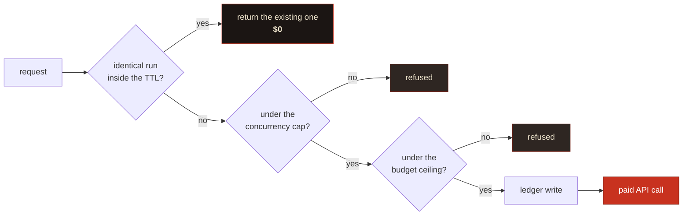
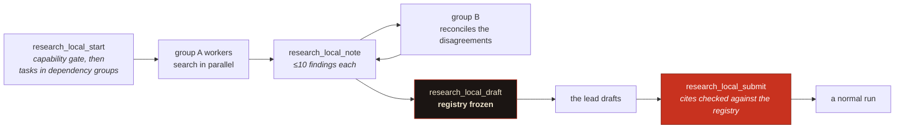

# Tool reference

Thirty-seven tools, six resources, four prompts. The [README](../README.md) has the short version of what each is for; this is the full contract.

Every tool description is also visible to an agent at runtime via `tools/list`, and those descriptions are the spec the [acceptance suite](test-plan.md) tests against.

---

## Tools

<details open>
<summary><b>Research</b> (24 tools)</summary>

<br>

### `research_plan`, free

You get the engineered prompt, the archetype it picked, cost and duration bands, your budget position, the **panel** that would run, and a **contract fingerprint**. It spends nothing. Call it first for anything non-trivial; it's where you catch a badly scoped question before it costs you $7.

The panel section prints member by member, free lane separately from paid, with a cost against each and a total, and it prints *before* the fingerprint so you can see what you're being asked to commit to. It also names every configured backend it left out and why. Name a `provider` and there is no panel to print, so the section is omitted.

| Parameter | Type | Notes |
|---|---|---|
| `question` | `string` | Your question, or an already-engineered brief (detected, sent verbatim) |
| `tier` | `fast` \| `max` | Defaults to `fast` |
| `archetype` | `enum` | `technical`, `competitive`, `regulatory`, `academic`, `forecasting`. Omit and it picks one |
| `scope` | `object` | `jurisdiction`, `timeHorizon`, `decisionContext`, `analysisLenses[]`, `exclude[]` |
| `corpusStores` | `string[]` | File Search stores to ground the run in |
| `groundedInRunIds` | `string[]` | Completed runs this one builds on, from [`research_ground`](#research_ground-free-by-default). Declared in the report's header, and never counted as corroboration |
| `collaborativePlanning` | `boolean` | Get a plan back to review before it executes |

> [!TIP]
> Of the fields here, I reckon `scope.decisionContext` is the one worth filling in. What you'll actually *do* with the findings drives the analysis lens, and telling the researcher how to think about what it finds tends to do more than telling it what to look for.

### `research_start`, spends money

Starts the run and hands back a handle. Three gates run first, and **all three are free**.



The ledger is written *before* the interaction, so a crash between the two over-counts rather than under-counts. That's the safe direction for a spend gate.

**Without an explicit `provider`, this starts a panel.** Every capable CLI you already pay for joins free, and an API backend joins when the question calls for what it is distinctively good at. See [how Dossier picks](providers/README.md#how-dossier-picks) for the lanes and the signals.

Every CLI is its own backend, so three signed-in CLIs are three free members rather than one chosen from three. Name `local-claude`, `local-codex`, `local-grok`, `local-cursor`, `local-agy` or `local-gemini` as `provider` to run exactly one of them; `local` still works and resolves to the strongest one available.

A panel runs the same three gates, but over the whole membership at once rather than member by member:

- **Dedupe** is per member. A member with an identical run already inside the TTL is handed that run and is not charged again; the rest still start.
- **Concurrency** must fit the whole panel. A panel of five needs five slots at once, and is refused whole rather than admitted in part.
- **Budget** reserves the **sum** of every member's worst case in one critical section, before any member starts. A panel that can't be afforded in full starts nothing, writes no ledger line, and tells you the whole figure it needed.

Each member comes back as its own run id, bound by a shared panel id. `research_status`, `research_read`, `research_tail` and `research_budget` all work per member exactly as they do for a single run. A paid create is attempted once, with one exception: a 429 is retried, because a rate limiter that answered created nothing. See [a failed run says which kind of failure it was](#a-failed-run-says-which-kind-of-failure-it-was).

When the last member reaches a terminal state the panel is merged automatically with `research_synthesise`'s free deterministic pass, and the result is written to every member's journal. Read it with `research_tail`. Agreement between members is not corroboration, and support is counted in independent registrable domains.

The merge note **opens with a roll-call**: how many members produced a report, then every member by name with its size and source count, or its state and failure kind. A member that fails silently otherwise inflates the apparent breadth of the panel, because the only thing reported was the merge and the merge only ever described the members that finished. Four members returning one report read exactly like four-way coverage. When fewer members contributed than were paid for, the note carries a warning saying to read the breadth as the answering members', not the panel's.

Set `DOSSIER_REQUIRE_CONTRACT=true` to make the plan-then-start handshake mandatory. Worth doing on any server an autonomous agent can reach. The fingerprint binds the whole membership, so a plan for a three-backend panel won't start a two-backend one.

### `research_approve_plan`

Approve the plan a collaborative-planning run proposed, amending it if you want.

> [!TIP]
> Pruning tangential branches and injecting the angles it missed is the highest-leverage thing you can do to a Deep Research run. Zero-shot autonomous execution is the wrong default for anything you'll be held to.

### `research_status` and `research_tail`

Status reports **liveness separately from state**. A run with no forward progress inside the watchdog window gets marked `stalled`, which you can branch on; `in_progress` on its own can't tell you the difference between a run that's thinking and one that's dead.

`research_tail` replays the durable journal from a cursor. Pass `{ runId, sinceSeq }`, get events plus the next cursor.

> [!NOTE]
> **Timing, measured against the live API. This is the honest version, and it is not the one I expected.**
>
> Polling shows nothing mid-run: `interactions.get` returns only the echoed `user_input` step until the run finishes, then delivers everything at once.
>
> So the server also consumes the SSE stream, which does connect and does deliver reasoning summaries. But on a 7.1-minute `fast` run it delivered **nothing until completion**: zero reasoning steps recorded while the run was in flight, then the whole thing at the end. On the evidence, a Deep Research background run buffers its stream rather than emitting incrementally.
>
> What that means for you: `research_tail` gives you clean, coalesced reasoning entries and a report you can read, but **treat mid-run progress as unavailable** rather than expecting a live feed. The plumbing is in place if the API starts emitting incrementally; it is not doing so today. Tracked in [#1](https://github.com/fledgeling-co/dossier-research-mcp/issues/1).

### `research_read`

| `mode` | What you get |
|---|---|
| `outline` *(default)* | Table of contents with per-section token estimates |
| `section` | One section, by 1-based index or heading substring |
| `grep` | Matching lines with their containing section. Literal by default; `regex: true` opts in |
| `summary` | Title, abstract, Executive Summary |
| `full` | Everything, capped by `maxTokens` |

`maxTokens` defaults to 6,000 and it's a hard cap. **Truncation is always marked in the text**, because silent truncation is exactly how someone acts confidently on half a finding.

### `research_verify_citations`

| Verdict | What it means |
|---|---|
| `live` | Resolves |
| `not_found` | 404 or 410; broken, or fabricated |
| `blocked` | 401/402/403, or a self-redirect loop. Paywalled or bot-blocked, so plausible but unconfirmed |
| `unreachable` | Network failure or timeout |
| `invalid_url` | Malformed, non-HTTP, or resolves to a private address |

Badges: `verified` at 90% live or better, then `partial`, then `suspect` above 15% broken or invalid.

> [!CAUTION]
> **`live` means the URL resolves. It doesn't mean the source supports the claim it's attached to.** Matching a claim to its source semantically would need a model call per citation and would still be a judgement rather than a fact, so this tool doesn't pretend to do it. Pair it with the `research-red-team` prompt.

### `research_followup` and `research_claims`

`research_followup` is one cheap model turn continuing the original interaction. It doesn't start a new research run and it doesn't re-search the web.

`research_claims` pulls the load-bearing claims out as portable cards (`claim`, `confidence`, `sourceUrl`, `evidence`), small enough to pass between agents where a whole report isn't. **Confidence is copied from the report, never re-assessed.**

### `research_wide`, spends money

For when the answer is a table, not an essay. You name the rows (entities) and the columns (fields); every cell comes back filled, cited, or explicitly marked `[uncertain]`.

| Parameter | Type | Notes |
|---|---|---|
| `topic` | `string` | What the matrix is about |
| `entities` | `string[]` | The rows. Up to 200 |
| `fields` | `object[]` | The columns: `name`, `detail` (`brief`/`moderate`/`detailed`), `description` |
| `window` | `enum` | `24h` `7d` `30d` `90d` `1y` `5y` `all`. Defaults to `1y` |
| `domains` | `string[]` | Restrict to these where the backend supports it; `-` prefix excludes |
| `runId` | `string` | Instead of a spec: validate a finished wide run |

Two calls, not one. The first starts the run; the second, with `runId`, parses the returned table and checks it against the spec you asked for. That second call is the point of the tool: a model that quietly drops the awkward column produces a table that looks complete, and only a gate that knows what was requested can tell the difference.

Uncertainty is marked **per cell**. A whole-report confidence line tells you nothing about which number to distrust, which is the only thing you want to know before acting on one.

> [!NOTE]
> Perplexity has a native wide-research mode; the others do not. On a backend without one the structure is asked for in the prompt and is **not schema-enforced**, and the response says so rather than letting you find out when a column is missing.

### `research_recent`, spends money

Time-boxed research. The window goes to the backend as a real filter where the backend has one, and the response tells you which of the two you got.

| Parameter | Type | Notes |
|---|---|---|
| `question` | `string` | What you want to know about recently |
| `window` | `enum` | Defaults to `30d` here, unlike everything else |
| `domains` | `string[]` | Up to the backend's cap; the remainder goes in the prompt |
| `searchMode` | `web` \| `academic` \| `sec` | Perplexity only |
| `includeX` | `boolean` | Search X too. Only xAI reaches it, at any price |

| Backend | Window support |
|---|---|
| Perplexity | Recency buckets: `24h`, `7d`, `30d` and `1y` are enforced exactly; `90d` filters at a year and asks for the rest |
| xAI | A real from-date. Enforced for every window |
| OpenAI | None. Prompt only |
| Gemini | None. Prompt only |

That table is why the tool exists. "Restricted to the last 12 months" means something different on each of those, and showing them identically would be a lie of omission.

### `research_compare`, spends money once per backend

The same brief on two or more backends, then a diff of what they claim. **Two providers is two full research runs**, so this is for the questions where a number is load-bearing.

Call it with `question` to start, then again with `runIds` once they finish. The diff separates claims more than one backend made from claims only one made, and grades the first group by **independent domains**, not by how many backends agreed.

> [!IMPORTANT]
> Cross-provider agreement is not independent evidence if both backends read the same page. Three research agents citing one vendor press release is one source with three wrappers, and the diff scores it `single-source` and says so. Near-identical wording across different domains is flagged as possible syndication, because one wire story republished across twenty outlets is twenty domains and one source.

A claim only one backend made is usually a coverage difference rather than an error. It is reported as a gap, and it is not corroboration either way.

### `research_doctor`, free

Audits every backend Dossier knows about: what works, what is configured but unproven, what is broken, and what could be on but is not. Makes no network call and spends nothing.

The "could be on" rows are the point. Without them you cannot tell that a capability is missing, only that you never used it.

| Parameter | Type | Notes |
|---|---|---|
| `probeLocal` | `boolean` | Also probe the coding CLIs and browser tooling on this machine. Local, offline and free: it runs `--version` on each binary, checks for a sign-in file by existence, never reading a credential, and runs the argv self-test below |
| `probeModels` | `boolean` | Ask each signed-in CLI which model it serves, and cache the answer. **This one costs a short model call per CLI**, billed to that CLI's own subscription. It implies `probeLocal`, since knowing which CLIs are identified and signed in is a prerequisite. Readings are shown with their age, and a reading older than 30 days no longer removes a backend from a panel |

`research_doctor` is annotated `readOnlyHint: false` because of `probeModels`. Annotations are fixed per tool rather than per call, so the tool carries the stronger claim even though the default invocation reads nothing and spends nothing.

#### The argv self-test

A binary answering `--version` proves nothing about the argv that carries your brief, and that gap is where a real bug lived: the Codex adapter sent `--search` to `codex exec`, which does not accept it, so every `local-codex` run died at argument parsing while `research_doctor` reported the backend CONFIGURED, UNVERIFIED.

So the audit now builds each adapter's **real** headless invocation, replaces the brief with an inert token, appends `--help`, and runs it. The flags are parsed, then the process prints its help and exits without reaching a model. Offline, free, milliseconds.

| Verdict | Meaning |
|---|---|
| `ACCEPTED` | The binary parsed this invocation. Not a promise the research will succeed, only that it will start |
| `REJECTED` | The binary refused it at argument parsing. **This is a defect in Dossier, not in your setup**, and every run on that backend will fail the same way |
| `INCONCLUSIVE` | Non-zero exit with no argument-parse signature, for instance a binary wanting a login. Deliberately not called a failure: accusing an adapter here would send a bug report to the wrong person |
| skipped | Absent, or a binary whose identity could not be confirmed. An unidentified binary is never invoked, on the same rule that governs a research run |

It runs on the default path rather than behind its own flag. It does spawn a process per identified CLI, which is the argument for a flag, and the argument loses: `probeLocal` already runs `--version` on every one of them, and putting the one check that finds this class of bug behind an option nobody sets is how the bug survived the first time.

It checks argument parsing and nothing else. A value the binary accepts as an argument and rejects later while loading its config would still pass, because `--help` short-circuits before config is read.

### `research_evidence`, free

Profiles the sources a report actually used. No fetching, no model call, no credentials: it reads the stored report, classifies the cited URLs and does the arithmetic.

What it gives you: the source mix by type, how concentrated it is by domain, four advisory floors, the search trace, and the numbered citation registry.

> [!CAUTION]
> The floors are **advisory, and gameable**. Padding a report with official sources satisfies a percentage without improving anything, and the floors wrongly penalise good investigative work where one leaked primary document outweighs twenty write-ups. Nothing is ever withheld because a floor failed. Read the mix, not the ticks.

Classification is coarse and admits it: an unrecognised domain is `other`, never a guess. An over-eager classifier would let a report inflate its official share with whatever happened to sit on a `.io` domain.

The **citation registry** is the other half. One numbered, deduplicated list built from the report, in which the same page cited three different ways is entry 7 three times rather than 7, 12 and 19. `research_followup` answers from it rather than from the report's prose, which closes the failure where a model invents a plausible reference mid-answer to support a sentence it wanted to write.

### `research_synthesise`, free or paid, your choice

Merges two or more completed runs into one evidence base and distils a single report.

This is not `research_compare`. That one diffs what two backends claim and leaves you holding two reports; this one produces a single report where every claim carries the run behind it.

The merge is deterministic and costs nothing: deduplicate by canonical URL, count **independent registrable domains**, classify and profile the sources, and record which run found what.

| Parameter | Type | Notes |
|---|---|---|
| `runIds` | `string[]` | Two to six completed runs answering the same question |
| `distil` | `auto` \| `model` \| `caller` | Who writes the merged report. `auto` uses a model if one is configured |

Two things it will tell you that a merged report normally hides.

**Whether the fan-out was worth paying for.** If most sources were found by more than one run, you bought the same pages several times over. It says so, in a warning, because the alternative is a confident-looking report that quietly cost four times what one run would have.

**Who found what.** Provenance keys on the run, not the backend, so merging four Gemini runs works as well as merging four different backends. A merged report where you cannot tell which run produced which claim is worse than the separate reports, because it launders a weak finding into a strong-looking one.

Support is counted in independent domains and never in how many runs agreed. Runs reading the same page agree for free.

### `research_export`, free

Writes a full report, plus its numbered source registry, into a directory you name.

```
research_export { runId, dir: "docs/research" }
```

The markdown carries a front-matter block recording the run id, the question, the backend, the model, the tier, the source count, the tools used, the estimated cost and the completion time. That header is what makes the file attributable once it is sitting in a repo six months later, so keep it if you commit the file.

Reports live in the server's store (`~/.dossier-research-mcp/reports/` by default) whether or not you export them. `research_read` prints the absolute path of the one you are reading.

### `research_ground`, free by default

Takes one to six completed runs and makes them available as grounding for the next question, with no export-and-upload round trip. This is how a finished report becomes an input instead of every question starting from nothing.

| Parameter | Type | Notes |
|---|---|---|
| `runIds` | `string[]` | One to six completed runs |
| `destination` | `local` \| `upload` | Defaults to `local`. `upload` sends the report to Google |
| `storeName` | `string` | Upload only, and required for it. An existing `fileSearchStores/…`; none is ever created for you |

**Local is the default and it is the one that cannot surprise anybody.** It writes the report into a fixed `dossier-grounding/` subdirectory of the first directory the operator granted with `DOSSIER_LOCAL_CORPUS_DIRS`, needs no key, opens no network connection, and `corpus_local_search` finds it afterwards like any other file there. The reply names the root it used.

> [!IMPORTANT]
> **You cannot choose the directory, the subdirectory or the file name.** Same rule as the local corpus, one step stronger: a file reader an agent can aim is an exfiltration primitive, and a file writer an agent can aim is worse. Files are written `0600` inside a `0700` directory.

> [!WARNING]
> `destination: "upload"` **sends the report to Google.** It has to be asked for by name, the tool is annotated non-read-only, and it needs a store you already made with `corpus_create`.

Then pass the same ids to `research_start` as `groundedInRunIds`, which is the half that makes the new report honest about what it was built on.

```
research_ground { runIds: ["dr_abc"] }
research_start  { question: "Has that changed since?", groundedInRunIds: ["dr_abc"] }
```

#### A prior report is your own document, and the arithmetic enforces it

A run grounded in earlier Dossier output can **launder a claim**: report A asserts something weakly supported, run B reads A and repeats it, and the assertion now appears in two reports. That looks like accumulation and is amplification.

So a Dossier report is treated exactly as any other document of yours: valid primary evidence about what was previously concluded, never independent evidence that the conclusion was right. Three things follow, and all three are computed rather than asked for:

- A grounded run **declares it in the header** of everything that presents its report. `research_read` leads with it, `research_export` writes it into the front matter and the body, and a grounding document made from an already-grounded run carries the chain, so you can see how far back the echo goes.
- A prior report cited as `dossier://run/<id>` (or found by its `dossier-run-<id>.md` name) classifies as your own document, so `countsAsCorroboration` is false for it and it never adds a domain to `research_compare`'s support grade or `research_synthesise`'s breadth. A claim in both the grounding report and the new one **counts once**.
- The prompt carries the rule and **no text from the prior reports**. A locally-grounded report has just been promised never to leave the machine, and a report is around 60,000 tokens besides.

One deliberate exception, said out loud rather than left to be found: `research_evidence`'s **source mix** still lists a prior report among the sources it profiles, because the mix describes what was read and it genuinely was read. It appears there classified as yours.

### `research_verify_claims`, free or paid, your choice

Tests whether each cited source actually contains the claim attached to it.

This is the tool `research_verify_citations` is not. That one proves a link resolves. This one tests whether the page contains the claim, and the verdict that earns its keep is `not_addressed`: a source that is *about* the topic without containing the specific assertion is the most common failure in a cited report, and it's completely invisible to link-checking because the link works perfectly.

**You can do the judging, and it costs nothing.** Pass the claims you pulled out of the report, get each cited page's text back, numbered, then send your verdicts.

```
research_verify_claims { runId, claims: [{ claim, url }] }   → the pages, numbered
research_verify_claims { runId, verdicts: [{ n, verdict }] } → the tally
```

**Or a model can, and that bills** (one small call per claim, needs `GEMINI_API_KEY`): pass `sample` and it runs end to end.

| Parameter | Type | Notes |
|---|---|---|
| `runId` | `string` | The completed run |
| `claims` | `object[]` | Caller mode step 1: `{ claim, url }` pairs you extracted |
| `verdicts` | `object[]` | Caller mode step 2: `{ n, verdict, quote?, note? }` |
| `sample` | `1-25` | Model mode: claims to check. One fetch plus one small model call each |

Whoever judges, three things stay server-side: the fetching (SSRF-checked, redirect-validated), the sample, and the tally. **A verdict on a claim that was never fetched is discarded**, because a verdict on a page nobody opened is the same defect as a report citing a source it never read.

> [!IMPORTANT]
> It catches a source that does not support its claim. It does not catch a report whose facts are each correct and whose conclusion does not follow, which is the harder failure and the one a 2026 review found in the wild: three facts established correctly, two of them multiplied, the third ignored, and an inflated estimate presented confidently. For that, read the reasoning, or run `research_counter_review`.

### `research_counter_review`, free or paid, your choice

Four lenses over a finished report, each a separate pass, each told to **refute** rather than summarise: claim validation, source diversity, recency, internal contradiction.

**You can run the lenses, and it costs nothing.** Call it and you get the four briefs; do the reviewing and send `findings` back.

```
research_counter_review { runId }                          → the four lens briefs
research_counter_review { runId, findings: [{ lens, checked, issues }] }
```

**Or a model can, and that bills** (one small call per lens, needs `GEMINI_API_KEY`).

Coverage is required; an issue quota is not. Each lens reports what it checked, and "checked, found nothing" is a real answer. Demanding a minimum number of issues rewards inventing objections to hit a number, which is worse than a quiet lens. A lens you never applied is named as such rather than counted as one that found nothing.

> [!NOTE]
> If all four lenses come back empty, the tool says so as a **failed review rather than a clean report**. Four adversarial passes finding nothing in a long research report usually means the passes did not bite.

### `research_import`, free

Bring a report that was produced somewhere else into Dossier: a Gemini or ChatGPT share link, or markdown you paste in.

This is the **subscription path**. If you already pay for Google AI Pro or ChatGPT Plus, you have already paid for deep research; run it in the web app yourself, share the result, and paste the link here. Nothing is charged, because whatever produced the report was billed wherever it ran.

| Parameter | Type | Notes |
|---|---|---|
| `url` | `string` | A **public** share link. One of this or `markdown` |
| `markdown` | `string` | The report text itself. Always works, and needs nothing to be public |
| `question` | `string` | What the report answers, recorded so the run reads like any other |

Once imported it is a normal run: `research_read` gives you the outline, `research_verify_citations` dereferences every URL, `research_evidence` profiles the source mix. That is the whole point; a report from your subscription greps identically to one from the API.

> [!TIP]
> Most share pages render client-side, so fetching the URL gets an empty shell rather than the report. The tool checks and tells you when that has happened. Copy the contents and pass them as `markdown` instead; it is the more reliable route anyway.

The `gemini-web-session` prompt walks the whole loop: it writes the brief, names the controls to click, and hands back the exact `research_import` call.

### The local loop: `research_local_start` · `_note` · `_draft` · `_submit`, all free

Research you run yourself with your own web search. No API is called and nothing is charged, and on the evidence it is not the consolation tier: on the April 2026 agent bench, Claude Code driving plain web search scored 97.0% at $1.54 while a premium deep-research API scored 75.8% at $10.92 on the same questions.

The split is the point. **The loop runs in your client, because that is where the web search is. The discipline runs in the server, because that is where it can be enforced.**



**Start** decomposes the question into one task per source class, each with the query dialect that index actually expects. Searching an academic index the way you search an issue tracker finds nothing, and it still returns results, which is why it goes unnoticed. A regulatory question gets filings and journalism; a technical one gets docs, issues and papers.

**Note** folds findings into one numbered registry, deduplicated by canonical URL. The same page found by three tasks stays one source rather than becoming three apparent corroborations.

**Draft** freezes the registry and hands back the numbered list. After this no source can enter the run, including one you find later.

**Submit** checks every cited URL against that frozen registry and **refuses the draft if it cites anything that was not gathered**.

> [!IMPORTANT]
> That last check is the whole argument for doing this in a server rather than a skill. A prompt can *ask* a model not to reach for a plausible-looking reference mid-sentence to support something it has already written. A server holding the frozen registry can check, and refuse. The invented citation resolves perfectly, so nothing downstream would ever catch it.

A task that never reports is named as a coverage gap rather than averaged away, and a draft that marks nothing as inference gets told so: a synthesised claim reads exactly like a sourced one, and that is how a wrong conclusion built from correct facts survives review.

#### You are the lead, and the lead does not read search results

The single largest thing the loop asks of you. `research_local_start` dispatches one worker per task; each worker does its own searching and hands back a distilled note. **The lead never sees a raw result page.**

Raw listings are the bulk of what a search returns and almost none of it is evidence. A lead that reads them spends its context on snippets and has none left for the report, which is how a run with good sources still produces a shallow synthesis. Ten one-sentence findings per worker is a hard cap in the schema rather than a suggestion: a worker that returns everything it saw has handed the sifting back to the lead, which is the job it was dispatched to do.

The material the lead actually drafts from arrives two ways. The **registry** carries the claim, the URL and the date. **Deep-read notes** carry what a page argued and the caveat buried three paragraphs in, which exists nowhere else. Without the second, telling the lead not to read search results would just force it back to the pages later.

If you have no way to dispatch workers, adopt each role in turn and discard the raw results as you go. The tool says so rather than assuming.

#### Dependency groups, not a flat fan-out

Tasks come back in two groups. **Group A** is independent and source-diverse, dispatched in parallel, at most three at a time. **Group B** is a single reconciliation task that may read what group A found.

`research_local_note` enforces the order. A group B task that reports before its dependencies have is refused, because a reconciliation run early has nothing to reconcile and just searches the topic again. When the last group A task reports, the reply hands over the registry and says to dispatch B against it. Its job is the disagreements, not the subject.

Reconciliation is skipped in `light` mode and when fewer than three group A tasks were planned. There is nothing to reconcile across two sources.

#### The parameters

`research_local_start`:

| Parameter | Type | Notes |
|---|---|---|
| `question` | `string` | Required |
| `archetype` | enum | Defaults to keyword selection over the question |
| `maxTasks` | `1..7` | How many parallel search tasks to plan. Default 5 |
| `deep` | `boolean` | Force every task to open pages rather than read result listings |
| `mode` | `standard` \| `light` | Evidence floors. `standard` expects 12 approved sources across 5 domains, `light` expects 6 across 3 |
| `asOf` | `YYYY-MM-DD` | The date every claim should be current as of. Defaults to today |
| `have` | object | What **you** can do: `webSearch`, `webFetch`, `subagents`, `filesystem`. All default true |

`research_local_note`:

| Parameter | Type | Notes |
|---|---|---|
| `runId`, `taskId` | `string` | The handle and which task is reporting |
| `findings` | array, **max 10** | `{ claim, url, quote?, published? }`. May be empty only if `gaps` is set |
| `gaps` | `string` | What you searched for and did **not** find |
| `deepReadNotes` | `string` | For a deep task: what the pages actually argued, caveats included. The lead drafts from this |
| `outcome` | enum, default `ok` | What happened when you searched: `ok`, `no-results`, `rate-limited`, `blocked`, `tool-failed`. See [Nothing found is a result](#nothing-found-is-a-result) |

**`light` is not a worse run, it is a smaller question.** Asking what one library does and asking which of six vector databases to standardise on should not be held to the same source count. Holding the small one to the large floors produces a run that fails its gates for being proportionate, which teaches people to ignore the gates.

#### Capability gates, and degrading out loud

`have` is declared by you, never detected. Dossier is a stdio server and cannot see whether its client has web search; a probe that guessed would be wrong in the direction that matters, because the failure being prevented is a loop that runs cheerfully with no search at all and writes a fluent report from the model's own memory with citations attached.

| Missing | What happens |
|---|---|
| `webSearch` | **Halt.** No session is opened. Enable search, or use a paid backend that brings its own |
| `webFetch` | Every task drops to **scan** depth, including the reconciliation task that asks for deep by default |
| `subagents` | Sequential: you adopt each role in turn and discard results as you go |
| `filesystem` | The registry is the only durable record, so report each task as it finishes rather than batching |

Each degradation is printed with what it costs. A fallback nobody is told about is a product failure wearing a success: the run completes, the report looks normal, and the reason it is thin is invisible to the only person who could have fixed it.

#### As-of dates and staleness

Every session carries an as-of date. At freeze time each source is assessed against it and anything stale, undated or dated after the horizon is listed, with a drafting rule that says to downgrade the claims resting on it and to say in the sentence that you did.

Recency is judged by source type rather than by one cutoff. A standard from 2019 is current; a benchmark from 2019 is not. A report that reads as present tense on a four-year-old page is wrong in the way nobody checks.

#### Nothing found is a result

Four outcomes that look alike from outside are kept apart.

- **Silent**: the task never reported. A coverage gap, named as one.
- **Nothing found**: the task ran, searched, and found nothing. An established negative about the public record. This is `outcome: no-results`.
- **Search failed**: the task ran and the search did not complete, so nothing was ruled out. `outcome: rate-limited`, `blocked` or `tool-failed`. Printed at draft time as unchecked rather than empty, with a warning against writing it up as a negative.
- **Refused**: the source arrived after the freeze. Listed, and never revived.

The middle two are the distinction worth having. Absence of evidence and absence of search arrive in the same shape, an empty report, and only the worker knows which one it was. Reporting a throttled search as `no-results` makes the report claim there is no public record of something nobody managed to look for, and no citation check can catch that.

When every task ran **cleanly** and the whole registry is empty, `research_local_draft` returns **the black box** rather than drafting rules: the checks that were made, `Confidence: N/A`, and a recommendation to contact the subject directly. Handing back drafting rules there would be inviting a report about a subject on which nothing was found. A single failed search disqualifies the black box, because it is an assertion about the world and a search that never ran cannot support one.

> [!NOTE]
> Registry finality is one-way. A source refused after the freeze stays refused for the life of the session, and the refusals are printed at draft time so the gap is visible rather than quietly closed. Start a new session if it matters.

The lead/subagent split, the dependency groups, the output contract, the capability gates, the as-of policy and the light/standard split are adapted from [daymade's deep-research skill](https://github.com/daymade/claude-code-skills). Dossier deliberately keeps its own counter-review rule instead of the skill's: coverage is required and an issue quota is not, because demanding a minimum number of objections rewards inventing them.

The typed `outcome` is adapted from `last30days-skill`'s per-source status, which records what happened to every source and states the rule plainly: a failure state is never evidence that a source had nothing. The [gap analysis](plan/external-skill-gap-analysis.md) records what else was read and what was deliberately left.

### `research_list`, `research_cancel`, `research_budget`

List runs, which reads the local store rather than the API, so it's cheap. Cancel an in-flight run; the committed spend stays on the ledger, because Google bills for work already done. Check your spend position and largest commitments.

#### A failed run says which kind of failure it was

`failed` on its own was doing too much work. "The adapter's invocation was rejected by the binary" and "the research failed" need opposite responses: the first means the software is broken and no question would have worked, the second means the question was hard. Every failed run now carries a kind, shown in the listing, in `research_status`, and in a panel's contribution roll-call.

| Kind | What happened | Budget |
|---|---|---|
| `BROKEN ADAPTER` | The binary refused the argv Dossier built. Re-running changes nothing | held; nothing was charged anyway |
| `rate-limited` | HTTP 429. The provider declined to admit the request and usually named a wait of seconds | **released** |
| `rejected by provider` | HTTP 400, 401 or 403. The request, the key or the entitlement needs fixing | **released** |
| `outcome unknown` | A timeout, a dropped connection, a 5xx, or any other status. The provider may have accepted it and may be billing | **held** |
| `research failed` | The run started, ran, and failed on its own terms | held |

The provider's own error text is shown alongside, verbatim, in both the listing and the status. It was always stored on the record and never surfaced, so a quota problem, an entitlement problem and a malformed request all read as the same unexplained failure.

#### Releasing a commitment for a request that bought nothing

The ledger is written **before** the paid call on purpose, so a crash over-counts rather than under-counts. That is right and has not changed. But a 429, 400, 401 or 403 is the provider saying it created nothing, and holding money against a call that never reached a model is a ceiling reduced for nothing.

Those four statuses, and only those four, release the commitment. It is done by **appending a compensating `release` line** naming the same run, never by editing or deleting the reservation, so the ledger stays an append-only record of what happened including the part where Dossier reserved and then learned better. A release can never give back more than its own run reserved, so a duplicated or hand-edited release line cannot lower committed spend without bound.

Everything else keeps its commitment. A 404 or a 409 very likely created nothing either, but "very likely" is the wrong standard when being wrong releases money against a report that was really bought.

</details>

<details>
<summary><b>Corpus</b>: your own documents (6 tools)</summary>

<br>

`corpus_create` · `corpus_list` · `corpus_add_file` · `corpus_delete`

File Search stores let a run search **your documents alongside the public web**. Pass store names in `corpusStores` and the server appends a grounding instruction that does two things.

First, it sets a **hierarchy of truth**: your internal documents are authoritative on internal facts, so your own numbers don't get quietly overwritten by whatever the web says louder. Second, it requires a **"Contradictions with the attached corpus"** section.

When it works, that contradictions section is the most useful thing in the report. What the internet says about your problem is commodity; where it disagrees with what your team already believes isn't.

### The local corpus: `corpus_local_list` · `corpus_local_search`

The other option, for anything you cannot hand to a third party. Files are read on your machine, matched on your machine, and **no byte of their content reaches any provider, reranker or model**.

The operator grants directories with `DOSSIER_LOCAL_CORPUS_DIRS` (colon or comma separated absolute paths). Off until somebody sets it.

> [!IMPORTANT]
> **There is deliberately no tool that grants a directory.** A tool that reads arbitrary local files and returns their contents is an exfiltration primitive, and the hands it must not fall into are an agent's: an agent that has just read a hostile web page is exactly the thing that must not be able to point a file reader at `~/.ssh`. Putting the grant in the environment keeps it where the human is and out of reach of anything the model reads.

Below the grant it is defence in depth: symlinks are resolved and re-checked against the root, dotfiles and credential and dependency directories are skipped, the walk is bounded in depth and file count, only text formats are read, and the query is a literal rather than a regular expression.

Matches come back badged as yours, with the rule attached: your own documents are the best evidence available about your own position, and never independent corroboration of a fact about the world.

[`research_ground`](#research_ground-free-by-default) writes finished Dossier reports into `dossier-grounding/` under the first granted directory, so they turn up here like any other file. They are your own documents in the sharpest sense, and the same rule governs them.

> [!WARNING]
> `corpus_add_file` **uploads the file to Google.** It's annotated non-read-only and its description says so plainly. Only add documents you're happy to hand to a third-party API.

> [!IMPORTANT]
> **Rough edge, disclosed in place.** In my one live test of this, the corpus was indexed, the `file_search` tool was attached, and both instructions were in the prompt; the researcher then produced a 12,660-token report with zero references to the corpus. The cause was almost certainly placement, since the block was being appended *after* the closing `<core_directive>`, which is both the weakest position in the prompt and a spot that broke the anti-drift anchor. That's fixed: the block now sits inside the scaffold and the contradictions section is part of `<output_format>`. I haven't re-run a paid job to confirm the fix end to end, so treat corpus grounding as attached-and-instructed rather than proven until you've seen it work on your own corpus.

</details>

<details>
<summary><b>Managed agents</b>: the other Gemini surface (4 tools)</summary>

<br>

`agent_create` · `agent_list` · `agent_run` · `agent_delete`

Persisted custom agents with a real Linux sandbox (Ubuntu, Python 3.12, Node 22) that can run code, write files, and carry your house methodology across every run.

**[Deep Research API vs the Managed Agents API](deep-research-api-vs-agent.md)** covers which surface fits which job, and the third option of rolling your own.

> [!IMPORTANT]
> At preview the only `base_agent` on offer is Antigravity, so **you can't derive a custom agent from `deep-research-*`**. A custom agent complements a Deep Research run; it doesn't specialise one.

</details>

---

---

## Resources and prompts

| Resource URI | What's in it |
|---|---|
| `research://capabilities` | Version, auth mode, `degraded` flag, tiers and cost bands, archetypes, feature flags, budget |
| `research://budget` | Ledger snapshot plus every entry in the window |
| `research://runs` | Index of all runs |
| `research://run/{runId}` | The full run record |
| `research://run/{runId}/report` | The report markdown |
| `research://run/{runId}/citations` | Verification scorecard and per-citation verdicts |

| Prompt | What it's for |
|---|---|
| `deep-research-brief` | Turns a vague need into an engineered brief, ready for `research_start` |
| `research-red-team` | Audits a finished report adversarially. A five-step procedure, not a vibe check |
| `research-triage` | Works out whether a question deserves a run at all, and at which tier, before you spend |
| `gemini-web-session` | Runs Deep Research on a subscription instead of the API, then imports the result. States the terms-of-service position rather than burying it |

---
