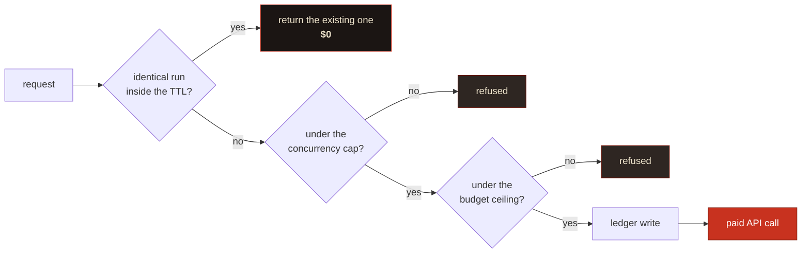

# Tool reference

Twenty tools, six resources, three prompts. The [README](../README.md) has the short version of what each is for; this is the full contract.

Every tool description is also visible to an agent at runtime via `tools/list`, and those descriptions are the spec the [acceptance suite](test-plan.md) tests against.

---

## Tools

<b>Research</b> (12 tools)

 

### `research_plan`, free

You get the engineered prompt, the archetype it picked, cost and duration bands, your budget position, and a **contract fingerprint**. It spends nothing. Call it first for anything non-trivial; it's where you catch a badly scoped question before it costs you $7.

| Parameter | Type | Notes |
|---|---|---|
| `question` | `string` | Your question, or an already-engineered brief (detected, sent verbatim) |
| `tier` | `fast` \| `max` | Defaults to `fast` |
| `archetype` | `enum` | `technical`, `competitive`, `regulatory`, `academic`, `forecasting`. Omit and it picks one |
| `scope` | `object` | `jurisdiction`, `timeHorizon`, `decisionContext`, `analysisLenses[]`, `exclude[]` |
| `corpusStores` | `string[]` | File Search stores to ground the run in |
| `collaborativePlanning` | `boolean` | Get a plan back to review before it executes |

> [!TIP]
> Of the fields here, I reckon `scope.decisionContext` is the one worth filling in. What you'll actually *do* with the findings drives the analysis lens, and telling the researcher how to think about what it finds tends to do more than telling it what to look for.

### `research_start`, spends money

Starts the run and hands back a handle. Three gates run first, and **all three are free**.

The ledger is written *before* the interaction, so a crash between the two over-counts rather than under-counts. That's the safe direction for a spend gate.

Set `DOSSIER_REQUIRE_CONTRACT=true` to make the plan-then-start handshake mandatory. Worth doing on any server an autonomous agent can reach.

### `research_approve_plan`

Approve the plan a collaborative-planning run proposed, amending it if you want.

> [!TIP]
> Pruning tangential branches and injecting the angles it missed is the highest-leverage thing you can do to a Deep Research run. Zero-shot autonomous execution is the wrong default for anything you'll be held to.

### `research_status` and `research_tail`

Status reports **liveness separately from state**. A run with no forward progress inside the watchdog window gets marked `stalled`, which you can branch on; `in_progress` on its own can't tell you the difference between a run that's thinking and one that's dead.

`research_tail` replays the durable journal from a cursor. Pass `{ runId, sinceSeq }`, get events plus the next cursor.

> [!NOTE]
> **Timing, measured against the live API. This is the honest version, and it is not the one I expected.**
>
> Polling shows nothing mid-run: `interactions.get` returns only the echoed `user_input` step until the run finishes, then delivers everything at once.
>
> So the server also consumes the SSE stream, which does connect and does deliver reasoning summaries. But on a 7.1-minute `fast` run it delivered **nothing until completion**: zero reasoning steps recorded while the run was in flight, then the whole thing at the end. On the evidence, a Deep Research background run buffers its stream rather than emitting incrementally.
>
> What that means for you: `research_tail` gives you clean, coalesced reasoning entries and a report you can read, but **treat mid-run progress as unavailable** rather than expecting a live feed. The plumbing is in place if the API starts emitting incrementally; it is not doing so today. Tracked in [#1](https://github.com/fledgeling-co/dossier-research-mcp/issues/1).

### `research_read`

| `mode` | What you get |
|---|---|
| `outline` *(default)* | Table of contents with per-section token estimates |
| `section` | One section, by 1-based index or heading substring |
| `grep` | Matching lines with their containing section. Literal by default; `regex: true` opts in |
| `summary` | Title, abstract, Executive Summary |
| `full` | Everything, capped by `maxTokens` |

`maxTokens` defaults to 6,000 and it's a hard cap. **Truncation is always marked in the text**, because silent truncation is exactly how someone acts confidently on half a finding.

### `research_verify_citations`

| Verdict | What it means |
|---|---|
| `live` | Resolves |
| `not_found` | 404 or 410; broken, or fabricated |
| `blocked` | 401/402/403, or a self-redirect loop. Paywalled or bot-blocked, so plausible but unconfirmed |
| `unreachable` | Network failure or timeout |
| `invalid_url` | Malformed, non-HTTP, or resolves to a private address |

Badges: `verified` at 90% live or better, then `partial`, then `suspect` above 15% broken or invalid.

> [!CAUTION]
> **`live` means the URL resolves. It doesn't mean the source supports the claim it's attached to.** Matching a claim to its source semantically would need a model call per citation and would still be a judgement rather than a fact, so this tool doesn't pretend to do it. Pair it with the `research-red-team` prompt.

### `research_followup` and `research_claims`

`research_followup` is one cheap model turn continuing the original interaction. It doesn't start a new research run and it doesn't re-search the web.

`research_claims` pulls the load-bearing claims out as portable cards (`claim`, `confidence`, `sourceUrl`, `evidence`), small enough to pass between agents where a whole report isn't. **Confidence is copied from the report, never re-assessed.**

### `research_list`, `research_cancel`, `research_budget`

List runs, which reads the local store rather than the API, so it's cheap. Cancel an in-flight run; the committed spend stays on the ledger, because Google bills for work already done. Check your spend position and largest commitments.

<b>Corpus</b>: your own documents (4 tools)

 

`corpus_create` · `corpus_list` · `corpus_add_file` · `corpus_delete`

File Search stores let a run search **your documents alongside the public web**. Pass store names in `corpusStores` and the server appends a grounding instruction that does two things.

First, it sets a **hierarchy of truth**: your internal documents are authoritative on internal facts, so your own numbers don't get quietly overwritten by whatever the web says louder. Second, it requires a **"Contradictions with the attached corpus"** section.

When it works, that contradictions section is the most useful thing in the report. What the internet says about your problem is commodity; where it disagrees with what your team already believes isn't.

> [!WARNING]
> `corpus_add_file` **uploads the file to Google.** It's annotated non-read-only and its description says so plainly. Only add documents you're happy to hand to a third-party API.

> [!IMPORTANT]
> **Rough edge, disclosed in place.** In my one live test of this, the corpus was indexed, the `file_search` tool was attached, and both instructions were in the prompt; the researcher then produced a 12,660-token report with zero references to the corpus. The cause was almost certainly placement, since the block was being appended *after* the closing `<core_directive>`, which is both the weakest position in the prompt and a spot that broke the anti-drift anchor. That's fixed: the block now sits inside the scaffold and the contradictions section is part of `<output_format>`. I haven't re-run a paid job to confirm the fix end to end, so treat corpus grounding as attached-and-instructed rather than proven until you've seen it work on your own corpus.

<b>Managed agents</b>: the other Gemini surface (4 tools)

 

`agent_create` · `agent_list` · `agent_run` · `agent_delete`

Persisted custom agents with a real Linux sandbox (Ubuntu, Python 3.12, Node 22) that can run code, write files, and carry your house methodology across every run.

**[Deep Research API vs the Managed Agents API](deep-research-api-vs-agent.md)** covers which surface fits which job, and the third option of rolling your own.

> [!IMPORTANT]
> At preview the only `base_agent` on offer is Antigravity, so **you can't derive a custom agent from `deep-research-*`**. A custom agent complements a Deep Research run; it doesn't specialise one.

---

---

## Resources and prompts

| Resource URI | What's in it |
|---|---|
| `research://capabilities` | Version, auth mode, `degraded` flag, tiers and cost bands, archetypes, feature flags, budget |
| `research://budget` | Ledger snapshot plus every entry in the window |
| `research://runs` | Index of all runs |
| `research://run/{runId}` | The full run record |
| `research://run/{runId}/report` | The report markdown |
| `research://run/{runId}/citations` | Verification scorecard and per-citation verdicts |

| Prompt | What it's for |
|---|---|
| `deep-research-brief` | Turns a vague need into an engineered brief, ready for `research_start` |
| `research-red-team` | Audits a finished report adversarially. A five-step procedure, not a vibe check |
| `research-triage` | Works out whether a question deserves a run at all, and at which tier, before you spend |

---
