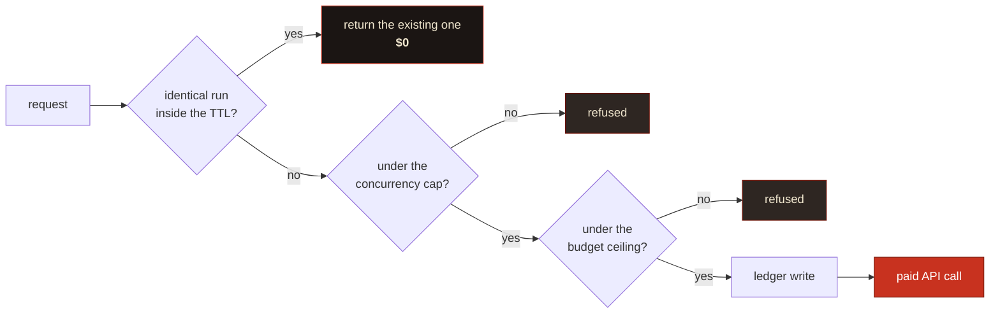
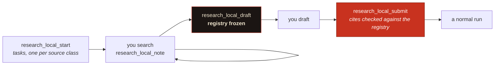

# Tool reference

Thirty-four tools, six resources, four prompts. The [README](../README.md) has the short version of what each is for; this is the full contract.

Every tool description is also visible to an agent at runtime via `tools/list`, and those descriptions are the spec the [acceptance suite](test-plan.md) tests against.

---

## Tools

<details open>
<summary><b>Research</b> (24 tools)</summary>

<br>

### `research_plan`, free

You get the engineered prompt, the archetype it picked, cost and duration bands, your budget position, and a **contract fingerprint**. It spends nothing. Call it first for anything non-trivial; it's where you catch a badly scoped question before it costs you $7.

| Parameter | Type | Notes |
|---|---|---|
| `question` | `string` | Your question, or an already-engineered brief (detected, sent verbatim) |
| `tier` | `fast` \| `max` | Defaults to `fast` |
| `archetype` | `enum` | `technical`, `competitive`, `regulatory`, `academic`, `forecasting`. Omit and it picks one |
| `scope` | `object` | `jurisdiction`, `timeHorizon`, `decisionContext`, `analysisLenses[]`, `exclude[]` |
| `corpusStores` | `string[]` | File Search stores to ground the run in |
| `collaborativePlanning` | `boolean` | Get a plan back to review before it executes |

> [!TIP]
> Of the fields here, I reckon `scope.decisionContext` is the one worth filling in. What you'll actually *do* with the findings drives the analysis lens, and telling the researcher how to think about what it finds tends to do more than telling it what to look for.

### `research_start`, spends money

Starts the run and hands back a handle. Three gates run first, and **all three are free**.



The ledger is written *before* the interaction, so a crash between the two over-counts rather than under-counts. That's the safe direction for a spend gate.

Set `DOSSIER_REQUIRE_CONTRACT=true` to make the plan-then-start handshake mandatory. Worth doing on any server an autonomous agent can reach.

### `research_approve_plan`

Approve the plan a collaborative-planning run proposed, amending it if you want.

> [!TIP]
> Pruning tangential branches and injecting the angles it missed is the highest-leverage thing you can do to a Deep Research run. Zero-shot autonomous execution is the wrong default for anything you'll be held to.

### `research_status` and `research_tail`

Status reports **liveness separately from state**. A run with no forward progress inside the watchdog window gets marked `stalled`, which you can branch on; `in_progress` on its own can't tell you the difference between a run that's thinking and one that's dead.

`research_tail` replays the durable journal from a cursor. Pass `{ runId, sinceSeq }`, get events plus the next cursor.

> [!NOTE]
> **Timing, measured against the live API. This is the honest version, and it is not the one I expected.**
>
> Polling shows nothing mid-run: `interactions.get` returns only the echoed `user_input` step until the run finishes, then delivers everything at once.
>
> So the server also consumes the SSE stream, which does connect and does deliver reasoning summaries. But on a 7.1-minute `fast` run it delivered **nothing until completion**: zero reasoning steps recorded while the run was in flight, then the whole thing at the end. On the evidence, a Deep Research background run buffers its stream rather than emitting incrementally.
>
> What that means for you: `research_tail` gives you clean, coalesced reasoning entries and a report you can read, but **treat mid-run progress as unavailable** rather than expecting a live feed. The plumbing is in place if the API starts emitting incrementally; it is not doing so today. Tracked in [#1](https://github.com/fledgeling-co/dossier-research-mcp/issues/1).

### `research_read`

| `mode` | What you get |
|---|---|
| `outline` *(default)* | Table of contents with per-section token estimates |
| `section` | One section, by 1-based index or heading substring |
| `grep` | Matching lines with their containing section. Literal by default; `regex: true` opts in |
| `summary` | Title, abstract, Executive Summary |
| `full` | Everything, capped by `maxTokens` |

`maxTokens` defaults to 6,000 and it's a hard cap. **Truncation is always marked in the text**, because silent truncation is exactly how someone acts confidently on half a finding.

### `research_verify_citations`

| Verdict | What it means |
|---|---|
| `live` | Resolves |
| `not_found` | 404 or 410; broken, or fabricated |
| `blocked` | 401/402/403, or a self-redirect loop. Paywalled or bot-blocked, so plausible but unconfirmed |
| `unreachable` | Network failure or timeout |
| `invalid_url` | Malformed, non-HTTP, or resolves to a private address |

Badges: `verified` at 90% live or better, then `partial`, then `suspect` above 15% broken or invalid.

> [!CAUTION]
> **`live` means the URL resolves. It doesn't mean the source supports the claim it's attached to.** Matching a claim to its source semantically would need a model call per citation and would still be a judgement rather than a fact, so this tool doesn't pretend to do it. Pair it with the `research-red-team` prompt.

### `research_followup` and `research_claims`

`research_followup` is one cheap model turn continuing the original interaction. It doesn't start a new research run and it doesn't re-search the web.

`research_claims` pulls the load-bearing claims out as portable cards (`claim`, `confidence`, `sourceUrl`, `evidence`), small enough to pass between agents where a whole report isn't. **Confidence is copied from the report, never re-assessed.**

### `research_wide`, spends money

For when the answer is a table, not an essay. You name the rows (entities) and the columns (fields); every cell comes back filled, cited, or explicitly marked `[uncertain]`.

| Parameter | Type | Notes |
|---|---|---|
| `topic` | `string` | What the matrix is about |
| `entities` | `string[]` | The rows. Up to 200 |
| `fields` | `object[]` | The columns: `name`, `detail` (`brief`/`moderate`/`detailed`), `description` |
| `window` | `enum` | `24h` `7d` `30d` `90d` `1y` `5y` `all`. Defaults to `1y` |
| `domains` | `string[]` | Restrict to these where the backend supports it; `-` prefix excludes |
| `runId` | `string` | Instead of a spec: validate a finished wide run |

Two calls, not one. The first starts the run; the second, with `runId`, parses the returned table and checks it against the spec you asked for. That second call is the point of the tool: a model that quietly drops the awkward column produces a table that looks complete, and only a gate that knows what was requested can tell the difference.

Uncertainty is marked **per cell**. A whole-report confidence line tells you nothing about which number to distrust, which is the only thing you want to know before acting on one.

> [!NOTE]
> Perplexity has a native wide-research mode; the others do not. On a backend without one the structure is asked for in the prompt and is **not schema-enforced**, and the response says so rather than letting you find out when a column is missing.

### `research_recent`, spends money

Time-boxed research. The window goes to the backend as a real filter where the backend has one, and the response tells you which of the two you got.

| Parameter | Type | Notes |
|---|---|---|
| `question` | `string` | What you want to know about recently |
| `window` | `enum` | Defaults to `30d` here, unlike everything else |
| `domains` | `string[]` | Up to the backend's cap; the remainder goes in the prompt |
| `searchMode` | `web` \| `academic` \| `sec` | Perplexity only |
| `includeX` | `boolean` | Search X too. Only xAI reaches it, at any price |

| Backend | Window support |
|---|---|
| Perplexity | Recency buckets: `24h`, `7d`, `30d` and `1y` are enforced exactly; `90d` filters at a year and asks for the rest |
| xAI | A real from-date. Enforced for every window |
| OpenAI | None. Prompt only |
| Gemini | None. Prompt only |

That table is why the tool exists. "Restricted to the last 12 months" means something different on each of those, and showing them identically would be a lie of omission.

### `research_compare`, spends money once per backend

The same brief on two or more backends, then a diff of what they claim. **Two providers is two full research runs**, so this is for the questions where a number is load-bearing.

Call it with `question` to start, then again with `runIds` once they finish. The diff separates claims more than one backend made from claims only one made, and grades the first group by **independent domains**, not by how many backends agreed.

> [!IMPORTANT]
> Cross-provider agreement is not independent evidence if both backends read the same page. Three research agents citing one vendor press release is one source with three wrappers, and the diff scores it `single-source` and says so. Near-identical wording across different domains is flagged as possible syndication, because one wire story republished across twenty outlets is twenty domains and one source.

A claim only one backend made is usually a coverage difference rather than an error. It is reported as a gap, and it is not corroboration either way.

### `research_evidence`, free

Profiles the sources a report actually used. No fetching, no model call, no credentials: it reads the stored report, classifies the cited URLs and does the arithmetic.

What it gives you: the source mix by type, how concentrated it is by domain, four advisory floors, the search trace, and the numbered citation registry.

> [!CAUTION]
> The floors are **advisory, and gameable**. Padding a report with official sources satisfies a percentage without improving anything, and the floors wrongly penalise good investigative work where one leaked primary document outweighs twenty write-ups. Nothing is ever withheld because a floor failed. Read the mix, not the ticks.

Classification is coarse and admits it: an unrecognised domain is `other`, never a guess. An over-eager classifier would let a report inflate its official share with whatever happened to sit on a `.io` domain.

The **citation registry** is the other half. One numbered, deduplicated list built from the report, in which the same page cited three different ways is entry 7 three times rather than 7, 12 and 19. `research_followup` answers from it rather than from the report's prose, which closes the failure where a model invents a plausible reference mid-answer to support a sentence it wanted to write.

### `research_verify_claims`, free or paid, your choice

Tests whether each cited source actually contains the claim attached to it.

This is the tool `research_verify_citations` is not. That one proves a link resolves. This one tests whether the page contains the claim, and the verdict that earns its keep is `not_addressed`: a source that is *about* the topic without containing the specific assertion is the most common failure in a cited report, and it's completely invisible to link-checking because the link works perfectly.

**You can do the judging, and it costs nothing.** Pass the claims you pulled out of the report, get each cited page's text back, numbered, then send your verdicts.

```
research_verify_claims { runId, claims: [{ claim, url }] }   → the pages, numbered
research_verify_claims { runId, verdicts: [{ n, verdict }] } → the tally
```

**Or a model can, and that bills** (one small call per claim, needs `GEMINI_API_KEY`): pass `sample` and it runs end to end.

| Parameter | Type | Notes |
|---|---|---|
| `runId` | `string` | The completed run |
| `claims` | `object[]` | Caller mode step 1: `{ claim, url }` pairs you extracted |
| `verdicts` | `object[]` | Caller mode step 2: `{ n, verdict, quote?, note? }` |
| `sample` | `1-25` | Model mode: claims to check. One fetch plus one small model call each |

Whoever judges, three things stay server-side: the fetching (SSRF-checked, redirect-validated), the sample, and the tally. **A verdict on a claim that was never fetched is discarded**, because a verdict on a page nobody opened is the same defect as a report citing a source it never read.

> [!IMPORTANT]
> It catches a source that does not support its claim. It does not catch a report whose facts are each correct and whose conclusion does not follow, which is the harder failure and the one a 2026 review found in the wild: three facts established correctly, two of them multiplied, the third ignored, and an inflated estimate presented confidently. For that, read the reasoning, or run `research_counter_review`.

### `research_counter_review`, free or paid, your choice

Four lenses over a finished report, each a separate pass, each told to **refute** rather than summarise: claim validation, source diversity, recency, internal contradiction.

**You can run the lenses, and it costs nothing.** Call it and you get the four briefs; do the reviewing and send `findings` back.

```
research_counter_review { runId }                          → the four lens briefs
research_counter_review { runId, findings: [{ lens, checked, issues }] }
```

**Or a model can, and that bills** (one small call per lens, needs `GEMINI_API_KEY`).

Coverage is required; an issue quota is not. Each lens reports what it checked, and "checked, found nothing" is a real answer. Demanding a minimum number of issues rewards inventing objections to hit a number, which is worse than a quiet lens. A lens you never applied is named as such rather than counted as one that found nothing.

> [!NOTE]
> If all four lenses come back empty, the tool says so as a **failed review rather than a clean report**. Four adversarial passes finding nothing in a long research report usually means the passes did not bite.

### `research_import`, free

Bring a report that was produced somewhere else into Dossier: a Gemini or ChatGPT share link, or markdown you paste in.

This is the **subscription path**. If you already pay for Google AI Pro or ChatGPT Plus, you have already paid for deep research; run it in the web app yourself, share the result, and paste the link here. Nothing is charged, because whatever produced the report was billed wherever it ran.

| Parameter | Type | Notes |
|---|---|---|
| `url` | `string` | A **public** share link. One of this or `markdown` |
| `markdown` | `string` | The report text itself. Always works, and needs nothing to be public |
| `question` | `string` | What the report answers, recorded so the run reads like any other |

Once imported it is a normal run: `research_read` gives you the outline, `research_verify_citations` dereferences every URL, `research_evidence` profiles the source mix. That is the whole point; a report from your subscription greps identically to one from the API.

> [!TIP]
> Most share pages render client-side, so fetching the URL gets an empty shell rather than the report. The tool checks and tells you when that has happened. Copy the contents and pass them as `markdown` instead; it is the more reliable route anyway.

The `gemini-web-session` prompt walks the whole loop: it writes the brief, names the controls to click, and hands back the exact `research_import` call.

### The local loop: `research_local_start` · `_note` · `_draft` · `_submit`, all free

Research you run yourself with your own web search. No API is called and nothing is charged, and on the evidence it is not the consolation tier: on the April 2026 agent bench, Claude Code driving plain web search scored 97.0% at $1.54 while a premium deep-research API scored 75.8% at $10.92 on the same questions.

The split is the point. **The loop runs in your client, because that is where the web search is. The discipline runs in the server, because that is where it can be enforced.**



**Start** decomposes the question into one task per source class, each with the query dialect that index actually expects. Searching an academic index the way you search an issue tracker finds nothing, and it still returns results, which is why it goes unnoticed. A regulatory question gets filings and journalism; a technical one gets docs, issues and papers.

**Note** folds findings into one numbered registry, deduplicated by canonical URL. The same page found by three tasks stays one source rather than becoming three apparent corroborations.

**Draft** freezes the registry and hands back the numbered list. After this no source can enter the run, including one you find later.

**Submit** checks every cited URL against that frozen registry and **refuses the draft if it cites anything that was not gathered**.

> [!IMPORTANT]
> That last check is the whole argument for doing this in a server rather than a skill. A prompt can *ask* a model not to reach for a plausible-looking reference mid-sentence to support something it has already written. A server holding the frozen registry can check, and refuse. The invented citation resolves perfectly, so nothing downstream would ever catch it.

A task that never reports is named as a coverage gap rather than averaged away, and a draft that marks nothing as inference gets told so: a synthesised claim reads exactly like a sourced one, and that is how a wrong conclusion built from correct facts survives review.

### `research_list`, `research_cancel`, `research_budget`

List runs, which reads the local store rather than the API, so it's cheap. Cancel an in-flight run; the committed spend stays on the ledger, because Google bills for work already done. Check your spend position and largest commitments.

</details>

<details>
<summary><b>Corpus</b>: your own documents (6 tools)</summary>

<br>

`corpus_create` · `corpus_list` · `corpus_add_file` · `corpus_delete`

File Search stores let a run search **your documents alongside the public web**. Pass store names in `corpusStores` and the server appends a grounding instruction that does two things.

First, it sets a **hierarchy of truth**: your internal documents are authoritative on internal facts, so your own numbers don't get quietly overwritten by whatever the web says louder. Second, it requires a **"Contradictions with the attached corpus"** section.

When it works, that contradictions section is the most useful thing in the report. What the internet says about your problem is commodity; where it disagrees with what your team already believes isn't.

### The local corpus: `corpus_local_list` · `corpus_local_search`

The other option, for anything you cannot hand to a third party. Files are read on your machine, matched on your machine, and **no byte of their content reaches any provider, reranker or model**.

The operator grants directories with `DOSSIER_LOCAL_CORPUS_DIRS` (colon or comma separated absolute paths). Off until somebody sets it.

> [!IMPORTANT]
> **There is deliberately no tool that grants a directory.** A tool that reads arbitrary local files and returns their contents is an exfiltration primitive, and the hands it must not fall into are an agent's: an agent that has just read a hostile web page is exactly the thing that must not be able to point a file reader at `~/.ssh`. Putting the grant in the environment keeps it where the human is and out of reach of anything the model reads.

Below the grant it is defence in depth: symlinks are resolved and re-checked against the root, dotfiles and credential and dependency directories are skipped, the walk is bounded in depth and file count, only text formats are read, and the query is a literal rather than a regular expression.

Matches come back badged as yours, with the rule attached: your own documents are the best evidence available about your own position, and never independent corroboration of a fact about the world.

> [!WARNING]
> `corpus_add_file` **uploads the file to Google.** It's annotated non-read-only and its description says so plainly. Only add documents you're happy to hand to a third-party API.

> [!IMPORTANT]
> **Rough edge, disclosed in place.** In my one live test of this, the corpus was indexed, the `file_search` tool was attached, and both instructions were in the prompt; the researcher then produced a 12,660-token report with zero references to the corpus. The cause was almost certainly placement, since the block was being appended *after* the closing `<core_directive>`, which is both the weakest position in the prompt and a spot that broke the anti-drift anchor. That's fixed: the block now sits inside the scaffold and the contradictions section is part of `<output_format>`. I haven't re-run a paid job to confirm the fix end to end, so treat corpus grounding as attached-and-instructed rather than proven until you've seen it work on your own corpus.

</details>

<details>
<summary><b>Managed agents</b>: the other Gemini surface (4 tools)</summary>

<br>

`agent_create` · `agent_list` · `agent_run` · `agent_delete`

Persisted custom agents with a real Linux sandbox (Ubuntu, Python 3.12, Node 22) that can run code, write files, and carry your house methodology across every run.

**[Deep Research API vs the Managed Agents API](deep-research-api-vs-agent.md)** covers which surface fits which job, and the third option of rolling your own.

> [!IMPORTANT]
> At preview the only `base_agent` on offer is Antigravity, so **you can't derive a custom agent from `deep-research-*`**. A custom agent complements a Deep Research run; it doesn't specialise one.

</details>

---

---

## Resources and prompts

| Resource URI | What's in it |
|---|---|
| `research://capabilities` | Version, auth mode, `degraded` flag, tiers and cost bands, archetypes, feature flags, budget |
| `research://budget` | Ledger snapshot plus every entry in the window |
| `research://runs` | Index of all runs |
| `research://run/{runId}` | The full run record |
| `research://run/{runId}/report` | The report markdown |
| `research://run/{runId}/citations` | Verification scorecard and per-citation verdicts |

| Prompt | What it's for |
|---|---|
| `deep-research-brief` | Turns a vague need into an engineered brief, ready for `research_start` |
| `research-red-team` | Audits a finished report adversarially. A five-step procedure, not a vibe check |
| `research-triage` | Works out whether a question deserves a run at all, and at which tier, before you spend |
| `gemini-web-session` | Runs Deep Research on a subscription instead of the API, then imports the result. States the terms-of-service position rather than burying it |

---
